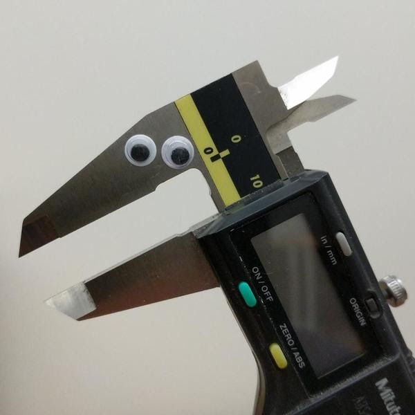

Shortcut to [today's lecture](lectureNotes.md/#todays-lecture)    


## New York University Abu Dhabi    
## Interactive Media Program    
## Course title: Introduction to Interactive Media  
Course number: IM-UH 1010   
Section: 1    
Credit Hours: 4         
Prerequisites: None       

Course website: [https://github.com/michaelshiloh/IntroductionToInteractiveMedia](https://github.com/michaelshiloh/IntroductionToInteractiveMedia)      
Instructor: Michael Shiloh mshiloh@nyu.edu    
Office hours: By appointment  
Meeting times: 10:25-1:05 Tu 11:50-1:05 Th   
Session: Fall 2021       
Class location: [Zoom](https://nyu.zoom.us/j/93719271713)   
[Discord](https://discord.com/channels/714727038078025851/716332110268465172)   

**This is subject to change**

### todays-lecture
### August 31 2021

#### Administration

- **Record Zoom!**
- Introductions
- Syllabus etc.
- Join the Discord server 
- **Connect to Zoom 10 minutes early**
	- This is to make sure you have time to fix any potential Zoom issues
	- You may keep your camera and mic turned off until class time

#### What’s the class about?

<ul>
 	<li>
Digital computation beyond computers (sometimes called "physical computing") considering humanistic needs in design and usability</li>
 	<li>
Computers traditionally lacked knowledge of outside world beyond a keyboard, mouse</li>
<li>Look critically at products and designs</li>
 	<li>
As artists and designers, we can explore new paradigms of interaction with machines and each other</li>
 	<li>
Relatively easily and inexpensively explore creative computation through open source software and hardware</li>
 	<li>
No background needed, strong DIY attitude</li>
 	<li>
Low barrier to entry, high ceiling</li>
</ul>
- Examples
<ul>
 	<li>Carlos Guedes' wonderful <a href="https://vimeo.com/235763130">Phobos</a>, Orquestra Robótica Disfuncional (1 min)</li>
 	<li>Sudhu Tewari's <a href="https://www.youtube.com/watch?v=MjNB3nKPMb8" >Yasmin Electro Mechanical Sequencer</a></li>
 	<li>List of <a href="http://eat.cca.edu/" >inspirational movies</a> collected by <a href="http://www.ultrafuzz.net/" >Barney Haynes</a> (also <a href="https://vimeo.com/barneyhaynes" >here</a>) and shown at his Interface classes.</li>
 	<li>List collected by <a href="https://github.com/zamfi">J.D. Zamfirescu</a>
<li><a href="http://www.youtube.com/watch?v=zkpH1BjD6Wc" >Tree-climbing robot</a></li>
<li><a href="http://www.youtube.com/watch?v=tOsNXg2vAd4#t=120" >Insect robot</a></li>
<li><a href="http://www.youtube.com/watch?v=YblSltHDbIU" >Treadbot</a></li>
<li><a href="http://www.future-cities-lab.net/projects/#/murmurwall/" >Murmur Wall</a></li>
<li><a href="http://vimeo.com/72826106" >Floating Couch</a></li>
<li><a href="https://www.youtube.com/watch?v=BZysu9QcceM#t=36" >Wooden Segment Mirror</a></li>
<li><a href="https://www.youtube.com/watch?v=pNkz8wEJljc" >Generative design</a></li>
<li><a href="https://vimeo.com/71044541" >Textile weaving</a></li>
<li><a href="https://www.youtube.com/watch?v=czuhNcNU6qU" >Projection mapping</a></li>
<li><a href="http://www.youtube.com/watch?v=sLVXmsbVwUs#t=20" >Laser
harp</a></li>
<li><a href="http://vimeo.com/57082262#at=130" >Arc-o-matic</a></li>
<li><a href="https://www.youtube.com/watch?v=w4cdbV2oaEc" >Eggbot</a></li>
<li><a href="http://www.youtube.com/watch?v=kx9D74t7GD8#t=89"
>Textspresso</a></li>
<li><a href="http://www.youtube.com/watch?v=pCC1GXnYfFI#t=11" >Shapoko / tinyg</a></li>
<li><a href="http://www.youtube.com/watch?v=NAbiAzYhTOQ" >Makerbot Replicator</a></li>
<li><a href="https://www.youtube.com/watch?v=0DNkbZvVYvc"
>Roomba</a></li></li>
 	<li><a href="https://www.youtube.com/watch?v=1G0MzlfMPuM" >Golan Levin: Art that looks back at you</a></li>
 	<li><a href="https://www.youtube.com/watch?v=PV_w38ldZaE" >Drawdio</a></li>
 	<li>Claire Neel's <a href="https://youtu.be/lYERKTf5YtI" >reactive eye</a></li>
 	<li>Professor Aaron Sherwood's <a href="http://aaron-sherwood.com/works/firewall/">Reactive Wall</a></li>
 	<li><a href="http://melissafelderman.com/digitalgraffitiwall/index.html">Digital Graffiti Wall</a></li>
 	<li><a href="http://www.willjfield.com/itp-2/explorer-space-simulator/">Space Simulator</a></li>
 	<li><a href="https://vimeo.com/114414122">Wind based jug organ</a></li>
 	<li><a href="http://www.yining1023.com/?p=392">Atmospheric Touch Lamp</a></li>
 	<li><a href="http://andysigler.com/projects/dipinator/">The Dipinator</a></li>
 	<li><a href="http://www.gabebc.com/Jitterbox">Jitterbox</a></li>
 	<li><a href="http://macdavel.blogspot.ae/">Youtube DDR</a></li>
 	<li><a href="https://lilikha.wordpress.com/">I Hand a Dream</a></li>
</ul>
</li>
</ul>

#### Let's get started

**Download Processing**
- Start now in case this takes a long time
- From [here](https://processing.org/download/)

**Github**
- What is Github?
- Difference between an account and a repository
- Follow along with me and create an account
- Instructions for this are
[here](https://github.com/michaelshiloh/resourcesForClasses#github-resources).

Please use your name for your account name so that I can more easily recognize it. 
If you don't want to use your name for privacy reasons, please choose an alias that I can
recognize as you.

Name your repository "Introduction to Interactive Media". 

- Edit your README.md file
	- What is README.md?
	- What is .md?
- Simple Markdown 
	- **Bold**
	- Paragraphs must be separated by a blank line
	- Inserting images: 
	- Always remember to commit your changes!
	- More [here](https://github.com/michaelshiloh/resourcesForClasses#github-resources).


**Processing**

#### Simple shapes

- `ellipse()`
- `rect()`
- `size()`
- `triangle(x1, y1, x2, y2, x3, y3)`
- `line()`
- `point()`

What does this all mean?
- Functions
- Arguments or parameters

Controlling color, fill, and stroke

- `color()`
- `stroke()`
- `noStroke()`
- `fill()`
- `arc(100, 100, 100, 100, 0, 180)`
- `arc(100, 100, 100, 100, 0, PI, CHORD)`
- `random()`

Confused? 
- Google
- Processing reference page

#### Variables
- `int myNumber = 45;`
- `int myRandomNumber = random(255);`
- `int myRandomNumber = round(random(255));`
- Other variable types. `int` is by far most common, another common is `float`
- Built-in variables
	- `width`, `height`
	- many others

Here is an example Processing program (also called a 'sketch') 

````
size(400, 400);
ellipse(width/2, height/2, 50, 50);

/*
stroke(0,255,0);
fill(255,0,0);
//ellipse(100,100, 50, 50);

fill(255,0,0, 30);
//rect(30, 30, 50, 80);


// Now I will try to draw an arc
//arc(100, 100, 100, 100, 0, radians(180), CHORD);

// pick a random number up to 180
float myRandomArcSize = random(180);
int arcSizeAsInt = round (myRandomArcSize);
println(myRandomArcSize + "   " + arcSizeAsInt);

// convert that number to radians
float arcSizeInRadians = radians(myRandomArcSize);

print(myRandomArcSize + "    " + arcSizeInRadians);

// draw the arc
arc(100, 100, 100, 100, 0, arcSizeInRadians, CHORD);
*/
````

#### Animation
- `draw()`
- `setup()`

````
int foo = 0;

void setup() {
  size(300, 300);
}

void draw() {
  ellipse(foo, 50, 40, 40);
  foo = foo + 1;
}
````

`background()`

`frameRate()`

Yesterday we were able to draw without using `setup()` and `draw()`. What's
the difference?

Static vs. active mode

#### Interaction with Processing

- conditionals

````
void setup() {
  size(300, 300);
}

void draw() {
  if (mousePressed == true) {
    background(color(0, 0, 255));
  } else {
    background(color(200, 0, 0));
  }
}
````

**Important concepts**:
1. `mousePressed` is another built-in variable. There are many others.
1. `mousePressed` is a new type of data, namely a `boolean`, which means it has
	 only one of two values, `true` or `false`
1. Note that `{` and `}` indicate the blocks
1. The `else` part of an `if()` statement is optional (what happens if we
	 remove it?)

- Two more interesting built-in variables: `mouseX`, `mouseY`
	- Using the cursor to draw
	- Now use a mouse click to clear the screen
	- (Time permitting, primitive painting program)

#### Loops
`while()` is like `if()` but it keeps on doing it as long as condition is true

````
void setup() {
  size(300, 300);

  int foo = 50;

  while (foo < width) {
    ellipse(foo, 50, 40, 40);
    foo = foo + 50;
  }
}
````
You should get in the habit of giving meaningful names to your variables. What
is a better name for the variable foo?

