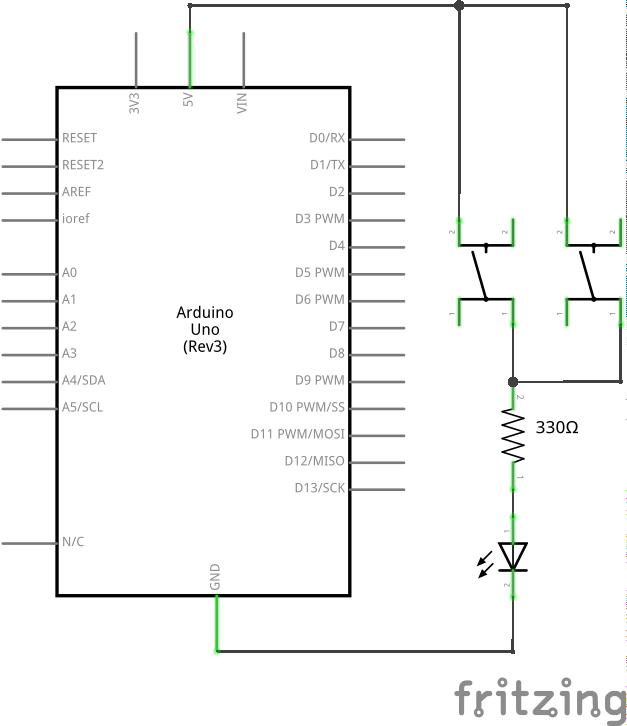
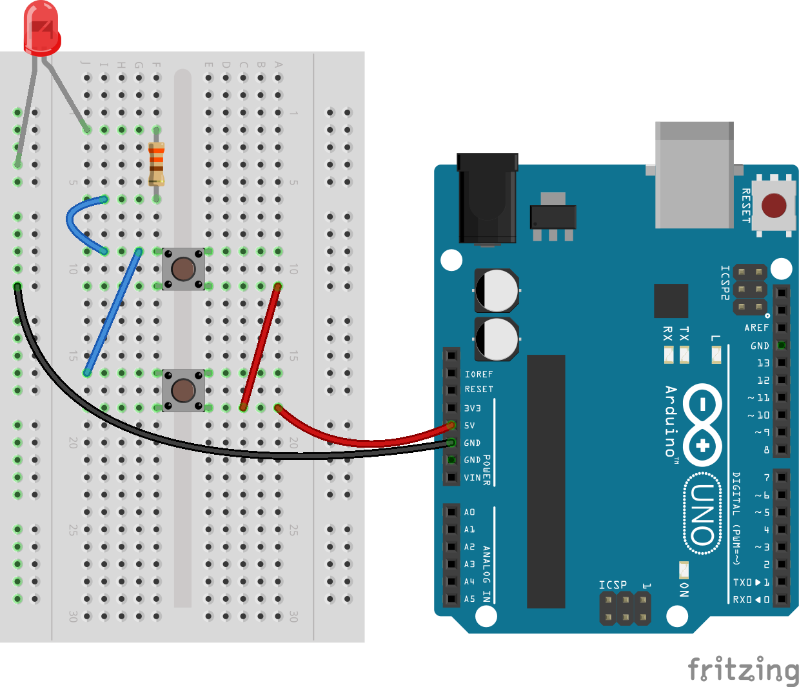
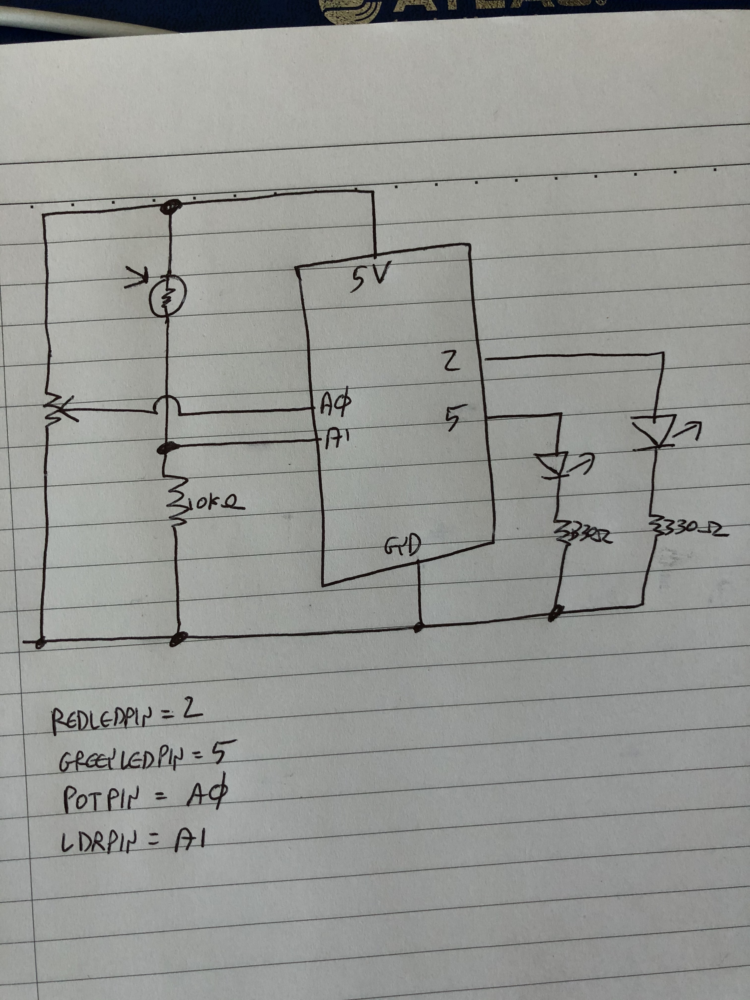

Shortcut to [today's lecture](lectureNotes.md/#todays-lecture)    
Class Zoom Join [URL](https://nyu.zoom.us/j/94814003038)

## New York University Abu Dhabi    
## Interactive Media Program    
## Course title: Introduction to Interactive Media  
Course number: IM-UH 1010   
Section: 1    
Credit Hours: 4         
Prerequisites: None       

Course website: [https://github.com/michaelshiloh/IntroductionToInteractiveMedia](https://github.com/michaelshiloh/IntroductionToInteractiveMedia)      
Instructor: Michael Shiloh mshiloh@nyu.edu    
Office hours: By appointment  
Meeting times:        
11:00 AM - 12:15 PM     M Tu W Th  
Session: Summer 2021       

This document: Lecture Notes

**This is subject to change**

### May 24 2021

#### Administration

- **Record Zoom!**
- **Turn off all notifications laptop and phone!**
- Introductions
- Syllabus etc.
- Join the Discord server 

#### What’s the class about?

<ul>
 	<li>
Digital computation beyond computers (sometimes called "physical computing") considering humanistic needs in design and usability</li>
 	<li>
Computers traditionally lacked knowledge of outside world beyond a keyboard, mouse</li>
<li>Look critically at products and designs</li>
 	<li>
As artists and designers, we can explore new paradigms of interaction with machines and each other</li>
 	<li>
Relatively easily and inexpensively explore creative computation through open source software and hardware</li>
 	<li>
No background needed, strong DIY attitude</li>
 	<li>
Low barrier to entry, high ceiling</li>
</ul>
- Examples
<ul>
 	<li>Carlos Guedes' wonderful <a href="https://vimeo.com/235763130">Phobos</a>, Orquestra Robótica Disfuncional;(1 min)</li>
 	<li>Sudhu Tewari's <a href="https://www.youtube.com/watch?v=MjNB3nKPMb8" >Yasmin Electro Mechanical Sequencer</a></li>
 	<li>List of;<a href="http://eat.cca.edu/" >inspirational movies</a>;collected by;<a href="http://www.ultrafuzz.net/" >Barney Haynes</a>;(also;<a href="https://vimeo.com/barneyhaynes" >here</a>) and shown at his Interface classes.</li>
 	<li>List collected by <a href="https://github.com/zamfi">J.D. Zamfirescu</a>
<li><a href="http://www.youtube.com/watch?v=zkpH1BjD6Wc" >Tree-climbing robot</a></li>
<li><a href="http://www.youtube.com/watch?v=tOsNXg2vAd4#t=120" >Insect robot</a></li>
<li><a href="http://www.youtube.com/watch?v=YblSltHDbIU" >Treadbot</a></li>
<li><a href="http://www.future-cities-lab.net/projects/#/murmurwall/" >Murmur Wall</a></li>
<li><a href="http://vimeo.com/72826106" >Floating Couch</a></li>
<li><a href="https://www.youtube.com/watch?v=BZysu9QcceM#t=36" >Wooden Segment Mirror</a></li>
<li><a href="https://www.youtube.com/watch?v=pNkz8wEJljc" >Generative design</a></li>
<li><a href="https://vimeo.com/71044541" >Textile weaving</a></li>
<li><a href="https://www.youtube.com/watch?v=czuhNcNU6qU" >Projection mapping</a></li>
<li><a href="http://www.youtube.com/watch?v=sLVXmsbVwUs#t=20" >Laser
harp</a></li>
<li><a href="http://vimeo.com/57082262#at=130" >Arc-o-matic</a></li>
<li><a href="https://www.youtube.com/watch?v=w4cdbV2oaEc" >Eggbot</a></li>
<li><a href="http://www.youtube.com/watch?v=kx9D74t7GD8#t=89"
>Textspresso</a></li>
<li><a href="http://www.youtube.com/watch?v=pCC1GXnYfFI#t=11" >Shapoko / tinyg</a></li>
<li><a href="http://www.youtube.com/watch?v=NAbiAzYhTOQ" >Makerbot Replicator</a></li>
<li><a href="https://www.youtube.com/watch?v=0DNkbZvVYvc"
>Roomba</a></li></li>
 	<li><a href="https://www.youtube.com/watch?v=1G0MzlfMPuM" >Golan Levin: Art that looks back at you</a></li>
 	<li><a href="https://www.youtube.com/watch?v=PV_w38ldZaE" >Drawdio</a></li>
 	<li>Claire Neel's <a href="https://youtu.be/lYERKTf5YtI" >reactive eye</a></li>
 	<li>Professor Aaron Sherwood's <a href="http://aaron-sherwood.com/works/firewall/">Reactive Wall</a></li>
 	<li><a href="http://melissafelderman.com/digitalgraffitiwall/index.html">Digital Graffiti Wall</a></li>
 	<li><a href="http://www.willjfield.com/itp-2/explorer-space-simulator/">Space Simulator</a></li>
 	<li><a href="https://vimeo.com/114414122">Wind based jug organ</a></li>
 	<li><a href="http://www.yining1023.com/?p=392">Atmospheric Touch Lamp</a></li>
 	<li><a href="http://andysigler.com/projects/dipinator/">The Dipinator</a></li>
 	<li><a href="http://www.gabebc.com/Jitterbox">Jitterbox</a></li>
 	<li><a href="http://macdavel.blogspot.ae/">Youtube DDR</a></li>
 	<li><a href="https://lilikha.wordpress.com/">I Hand a Dream</a></li>
</ul>
</li>
</ul>

### May 25 2021

#### Administration

- **Record Zoom!**
- **Turn off all notifications laptop and phone!**
- **Connect to Zoom 10 minutes early**
  - This is to make sure you have time to fix any potential Zoom issues
  - You may keep your camera and mic turned off until class time

#### Let's get started

**Download Processing**
- Start now in case this takes a long time
- From [here](https://processing.org/download/)

**Github**
- What is Github?
- Difference between an account and a repository
- Follow along with me and create an account
- Instructions for this are
[here](https://github.com/michaelshiloh/resourcesForClasses#github-resources).

Please use your name for your account name so that I can more easily recognize it. 
If you don't want to use your name for privacy reasons, please choose an alias that I can
recognize as you.

Name your repository "Introduction to Interactive Media". 

- Edit your README.md file
	- What is README.md?
	- What is .md?
- Simple Markdown 
	- **Bold**
	- Paragraphs must be separated by a blank line
	- Inserting images: 
	- Always remember to commit your changes!
	- More [here](https://github.com/michaelshiloh/resourcesForClasses#github-resources).

**Processing** Finally!

#### Simple shapes

- `ellipse()`
- `rect()`
- `size()`
- `triangle(x1, y1, x2, y2, x3, y3)`
- `line()`
- `point()`

What does this all mean?
- Functions
- Arguments or parameters

Controlling color, fill, and stroke

- `color()`
- `stroke()`
- `noStroke()`
- `fill()`
- `arc(100, 100, 100, 100, 0, 180)`
- `arc(100, 100, 100, 100, 0, PI, CHORD)`
- `random()`

Confused? 
- Google
- Processing reference page

Here is the simple program I showed you in class:
````
size(500,500);
rect(40, 60, 60, 60);

fill (random(255), random(255), 100);
ellipse(50, 40, 60, 60);


stroke(200, 10, 100);
line (200, 200, 900, 20);

noStroke();
ellipse(350, 40, 60, 60);

fill (20, 20, 150);
arc(100, 100, 100, 100, 0, radians(180));

print(random(100));
````

### May 26 2021
#### Look at homework
#### Clearing up any remaining Github questions
- Local images
- Links
- Code

#### Variables
- `int myNumber = 45;`
- `int myRandomNumber = random(255);`
- `int myRandomNumber = round(random(255));`
- Other variable types. `int` is by far most common, another common is `float`
- Built-in variables
	- `width`, `height`
	- many others

Here is an example Processing program (also called a 'sketch') 
which includes comments

````
size(400, 400);
ellipse(width/2, height/2, 50, 50);

/*
stroke(0,255,0);
fill(255,0,0);
//ellipse(100,100, 50, 50);

fill(255,0,0, 30);
//rect(30, 30, 50, 80);


// Now I will try to draw an arc
//arc(100, 100, 100, 100, 0, radians(180), CHORD);

// pick a random number up to 180
float myRandomArcSize = random(180);
int arcSizeAsInt = round (myRandomArcSize);
println(myRandomArcSize + "   " + arcSizeAsInt);

// convert that number to radians
float arcSizeInRadians = radians(myRandomArcSize);

print(myRandomArcSize + "    " + arcSizeInRadians);

// draw the arc
arc(100, 100, 100, 100, 0, arcSizeInRadians, CHORD);
*/
````
	
#### Animation
- `draw()`
- `setup()`
- **COMMAND T** or **CONTROL T**

#### Animation

Basic concept:
- `setup()`, `draw()`

````
int foo = 0;

void setup() {
  size(300, 300);
}

void draw() {
  ellipse(foo, 50, 40, 40);
  foo = foo + 1;
}
````
**Indentation**
-	COMMAND T or CONTROL T is your friend!

What is this `int foo` stuff?

#### Variables!

#### More functions:
`background()`

What is this `void blahblah()` stuff?

#### Functions!

- `stroke()`, `fill()`, `ellipse()`, and `rect()` are all built-in functions
meaning they are defined for you
- Other  functions you have to define yourself (e.g. `setup()` and `draw()`
- Later we will talk about what the word `void` means and how to define
	functions

#### conditionals

#### Loops

`while()` is like `if()` but it 
**keeps on doing it as long as condition is true**

````
void setup() {
  size(300, 300);

  int foo = 50; // Initialization step

  while (foo < width) { // while() construct and condition
    ellipse(foo, 50, 40, 40);
    foo = foo + 50; // Incrementation step
  }
}
````

Important things to think about (or try)

1. You should get in the habit of giving meaningful names to your variables. 
What is a better name for the variable foo?
1. What would happen if you replace the `while()` with `if()`?

There is another way to make a loop using the keyword `for()`. The `for()`
loop structure combines the initialization step and the incrementation step
into the `for()` loop construction:

````
void setup() {
  size(300, 300);

	// initialization, condition, and incrementation all in one line
  for (int foo = 50; foo < width; foo = foo + 50)  { 
    ellipse(foo, 50, 40, 40);
  }
}
````

Which should you use? Whichever is easier for you to understand. Remember that
most of the time spent programming is fixing problems, and whatever you
understand best will probably have fewer problems.

Here is the code we developed in class:

````
/* block style of comments
name
 assignment
 date

 versions
 */


// until end of line style of comments

int x = 9;  // ASSIGN the value of 9 to the variable x
float myFloat;

void setup() {

  // set canvas size
  size(350, 450);

  fill(10, 23, 219);
  // initialize myFloat
  myFloat = 5.6;

  // Print out the numbers 1 through 10
  int i = 1;
  while (i <= 10) {
    println(i);
    i = i + 1;
  }

  for (int j = 30; j <= 40; j = j + 1) {
    println(j);
  }
}

void draw() {
  background(255);
  circle(x, height/2, 30);
  x = x + 1;

  if (x == width) { // TEST whether the variable width is equal to the variable x
    //println("condition is true");
    x = 0;
  } else {
    //println("condition is false");
  }

  //println("loop is done");
}
````

### May 27 2021
#### Record, turn off distractions, post homework on Discord

#### Any questions about the homework or what we covered yesterday?

#### Interaction with Processing
````
void setup() {
  size(300, 300);
}

void draw() {
  if (mousePressed == true) {
    background(color(0, 0, 255));
  } else {
    background(color(200, 0, 0));
  }
}
````

**Important concepts**:
1. `mousePressed` is another built-in variable. There are many others.
1. `mousePressed` is a new type of data, namely a `boolean`, which means it has
	 only one of two values, `true` or `false`
1. Note that `{` and `}` indicate the blocks
1. **The `else` part of an `if()` statement is optional (what happens if we remove it?)**

-  Another two interesting built-in variables: `mouseX`, `mouseY`
	- Using the cursor to draw
	- Determining where the mouse is
	- Determining whether the mouse is inside a box or a circle
	- Now use a mouse click to clear the screen
	- (Time permitting, primitive painting program)

#### More functions:
`frameRate()`

Here are the two examples we developed in class:

````
 /*
  print("the value of the variable mouseX ");
  print(mouseX);
  print(" Y ");
  print (mouseY);
  println();
  */
  println("X= " + mouseX + " Y= " + mouseY + "frameCount = " + frameCount);
````

````
void draw() {
  ellipse(50, 70, 30, 30);
  
  /* this only works for a rectangle
  if ((mouseX > 50) && (mouseX < 75) && mouseY > 70 && mouseY < 105) {
    print("mouse is in the box! ");
  }
  */
  if (dist(mouseX, mouseY, 50, 70) < 15) {
    print("mouse is in the circle! ");
  }
 
  println("X= " + mouseX + " Y= " + mouseY + "frameCount = " + frameCount);
}
````

#### Functions

Every time you use one of the built-in 'commands', you are really using (or
more properly 'calling') a built-in function. Functions are a very important
building block of programming, and in addition to using built-in functions,
you can also create your own. In fact, you've already been doing that, when
you created the `setup()` and `draw()` functions. In the case of
`setup()` and `draw()` you have to use those names, but when you create other
functions you can make up your own names. Just like variables names, good 
function names make your programs easier to understand.

Why create your own funtions?

- Reuse (if it's something you might do again)
- Clarity (remember your three important audiences: yourself, others learning
	from you, me when I grade your work)
- Easier to debug (what is debugging?)
	- One of the most powerful ways to approach
	a bug is to reproduce it with simplest possible example. 
	This is much easier when the thing that's causing
	the problem is already a function.
- Modularity
- Flexibility (with good choice of parameters)

Let's modify the example from last week to use a function. First let's draw a
house instead of a circle to make it a little more interesting:

````
void setup() {
  size(300, 300);

  // initialization, condition, and incrementation all in one line
  for (int foo = 50; foo < width; foo = foo + 50)  {
    rect(foo, 50, 40, 40);
    line(foo, 50, foo+20, 30);
    line(foo+20, 30, foo+40, 50);
  }
}
````

Now let's make a function called `drawOneHouse()`. If we want to
draw a house at different locations, we need a way to tell
the function `drawOneHouse()` where to put the house. Functions accommodate
this by allowing us to pass information into the function by putting 
that information in the parenthesis. In the function, we store this
information in temporary variables that we can use in the function:

````
void setup() {
  size(300, 300);

  for (int foo = 50; foo < width; foo = foo + 50) {
    drawOneHouseAt(foo);
  }
}

void drawOneHouseAt(int x) {
  rect(x, 50, 40, 40);
  line(x, 50, x+20, 30);
  line(x+20, 30, x+40, 50);
}
````

**Things to notice**
1. I've said this before and I'll keep saying: 
	**Choose descriptive names for your variables and functions!** 
	`foo` is a bad name, `x` is a good name,
	`xLoc` or `xVal` might be a better name,
	 `drawOneHouseAt` is a good name.
1. The value of `foo` (50, 100, 150 ...) is the information passed to the
	 function so that the function can do it's work. The proper name for this
	 information is an **argument**
1. The variable `x` is a temporary variable that only exists in the function.
	 This variable is used to store the argument that was passed into the
	 function so that the function can do its work. Once the function is
	 finished, this variable is no longer needed and is destroyed. 
	 A variable used in this way is called a **parameter**
1. Functions may take zero, one, or multiple arguments. When you write 
	a function, you decide how many arguments you need. For example, we might
	have included the house size or roof height or house y location. (Of course
	when you use functions that someone else wrote 
	you must use the proper number of parameters.)
1. Functions can return information as well, for example the `random()`
	 function. Functions can either return one piece of information, or none.
	We will see later how to do this. If your function returns no information,
	use the word `void` in front of the function name to indicate this.
1. Finally we understand why `setup()` and `draw()` have the world `void` in
	 front of them! They are functions that return no information, just like
	 our function `drawOneHouseAt()`

#### Variable Scope

````
int foo;  // this is a global variable, visible in all functions

void setup() {
  foo = 7;
}

void draw() {

  println(foo);

  int bar; // this is a local variable, visible only inside of draw()

  for (int i = 0; i < width/2; i++) { 
    // i is a local variable visible only inside this for() loop
    ellipse(i, height/2, 10,15);
  }
}
````

In class exercise:

1. Write a function that will take a single parameter
and draw a vertical line from the top of the canvas to the bottom
at the X coordinate indicated by the parameter
	1. In the `draw()``` function test this function 
	at a couple of different locations
1. Write another function that will draw a **horizontal** line
at the indicated **Y** coordinate
	1. Test as before
1. Using these two functions, write a program in `draw()`
that draws a grid of lines at regular intervals on the canvas

Discussion:

- What debugging methods helped you find and fix problems?
- What other functions might be useful?
- What other parameters might be useful?

#### Motion

Let us use make a ball bounce on the floor. First, make a circle move:

<pre>void setup() 
{ 
  size(500, 500);
  x = width/2;
} 

float speed = 5;
float x;
float y = 0;

void draw() {
  background(150);

  ellipse(x, y, 20, 20);

  y+=speed;
}
</pre>

Now, make it change directions when it hits the floor:

<pre>void setup() 
{ 
  size(500, 500);
  x = width/2;
} 

float speed = 5;
float x;
float y = 0;

void draw() {
  background(150);

  ellipse(x, y, 20, 20);

  y+=speed;

  if (y>=height) {
    speed = -speed;
  }
}
</pre>

Now, do two thing: 1) use gravity to increase its speed as it falls and 2) reduce its speed on each bounce:

<pre>

float gravity = .1;
float speed = 0;
float x = 320;
float y = 0;

void setup() 
{ 
  size(500, 500);
} 

void draw() {
  background(150);
  ellipse(x, y, 20, 20);

  y+=speed;

  speed+=gravity;

  if (y>=height) {
    speed = 0.95 * speed; // this slows the acceleration
    speed = -speed; // this reverses
  }
}
</pre>

Discussion:

- What functions might be useful here?
- How can we use the `random()` function to make things more interesting?
- What about multiple bouncing balls?
- How could I make the ball move sideways?
- How could I make it bounce off the walls as well?

### May 31 2021

#### Homework feedback
- Problems? Observations? 
- What was the most difficult thing in the first assignment? Can you think of
	anything you've learned since that might have helped?
- float f = random(100); What's the difference if you put this in `setup()`,
	`draw()`, or make it global?
- How could you make this global but still have it change?
- Meaningful comments! 
- Fix indentation! (What to do if you forget?)
- [`pmouseX`](https://github.com/safal312/introToIM/blob/main/May27/generativeArt.pde)

Nexted loops

````
void setup()
{
  int divisions = 20;
  size(500, 500);
  int xSteps = width/divisions;
  int ySteps = height/divisions;

  for (int x = 0; x < width; x += xSteps) {
    for (int y = 0; y < height; y += ySteps) {

      // horizontal lines go from x=0 to x=width but at different y locations
      line(0, y, width, y);

      // Vertical lines go from y=0 to y=height but at different x locations
      line(x, 0, x, height);
    }
  }
}
````

#### Discuss readings
Casey Reas and chance operations (Abdul and Ehtisham to lead)

#### Arrays 

````
final int numberOfValues = 10;

int[] values = new int[numberOfValues];

int n = 0;
while (n < values.length) {
  values[n] = (n+1) * (n+1);
  n = n + 1;
}

for (int i = 0; i < values.length; i++) {
  println(values[i]);
}
````

**Things to notice**

- Similar to the way functions are signified by `()`, 
	arrays are signified by `[]`
- Arrays can be of any data type, but can't be mixed types
- Two new concepts:
	- `final` keyword
	- `new` keyword
- Why not just use ten "normal" variables?
- Arrays and loops (either `for()` or `while()`) almost always show up
  together. If you have an array, you almost always want a loop.
- Note that the `while()` loop used to put the numbers into the array
	is exactly the same as the `for()` loop used to print the array. I could
	have used either in both places. I did this to show you that they are
	interchangeable.

#### How to add more examples into Processing

For example, from Dan Shiffman's book *Learning Processing*

1. File -> Examples -> Add Examples
1. type `learning processing` in the search box
1. select the one we want

Now you can see all examples from Dan's excellent book 

1. File -> Examples -> Contributed Examples

The examples are also online [here](http://learningprocessing.com/examples)

You will find many interesting examples in there, including many on arrays.

A more advanced array example, and introduction to the very useful `map()`
function:

````
float[] coswave; 

void setup() {
  size(900, 300);
  
  coswave = new float[width];
  for (int xPosition = 0; xPosition < width; xPosition++) {
    coswave[xPosition] = cos(radians(xPosition));
  }
  background(255);
  noLoop();
}

void draw() {
  for (int xPosition = 0; xPosition < width; xPosition++) {
    float waveHeight = map(coswave[xPosition], -1, 1, 0, height);
    point(xPosition, waveHeight);
  }
}
````

**Remember**
- Arrays and loops (either `for()` or `while()`) almost always show up
  together. If you use an array, you probably want a loop.
- Just like single variables and functions, 
	**choose good names for your arrays!**

**Things to notice**
* In the first array example, 
I created the variable that would store the
array, and created the ten `int`s, all in one line. 
In this cosine example,
I created the variable that would store the array globally, 
and then I created the `float` variables inside of `setup()`.
Either way works; sometimes you will find you have to do it one
way or the other, but for the most part it's your choice.
* I used `noLoop()` because this only needed to run once. In fact
I didn't even need to use `draw()`, 
I could have put all the action into `setup()`. I did it this way so that I
could introduce you to the `noLoop()` function
* How did I get the height of the wave to perfectly fit the height?
Practice using the `map()` function, it is incredibly useful
and works in Arduino also exactly the same way.

#### Classes

[this](https://github.com/michaelshiloh/simpleProcessingClassExample)

### June 1: Transformations, Text, CSV files, Events, Perlin noise

#### Announcements
Good news everyone! Your work can be in the 
[gallery](https://www.nyuadim.com/gallery/) on the IM website, 
to serve as inspiration for other students, 
to be an example of what we do in IM, and so that you can be famous!
The process is simple. Fill out 
[this](https://forms.gle/7S7xUrErhP37vpVy7) 
easy application form for your work to be considered.
You can submit as many pieces as you like.

#### Discussion: The Art of Interactive Design, Ch. 1 (Andres and Saf)

#### Transformations
Transformationss move the canvas 
so you can draw in different places with the same code
- Available 2D transforms are 
	- `translate()`
	- `rotate()`
	- `scale()`
- pushMatrix() and popMatrix() allow you to remember where the canvas was, 
and then return to it's last position

Example: Draw a house at a given location, no transform:

````
void house(int x, int y)
{
  triangle(x + 15, y, x, y + 15, x + 30, y + 15);
  rect(x, y + 15, 30, 30);
  rect(x + 12, y + 30, 10, 15);
}
````

Same result, but using a transform:

````
void house(int x, int y)
{
  pushMatrix();
  translate(x, y);
  triangle(15, 0, 0, 15, 30, 15);
  rect(0, 15, 30, 30);
  rect(12, 30, 10, 15);
  popMatrix();
}
````

##### Rotation and scaling 

Work through 
<a href="https://processing.org/tutorials/transform2d/">this</a> 
tutorial

* As always, Dan Shiffman has excellent
[examples](http://learningprocessing.com/examples/chp14/example-14-02-multiple-translation).

#### Text

````
String message= "Important message";

void setup() {
  size(640, 360);

  // What fonts are available?
  // String[] fontList = PFont.list();
  // printArray(fontList);

  PFont f = createFont("monaco", 32);
  textFont(f, 32);

	color myFavoriteColor =color(255, 0, 0);
  fill(myFavoriteColor);

  textAlign(CENTER);
  text(message, width/2, height/2);
}
````

**Things to notice**

* New datatype called `PFont`
* New datatype called `color`
* `fill()` and `textAlign()` will apply to any further texts or shapes until
they are changed

Some advanced examples using text are
[here](https://github.com/aaronsherwood/introduction_interactive_media/tree/master/processingExamples)

##### Data Visualization

What is data visualization? Here are some examples

<ul>
 	<li><a title="http://benfry.com/allstreets/" href="http://benfry.com/allstreets/">Ben Fry</a></li>
 	<li><a href="http://www.aaronkoblin.com/project/flight-patterns/">Aaron Koblin</a></li>
 	<li>Jer Thorp
<ul>
 	<li><a href="http://blog.blprnt.com/blog/blprnt/just-landed-processing-twitter-metacarta-hidden-data">just landed</a>
<ul>
 	<li>just landed location</li>
 	<li>plus twitter home location</li>
</ul>
</li>
 	<li><a title="http://nytlabs.com/projects/cascade.html" href="http://nytlabs.com/projects/cascade.html">http://nytlabs.com/projects/cascade.html</a></li>
 	<li>Nytimes top <a href="https://www.flickr.com/photos/blprnt/sets/72157614008027965/with/3288898519/">coverage and connections</a></li>
</ul>
</li>
 	<li><a href="http://feltron.com/FAR14.html">nicholas feltron</a></li>
</ul>
<strong>Where to find data</strong>
<ul>
 	<li>Sources
<ul>
 	<li><a href="https://www.springboard.com/blog/free-public-data-sets-data-science-project/">https://www.springboard.com/blog/free-public-data-sets-data-science-project/</a></li>
 	<li>https://www.ndbc.noaa.gov/rt_data_access.shtml</li>
 	<li><a href="https://www.kaggle.com/datasets">Source</a> of datasets from Alia</li>
	<li>Also look at examples from last spring. You can see their Github
	repositories <a href="https://wp.nyu.edu/abudhabi_im_intro/student-github-repositories/">here</a></li>
</ul>
</li>
 	<li>Format
<ul>
 	<li>CSV</li>
 	<li>Can use a spreadsheet program to open data from many formats and then save as CSV</li>
</ul>
</li>
</ul>

##### How to process CSV files

````
String strings[];

void setup() {
  size(480, 270);

  // The text from the file is loaded into an array.
  strings = loadStrings("data.csv");

  // How many lines did we get?
  println("strings array contains this many lines: " + strings.length);

  noStroke(); // bargraph looks nicer with no outline
}

int csvRowNumber = 0;

void draw() {
  int data[];

  background(255);

  // use split() to split on commas (hence the ',')
  // split() will split each string into an array of strings
  // which we immediately convert into an array of ints using the int() function
  data = int( split(strings[csvRowNumber], ',' ) );

  // print out the array of data for this row from the original CSV file
  println("data for row # " + csvRowNumber);
  printArray(data);

  // Now draw a bar graph of this data

  // calculate how wide each line should be to fit the width of the canvas
  float w = width/data.length;

  for (int j = 0; j < data.length; j ++ ) {
    // The array of ints is used to set the color and height of each rectangle.
    fill(data[j], 0, 0); // change the amount of red according to the value
    rect(j*w, height-data[j], w, data[j]); // the height also depends on the value
  }

  // Do we have another row to display?
  if (csvRowNumber < strings.length-1) {
    csvRowNumber++;
  } else {
    println("This is the last row");
  }

  noLoop(); // stops the draw() function from continuing
}

// If you click the mouse, allow the draw() function to resume
void mouseClicked() {
  loop();
}
````

Things to notice:
1. The `split()` function does half the magic
1. The `int()` function does the other half
1. `loop()` and `noLoop()` can be used anytime you want to start or stop the
	 `draw()` function from repeating
1. We will talk later about events (`mouseClicked()`)


More complex examples are in Aaron Sherwood’s Introduction to Interactive Media <a href="https://github.com/aaronsherwood/introduction_interactive_media">Github repository</a>
<ul>
 	<li>load/split strings: splitCommas.pde</li>
 	<li>load save table: tableSaveLoad.pde</li>
 	<li>forces: lettersGravityWind.pde</li>
</ul>

##### JSON and XML: Other file formats

JSON and XML are other format for organizing data in a file. 
They are more complex than CSV, and again Processing provides functions.

For example for 
parsing [JSON](https://processing.org/examples/loadsavejson.html)

If you want to learn more about JSON and also XML, 
[this](https://www.youtube.com/watch?v=rqROpUNb2aY)
is a good introductory video tutorial.

##### Generative Text
Pull words from a CSV file 
and by using `random()` in a clever way,
write poems or slogans or whatever. 

Here is a terribly lame example:

````
/*
Generate poetry from a file of words
 the file has words in this format:
 
 roses,red,violets,blue,dream,disneyland
 
 we will refer to them as:
 
 item1,color1,item2,color2,verb,location
 
 and construct a poem:
 
 item1 are color1, item2 are color2
 when I verb I verb to location
 */

// Let's put the index of the word into numbers:
final int ITEM1 = 0;
final int COLOR1 = 1;
final int ITEM2 = 2;
final int COLOR2 = 3;
final int VERB = 4;
final int LOCATION = 5;
// final means that I will not change these variables
// It is conventional to use all caps for variable names that will not change


String strings[];

void setup() {

  // The text from the file is loaded into an array.
  strings = loadStrings("mydatafolder/words.csv");

  // How many lines did we get?
 // println("strings array contains this many lines: " + strings.length);
}

int csvRowNumber = 0;

void draw() {
  String singleRow[];

  // First line: "item1 are color1, item2 are color2"

  // Pick a random number, round that number DOWN to a whole number,
  // and split that row into individual words
  singleRow = split(strings[int (random(strings.length))], ',');
  // get item1
  print(singleRow[ITEM1]);

  print(" are " );

  // Now keep doing this for each word
  singleRow = split(strings[int (random(strings.length))], ',');
  // get color1
  print(singleRow[COLOR1]);
  
  // need a space between COLOR1 and ITEM2
  print(", " );

  // Now the second half of the first line: "violets are blue" 
  singleRow = split(strings[int (random(strings.length))], ',');
  print(singleRow[ITEM2]);
  print(" are " );
  singleRow = split(strings[int (random(strings.length))], ',');
  // get color1
  print(singleRow[COLOR2]);


  // that's the end of the first line of the poem so start a new line
  println();

  // Now the second line: when I verb I verb of location

  print("When I " );  
  singleRow = split(strings[int (random(strings.length))], ',');
  print(singleRow[VERB]);
  print(" I " );
  singleRow = split(strings[int (random(strings.length))], ',');
  print(singleRow[VERB]);
  print(" to the " );
  singleRow = split(strings[int (random(strings.length))], ',');
  print(singleRow[LOCATION]);

  // that's the end of the second line of the poem so start a new line
  // and also put an extra blank line
  println();
  println();

  noLoop(); // Wait for a mouse click then do it again
}

// If you click the mouse, allow the draw() function to resume
void mouseClicked() {
  loop();
}
````

and this is an example of the words you can feed it. If you copy the program
exactly as I have, you should make a folder called `mydatafolder` in the same
folder as the sketch, and then put these contents into a file called
`words.csv`:

````
roses,red,violets,blue,dream,disneyland
robots,silver,pencils,grey,run,supermarket
goldfish,orange,motors,white,turn,workbench
books,multicolored,lamposts,azure,swim,island
computers,black,mice,pink,squeak,home
````

#### Perlin Noise

````
void draw() {
  background(204);
  float n = random(0, width);
  line(n, 0, n, height);
}
````

What if we wanted the line to move in a more organic, lifelike
fashion? Organic things (e.g. butterflys, leaves blowing in the wind, clouds) 
don't jump instantly from one place to another,
they tend to move close to where they were last time

````
float offset = 0.0;

void draw() {
  background(204);
  offset = offset + .01;
  float n = noise(offset) * width;
  line(n, 0, n, height);
}
````

Things to notice:

* Why is the variable `offset` global? (Remember our discussion of variable
	scope)

#### Events

````
final int maxColors = 10;
color[] myColors = new color[maxColors];

int colorChoice = 0;

void setup() {
  size(600, 500);

  for (int i = 0; i < myColors.length; i ++ ) {
    myColors[i]=color(random(255), random(255), random(255));
  }
}

void draw() {
}

void mousePressed() {
  background(myColors[colorChoice]);
  colorChoice ++;
}
````

Things to notice:

* How does the background change if I never call `mousePressed()`?
`mousePressed()` is a *callback function*, meaning we have told
Processing that we are interested in this event, and if it occurs,
call this function. There are many different types of events available in
Processing, and you register an interest in them by creating a callback
function with the appropriate name. See *mouse* and *keyboard* 
in the Processing Reference Page.

* What happens if I click the mouse more than 10 times?  

##### Array Lists

Arrays are great, but they are of fixed size. There is an extension of the
array concept called an ArrayList which allows the size to be manipulated
dynamically.

Here is a short example showing how to work with ArrayLists:

````
class Thing {
  int i;
  float f;
  
  Thing(int _i, float _f) {
    i = _i;
    f = _f;
  }
  
  int getInt() {
    return i;
  }
  
  float getFloat() {
    return f;
  }
}

ArrayList<Thing> myThings = new ArrayList<Thing>();

void setup() {

  // The ArrayList should be empty
  println(myThings.size());

  for (int i = 0; i < 10; i++) {
    myThings.add(new Thing(i, float(i)));
    println(myThings.size()); // not that size() is a function!
  }

  // The value at index 5 should be 5
  // Just like arrays, the index starts at zero
  // so index 5 is the sixth item
  println("at index 5, x = " + myThings.get(5).getInt());
}

void mouseClicked() {
  myThings.add(new Thing(mouseX, mouseY));
  println("added a new Thing at mouse location x = " + mouseX + " y = " + mouseY);
}

void keyPressed() {
  if (key == 'd') {
    myThings.remove(0); // remove the first vector
    println("removed the first Thing, size is now " + myThings.size());
  }

  if (key == 'p') {
    for (int i = 0; i < myThings.size(); i++) {
      Thing t = myThings.get(i);
      println("index = " + i + " int = " + t.getInt() + " y = " + t.getFloat());
    }
  }
}

// Need to have a draw() function so that callbacks occur
void draw() {
}
````

### February 16 2021

### todays-lecture
- Record
- Turn off distractions

##### Lauren McCarthy (Hanaan and Ilya)

#### Midterm projects

Midterm projects will be due on Monday June 14 
but we will start working on Arduino sometime next week
after we cover images, sound, and the items we skipped

#### Working with Images

[aiweiwei.jpg](media/aiweiwei.jpeg)

<strong>PImage</strong>
<ul>
 	<li>Just another class, i.e. it has
<ul>
 	<li>Data (the pixels, width, height, etc.)</li>
 	<li>Functionality `(image()`, `get()`, etc.)</li>
</ul>
</li>
</ul>

````
PImage photo; 

void setup() { 
  size(700, 700); 
  photo = loadImage("/home/michael/tmp/intro/aiweiwei.jpeg");
} 

void draw() { 
  image(photo, 10, 10);
	// How do you suppose you might scale the image?
}
````

Things to notice

* Get familiar with the error *NullPointerException*
* If you do not specify a complete path Processing will look 
in the same folder as the sketch and
for a folder called *data* in the same folder as the sketch
(I'm not sure in what order)


- `image(photo, positionX, positionY, width, height)` - display 
this image at this location and scale to this size
- `photo.resize(w,h)` - scale to this size. If one of the arguments is zero,
	then scale to the remaining argument and retain the original aspect ratio.
- `photo.get(x,y,w,h)` - Gets a portion of the image
- `photo.get(x,y)` - Gets the color of the pixel at this location

````
PImage photo;

void setup() {
  photo = loadImage("/home/michael/tmp/intro/aiweiwei.jpeg");

  size(700, 700);

  image(photo, 10, 10);

  PImage newImage = photo.get(400, 550, 100, 100);

  image (newImage, 50, 50);
}
````

Also

````
tint(red, green, blue);
imageMode(CENTER);
````

Arrays of images

Example15-3: *Swappingimages* from Dan Shiffman's *Learning Processing* 


<strong>Pixels</strong>

You can access individual pixels 
from the canvas (and whatever is on the canvas)
using the special built-in array called ````pixels````. 
Before using it you must load images from the canvas into the ````pixels```` array ````usingloadPixels()````, 
and after making any changes you must call ````updatePixels()```` 
to write from the pixels array back to the canvas
if you want to make changes to the canvas

````
color pink = color(255, 102, 204);

loadPixels();

// change the first row to pink
for (int i = 0; i < width; i++) {
  pixels[i] = pink; 
}

updatePixels();
````

the pixels array is one-dimensional, 
meaning if you want to go to a different row on the canvas 
you need to offset by that many widths:


````
color pink = color(255, 102, 204);

loadPixels();

// Change the fifth row to pink
for (int i = width*5; i < (width + width*5); i++) {
  pixels[i] = pink;
}

updatePixels();
````

It's important to remember that a pixel is just a color (red, green, blue).
Anything so you can manipulate pixels mathematically 
e.g. make it fade:

````
int r = 255;
int change = -1;
void setup() {
  size(500,500);
}

void draw() {

  color myColor = color(r, 102, 204);

  loadPixels();
  for (int i = 0; i < width * height; i++) {
    pixels[i] = myColor;
  }
  updatePixels();

  r -= change;

  if (r < 0 || r > 255) {
    change = -change;
  }
}

````

The `pixels` [data
type](https://processing.org/reference/color_datatype.html)

Some fun examples from Professor Sherwood:


````
PImage img;
PImage[] tiles;

int tileSize = 100;

void setup() {
  size (400,400);
  img = loadImage("/home/michael/tmp/intro/aiweiwei.jpeg");
  tiles = new PImage[img.height/tileSize];
  for (int i=0; i< tiles.length; i++) {
    tiles[i] = img.get(int(random(img.width-tileSize)), int(random(img.height-tileSize)), tileSize, tileSize);
  }
  imageMode(CENTER);
}

void draw() {
  pushMatrix();
  translate(width/2, height/2);

  int numSegments = 10;
  float eachAngle = TWO_PI/numSegments;
  int whichImage = (int)random(tiles.length);
  for (int i = 0; i< numSegments; i++) {
    float x = cos(eachAngle*i)*tileSize+1;
    float y = sin(eachAngle*i)*tileSize+1;
    pushMatrix();
    translate(x, y);
    rotate(eachAngle*i);
    image(tiles[whichImage], 0, 0);
    popMatrix();
  }

  popMatrix();
  noLoop();
}

void keyPressed() {
  loop();
}
````

Here is a more complex version, on which I based the simple version above: [circularImages.pde](https://raw.githubusercontent.com/aaronsherwood/introduction_interactive_media/master/processingExamples/pixels/circularImages/circularImages.pde)

Can we use a sequence of images for animation?


How would we use them?

Aaron's
[method](https://raw.githubusercontent.com/aaronsherwood/introduction_interactive_media/master/processingExamples/pixels/spritesheet/spritesheet.pde)


### February 23 2021

#### Sound

Sound library [reference
page](https://processing.org/reference/libraries/sound/index.html)

##### Install the Sound library

- Sketch -> Import Library -> Add Library (notice many other library
	options)
- Search for Sound
- Install *Sound* written by *The Processing Foundation*

##### Play with examples

- File -> Examples -> Libraries -> Sound -> Oscillators -> SineWave
- File -> Examples -> Libraries -> Sound -> Effects -> BandPassFilter
- File -> Examples -> Libraries -> Sound -> Soundfile -> Keyboard

**Notes**
1. Some soundfiles don't work. I don't know why.
2. New concept: ````switch()```` statement
3. ````keyPressed()```` is another example of a ````callback function ````

### February 25 2021

##### Examples from Learning Processing chapter 20

- File -> Examples -> Contributed Examples -> Learning Processing ->
chp_20_sound -> example_20_02_sound_effect
- The first example sound file is one that does not work for me. 

##### What is
[sound](https://intro.nyuadim.com/2020/10/13/week-6-sound/)?

#### If we had multiple sound files, how would we play the next one when we click the mouse?

Let's try this together before you look at a couple of ways to solve this

````


````

One solution:

````
import processing.sound.*; //* load the sound library

SoundFile[] songs;
final int numberOfSongs = 5;

SoundFile currentSong;

void setup() {
  size(400, 500);

  songs = new SoundFile[numberOfSongs]; // makes the array of songs

  // open each file and put it in the songs array
  for (int i = 0; i< numberOfSongs; i++) {
    songs[i] = new SoundFile( this, "/tmp/" + (i+1) + ".aif");
  }
  currentSong = songs[0];
}

void draw() {
}

void mousePressed() {

  if (currentSong.isPlaying() == false ) {
    int songToPlay = (int) random(numberOfSongs);
    songs[songToPlay].play();
    currentSong = songs[songToPlay];
  }
}
````

Another [solution](https://github.com/aaronsherwood/introduction_interactive_media/tree/master/processingExamples/sound/shortFile/shortFile.pde)

##### Blocking vs. non-blocking functions

- Which function is non-blocking?
- How do you know when a non-blocking function is done?
- Soudfile [reference
	page](https://processing.org/reference/libraries/sound/SoundFile.html)

What about using the mouse position to select sound tracks?

Let's try this together before you look at the 
[solution](https://github.com/aaronsherwood/introduction_interactive_media/tree/master/processingExamples/sound/loopingFiles/loopingFiles.pde)

##### Synthesis

We can create our own complex sounds starting with basic oscillators and then
changing the envelopes. [Example](https://github.com/aaronsherwood/introduction_interactive_media/blob/master/processingExamples/sound/synthesis/synthesis.pde)

##### Debugging

Here are some ideas we came up with in class. There are many more suggestions!
Add your own or Google "How to debug" for tons of ideas:

Debugging

- Comment out each line until you find the problem
- Read the error messages! This only helps for syntax for example
	- Brackets missing
	- Incorrect number or types of parameters
	- Mis-spelled function names
- Print value of variables or strings
	- Especially inside of loops
	- Especially for arrays and classes
- Use the documentation! 
	The reference page also says what are the data types for 
	the return value and each argument
- If you’re replacing something that works, don’t delete it; comment it out
- Try things in isolation
- Paste the error message into Google!
- Make changes in small pieces and test after each piece
- Use Discord!

### March 2 2021
- **Get kits from the bookstore**
- Look at homework for March 18

### March 4 2021
- **Use Github to backup your work frequently!**
- Remember homework due March 18

### March 16 2021

#### Electricity 

**Simple circuit using Arduino, LED, and Resistor**

The most confusing part of this lecture will be the solderless breadboard:

Image courtesy of
[SparkFun](https://learn.sparkfun.com/tutorials/how-to-use-a-breadboard/all)

Here is how to build the circuit


**Theory**

Electricity is mysterious

- We can predict what it will do quite accurately, but don't really understand
	it what is it
- Flow of electrons
- Electrons want to move from place of higher potential energy to place of lower potential energy
	- Like a rock or water falling from a height
	- Unlike a rock or water, electricity can only travel in a conductor
- AC vs. DC - very briefly, will discuss more as it comes up

What makes a circuit?

- Something to provide that difference in potential 
that will cause the electrons to want to move. 
	- Typically a battery, charger, or USB port
	- The technical term is "power supply"
	- In our case your laptop via the Arduino
		- What is the Arduino doing in this case?
- Conductors to allow the electronics to move
- Components or other things that usually convert this electrical energy 
to some other form of energy (e.g. light, sound, heat, movement)
- Optionally, switches or other sensors to control the flow of energy
	- In our circuit the resistor is controlling the brightness of the LED so that it doesn't burn out

Schematics

Here is the schematic of what you've built


- Important part of something, 
	without getting distracted by details (e.g. subway maps)
- What's important in an electrical schematic?
	- Where is the power coming from?
	- What other components are there in the circuit?
	- How are they connected?

**Schematics are an important way to show a circuit. You will be required to
understand and use them**

Switches

- What if we want to turn it the LED on and off?
 	- Pull out a wire
 	- That's a switch, but a pretty inconvenient one
	- Schematic symbol of switch
	- How does it work?
		- Breaks the flow of electrons by breaking the continuous path
		- Doesn't electricity (the electrons) just flow out the end of the wire?
	- The switch can go on either side. How is this possible?

Let's use a real switch


- How is this switch different from the earlier switch?
	- Schematic symbol of momentary switch
	- What was the previous "switch"?
	- Schematic symbol of toggle switch

Series and Parallel

- What if we put two switches in?
- Two different ways: series and parallel
	- Components in series have the same **current** flowing through them
	- Components in parallel have the same **voltage** across them
- No matter how many components you have in a circuit, and how they are
	connected, they will obey these principles.





- Any two components can be connected in series or parallel; not just switches
- More than two components might be in series, or parallel, or neither

Ohm's law
- I=V/R
- The math only works for linear components 
	- But the principle is the same for non-linear components 
	- **is a very important concept**:
		- For a given resistance, 
			the higher the pressure (voltage), 
				the higher the current
		- For a given voltage, the higher the "resistance", 
			the lower the current

### March 18 2021

#### Arduino finally!

Make sure everything is working

- Upload the Blink example
- Change the parameter in delay()
- Upload again and verify that the LED blinks at the new rate

What is going on?

- Code
- Circuit
- I/O pins

Let's extend this circuit to the breadboard:


Let's add a switch


````
// the setup function runs once when you press reset or power the board
void setup() {
  pinMode(8, OUTPUT);
  pinMode(13, OUTPUT);
  pinMode(A2, INPUT);
}

// the loop function runs over and over again forever
void loop() {

  int switchPosition = digitalRead(A2);

  if (switchPosition == HIGH) {
    digitalWrite(8, HIGH);   // turn the LED on (HIGH is the voltage level)
    digitalWrite(13, LOW);
  } else  {
    digitalWrite(8, LOW);    // turn the LED off by making the voltage LOW
    digitalWrite(13, HIGH);
  }
}
````

Other things you can do:

Add another LED on a different pin


Add another switch on a different pin


#### In-class exercise

Now write a program that will blink different patterns depending on which
switch is pressed. 
Using two switches you can select between four patterns.
How is that possible?

````


````

Here is the hand drawn schematic example I drew in class:


### March 23 2021

- Student lead discussion
- Homework presentations

### March 25 2021

#### Misc
- Resources are available to help you with your homework (me, Jack), but only
	if you start your homework early enough. If you wait until the last minute
	and then don't have time to get help, that is unexcusable.
- Hand drawn switches can use the simple symbol
- Use constants for pin numbers
- When you lead the class discussion, minimize the time you spend summarizing
	the reading. 
- Haneen last picture of March23 pulldown resistors seem to be in wrong row
- Schematic problems

#### Analog Input

Build this circuit. Try to follow the schematic and not the breadboard view:


- Analog Inputs, `analogRead()`, and (some) sensors go together
	- This only works on the six analog input pins (A0-A5)
	- Digital sensors, like a switch, have only one of two values 
	and so are more suited to a digital input

Do you see a similarity between this circuit and 
something we learned yesterday?

Analog sensors can be resistive or not. Resistive sensors all use the same
pattern: a voltage divider.
Note the similarity to the circuit we used for a switch - 
a switch is also effectively a voltage divider.

What other sensors do we have in the kit?

Which ones are resistive?

#### Analog Output

- Analog Outputs, `analogWrite()`, PWM and (some) actuators go together
	- This only works on the six PWM pins (3, 5, 6, 9, 10, and 11).
	- Some actuators, like a solenoid, can be in only one of two states,
	and so are more suited to a digital output

- Not true analog voltage. PWM = Pulse Width Modulation
- Works for LEDs and motors

#### Functions that you know from Processing that are useful here:
- `map()`
- `constrain()`
- `if()`

Remember how we used `print()` in Processing to help us find problems in our 
program? You can do that in Arduino to but the function has a slightly
different name: `Serial.println()`
- Must be initialized `Serial.begin()`
- Can not concatenate strings with the `+` function
	- Instead, you need multiple calls to `Serial.println()` e.g.:

````
Serial.print("First value = ");
Serial.print(firstValue);
Serial.print(" Second value = ");
Serial.print(secondValue);
Serial.println();
````

#### In-class exercise

1. Use one of the analog sensors to select which of two LEDs lights up
1. Use one of the analog sensor to control how fast two LEDs alternate

Code we played with in class:
A few examples showing how to work with analog inputs and outputs

````
/* First, using map() and constrain() */

void setup() {
  Serial.begin(9600);
}

const int sensorPin = A2;
const int blueLEDPin = 6;

void loop() {

  int sensorValue = analogRead (sensorPin); // range of 0 - 1023

  int ledBrightness = map(sensorValue, 150, 620, 200, 0);

  ledBrightness = constrain(ledBrightness, 0, 200);

  // The range of my LED wasn't very good so I added this
  // to see what was going on, then I realized that my range was quite different
  Serial.print("sensorValue = ");
  Serial.print(sensorValue);
  Serial.print(" ledBrightness = ");
  Serial.print(ledBrightness);
  Serial.println();

  analogWrite(blueLEDPin, ledBrightness); // can only go 0 - 255
}
````

**Notes**
1. You may have noticed that the built-in LED blinks 3 times when you turn on
	 your Arduino. In fact it does this every time it resets, which also happens
	 when you upload a new program. Since this LED is connected directly to pin
	 13, it means that whatever you have attached to pin 13 will be activated 3
	 times briefly whenver the Arduino resets. So, if you make a big robot, 
	 you probably should not use pin 13 for the motor
1. Pins 0 and 1 are used for communication with your laptop, and this has two
	 effects:
	1. Connecting anything to pins 0 or 1 might interfere with laptop
		 communication (which includes uploading!)
	2. Anything connected to pins 0 or 1 might be activated during
		 communication!
1. For these reasons it is best to avoid pins 0, 1, and 13. If you run out of
	 pins and need to use them there are ways around this.

#### Data Types

Just like in Processing, there are different data types:

````
int
float
char
boolean
````

#### Conventions: Schematics and Wire Colors

- When drawing schematics

	- All **sensors** on the **left**
	- All **inputs** on the **left** side of the Arduino 
	- All **actuators** on the **right**
	- All **outputs** on the **right** side of the Arduino 
	- There are exceptions e.g.
		- If using CAD you can't control where the pins are on Arduino
		- Some devices (e.g. the ultrasonic distance measuring sensor) that have
			both inputs and outputs

- When wiring your circuits

	- All **5V** connections should use **red** wire, 
	and don't use red for anything else
	- All **GND** connections should use **black** wire,
	and don't use black for anything else
		- If you run out of black you may either
			- Color some white cables black with a Sharpie
			- Dedicate green as an additional black, and then
			don't use green for anything else either
	- All other connections can use any other colors
	- If you use the buses
		- Red bus for 5V
		- Black or Blue bus for GND

#### Circuits

Some theory that might help you think about why circuits are they way they
are
- Important concepts:
	- Voltage 
		- Voltage is a relative quantity so it's always measured or identified
			relative to some other point (usually a common reference point such as
			"ground")
		- Can be thought of the "pressure" applied to the electrons
		- Analogous to holding a brick at a certain height above the floor. Relative
			to the floor, the brick has a certain amount of potential energy
		- Voltage exists whether or not there is a circuit
	- Resistance 
		- The resistance the electrons face as they try to get through
		components. 
		- Analogous to a traffic jam on a road
		- Conductors (wires) have zero resistance (for our purposes)
		- All components have some sort of "resistance"
		- Resistance is a property of a component and therefore
		exists whether or not there is a circuit
	- Current  
		- The rate of flow of electrons through a circuit (electrons/second)
		- Somewhat analogous to litres/hour or cars/hour
		- **Current only exists when there is a circuit**
- If you measure the voltage between any two points, the voltage will not
	change as you move to different places on the **wire**. 
		However if you cross
		a component the voltage might be different on the other side of the
		component
- If you measure current through components connected in 
	series the current will not change. This is because **all** the electrons
	that go through the first component have to go through the rest. No
	electrons can leave the path, and no new ones can enter.
		However if there are any branches some electrons might go on the
		branches and thus the current will drop.

#### Debugging

If you want my help solving a problem in your assignment, do the following:
1. Upload your schematic, code, and 
the best picture you can take of your breadboard circuit to Github 
1. Write a message on Discord, describing carefully
	1. What you think should be happening
	1. What instead is happening 

What techniques have you learned to help you find problems?
	- 
	- 
	- 

### March 30 2021

- Discussion: A Brief Rant, A Response (Nouf, Rebecca)
- View homework

### April 1 2021

Time permitting:
- Review problems people had
- Review rest of homework

#### Sound

**`tone()`**

- [Schematic](https://www.arduino.cc/en/Tutorial/ToneMelody)
- [Reference
page](https://www.arduino.cc/reference/en/language/functions/advanced-io/tone/)

**Notes**
- "Use of the `tone()` function will interfere with PWM output on pins 3 and 11"
	- That's not very specific. I think they mean "prevents `analogWrite()` on
		pins 3 and 11"
- The `tone()` function is *non-blocking*
- Arduino supports tabs just like in Processing
- Arduino has arrays just like in Processing

**Servo motor**

- [Schematic](https://www.arduino.cc/en/Tutorial/Knob)
- [Reference
page](https://www.arduino.cc/en/Reference/Servo)


**Notes**
- Use of the servo library disables `analogWrite()` (PWM) on pins 9 and 10
- The `Servo.write()` function is *non-blocking*

#### PWM
- How do you suppose `analogWrite()` makes an LED dimmer?
- [PWM](https://www.ekwb.com/blog/what-is-pwm-and-how-does-it-work/)
- What do `analogWrite()`, `tone()` and `Servo` have in common?
- What is sound?
- How does a servo motor
	[work](https://lastminuteengineers.com/servo-motor-arduino-tutorial/)?
	

#### Blink Without `delay()`

Why do we need this? 

What problem does delay cause? 

For example, how would you
- Blink LEDs at different rates
- Blink an LED while playing a tune
- Play a tune while moving a servo motor

**Whenever we use `delay()` we can't do other things**

[Tutorial](https://www.arduino.cc/en/Tutorial/BlinkWithoutDelay)

So much for blinking. What if we want to move a servo motor at the same time?

Adafruit [Multitasking Tutorial Part
I](https://learn.adafruit.com/multi-tasking-the-arduino-part-1?view=all)

Play a melody and blink an LED 
without using `delay()`:
[toneMelodyAndBlinkWithoutDelay](https://github.com/michaelshiloh/toneMelodyAndBlinkWithoutDelay)

#### Theory (continued)

- Review
- Voltage does **not** change in a conductor
	- That is why we can connect things to the same node in any order
- Voltage **does** change when you go across a component
	- That is why it is **important** to make connections to the right side of a
		component!

### April 6 2021

- Discuss readings: Rhea and Soojin
- Look at (and listen to) homework

### April 8 2021

#### Serial communication

- Where have we seen serial before?
	- serial.println
	- Serial ports list
	- What is serial? As opposed to what?
		- Decimal information: `48,342`
		- Each decimal digit can be one of 0, 1, 2, 3, 4, 5, 6, 7 8, 9
		- Binary information: `0010110111101101`
		- Each Binary dIgiT can be either 0 or 1
		- Each Binary dIgiT is called a *bit*
		- How do you convey a single bit (you've been doing this for the
			past 3 weeks)?
			- `digitalWrite(pin, HIGH)` can be thought of as a binary `1`
			- `digitalWrite(pin, LOW)` can be thought of as a binary `0`
		- How do you convey more than one bit?
			- All bits at once, one wire per bit (this is called parallel
				communication)
			- One bit at a time, with some kind of timing (serial)
		- Serial is the most ubiquitous way for computers to talk to each other
			- But there are many different schemes to specify e.g. the timing
				- I2C
				- SPI
				- RS-232
				- USB - universal serial bus

- A critical part of serial communication is the speed, or baud rate.
- But, laptop is much, much faster than Arduino. What happens if you do this:

````
while (1) {
	Serial.println("Hello, world");
}
````
- Computers usually have a *buffer* 
	(memory to store received messages until they are processed) 
	- Your laptop is (1) very fast and (2) has a big buffer
	- Your Arduino is (1) much slower and (2) has a very small buffer
- Handshaking to the rescue!



[Code](https://github.com/aaronsherwood/introduction_interactive_media/blob/master/arduinoExamples/serialExamples/buildOffThisOne/buildOffThisOne.ino)

##### In-class exercise! Yay!

Break into groups and, referring to the given code and circuit
do the following, always using handshaking:

1. Make something that uses only one sensor on Arduino and makes the ellipse in
processing move on the horizontal axis, in the middle of the screen, and
nothing on Arduino is controlled by Processing
1. Make something that controls the LED brightness from Processing
1. Take Aaron's [gravity wind example](https://github.com/aaronsherwood/introduction_interactive_media/blob/master/processingExamples/gravityExamples/gravityWind/gravityWind.pde)
and make it so every time the ball bounces one led lights up and then turns
off, and you can control the wind from one analog sensor

##### Homework: Note there is reading, production, and writing!

### April 13 2021

##### Class

- Discuss readings: Riley
- Look at homework


### April 15 2021

#### Can't upload sketch to Arduino
1. Make sure the right port is selected
1. Make sure you have nothing plugged in to pins 0 or 1
1. Make sure your Arduino has power (is the power light on?)
	1. If not, then you probably have a short circuit on your breadboard
1. Make sure the USB cables are plugged in all the way
1. Try a different USB port on your laptop (don't forget to select this port in the Arduino IDE)
1. If you have a Processing sketch communicating with Arduino, 
	you must stop the Processing sketch before you upload to Arduino

#### Making things move 

An LED can make light, what makes motion?

	=> **Electromagnetism**

Electrical devices that rely on the principle of electromagnetism:

- Electromagnets
- Loudspeakers and headphones
- Solenoid
- Relays
- All kind of motors
	- AC motors
	- DC motors
	- Brushless DC motors
	- Stepper motors

#### DC Motors

Arduino current limitations

Remember I=V/R 

In Arduino, V is always 5V

LEDs have relatively <strong>high</strong> "resistance", 
and so consume <strong>low</strong> current.
Motors have relatively <strong>low</strong> "resistance", 
and so consume <strong>high</strong> current


**Current flowing through any resistance causes heat (P = I^2/R)**

**Everything has resistance**

Therefore, where electricity is flowing there will be heat

**Heat causes damage**

Arduino can not protect itself from damaged caused by overheating. 
It does not <strong>limit</strong> current, 
it is <strong>damaged</strong> by too much current

The amount of heat a component can withstand before it is damaged 
is governed, to a large extent, by its size

The transistors that make up Arduino are tiny 


Image courtesy of SparkFun

The reason for using the separate Motor Driver is simple:

**It has much bigger transistors**

(It also makes it easier to control both direction and speed, 
but you could do that with the Arduino alone, 
it  would just be a little more complicated)

H-bridge (draw this on whiteboard)

Circuit Schematic


How did I choose which pins to use?
- Never use pins 0 and 1 (dedicated for USB communication)
- Avoid pin 13 if possible (it flashes 3 times on reset)
- Directional control pins (ain1, ain2, bin1, bin2) only require
	digital signals so avoid pins with extra functionality 
	(analog input, SPI, PWM)
- Inclusion of the servo library 
	disables `analogWrite()` on pins 9 and 10
	(I'm not using the servo library now but perhaps I'll add it later)
- Use of the `tone()` function 
	disables `analogWrite()` on pins 3 and 11
	(I'm not using the `tone()` function now but perhaps I'll add it later)
- This leaves PWM pins 5 and 6 for the speed controls (pwma and pwmb)
- Might as well choose nearby digital pins

Theory

Code

````

const int ain1Pin = 3;
const int ain2Pin = 4;
const int pwmAPin = 5;

const int bin1Pin = 8;
const int bin2Pin = 7;
const int pwmBPin = 6;


void setup() {
  pinMode(ain1Pin, OUTPUT);
  pinMode(ain2Pin, OUTPUT);
  pinMode(pwmAPin, OUTPUT); // not needed really
}

void loop() {
  // turn in one direction, full speed
  Serial.println("full speed");
  analogWrite(pwmAPin, 255);
  digitalWrite(ain1Pin, HIGH);
  digitalWrite(ain2Pin, LOW);
  // stay here for a second
  delay(1000);

  // slow down
  Serial.println("slowing down");
  int speed = 255;
  while (speed--) {
    analogWrite(pwmAPin, speed);
    delay(20);
  }
}

````

##### Look at final project proposals

##### Time permitting:

1. Quiz
1. What's the difference between `write()` and `print()`?

File -> Examples -> Communication -> Dimmer

- Letters all have numeric codes

[ASCII](http://www.asciitable.com/)

- which keyboard character has the smallest numerical code? 
	The largest?

**`print()` and `println()` send the ASCII code, while `write` sends the raw number**
- `write()` can only send numbers between 0 and 255


### April 20 2021

##### Quiz
- Analog vs. digital
- How many numbers can you count with one digit? two digits? three digits?
	- What's the relationship between digits and the amount of numbers?
	- What about binary digits (bits)?
- Series vs. parallel
	- Series components have one end of one component connected to one end of
		another component and nothing else connected to that point. What happens
		at the other ends of the components doesn't matter.
	- Parallel components have one end of both components connected together,
		and the other end of both components connected together. Other things may
		or may not be connected anywhere.
- Why some sensors never result in the full range of 0-5V (or to the numbers 0-1023 from `analogRead()`)
- Short circuit
- What to check with Digital Multimeter (DMM)?
	- Supply voltage
	- Continuity of each connection
		- What is continuity?
		- Must be measured with **unpowered** circuit
- Pulldown resistor 
	- "The resistor makes sure that the voltage becomes zero 
when the switch is opened."
- Full range does not depend on Arduino or ADC resolution. 
	- It depends on the
	sensor. In order to get full range, a sensor would have to go from zero ohms
	to infinite ohms
- Blink without delay
	- `if (millis() % interval)`
- How do you determine the range of values from any given sensor?

##### Final project status

### April 22 2021

##### Course Evaluations

##### Final project status

- What is the most difficult or frightening (least confident) part that remains to be done?
- What is the easiest part that remains to be done?

### April 27 2021
- **Record Zoom**

##### Course Evaluations

If you did not finish your course evaluation last week, do it now.

##### Final project 
- Present your project on Thursday. You may show photographs and videos in
	addition to the finished item

