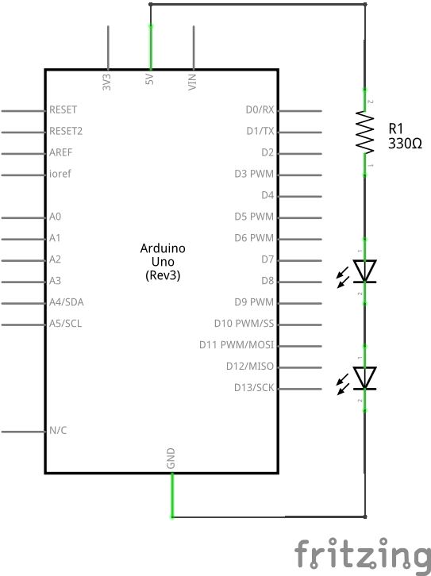
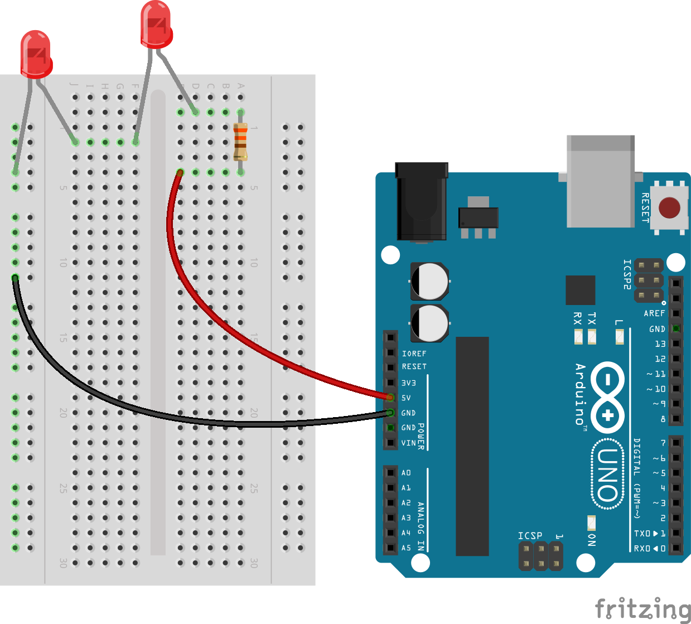
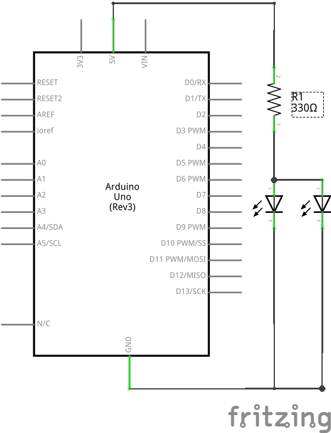
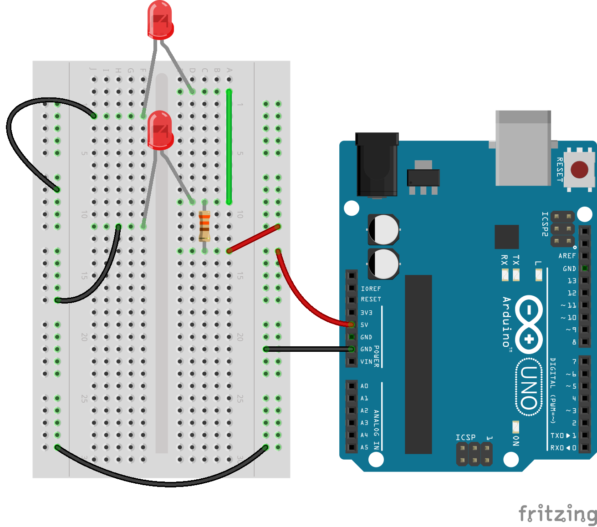

Shortcut to [today's lecture](lectureNotes.md/#todays-lecture)    


## New York University Abu Dhabi    
## Interactive Media Program    
## Course title: Introduction to Interactive Media  
Course number: IM-UH 1010   
Section: 1    
Credit Hours: 4         
Prerequisites: None       

Course website: [https://github.com/michaelshiloh/IntroductionToInteractiveMedia](https://github.com/michaelshiloh/IntroductionToInteractiveMedia)      
Instructor: Michael Shiloh mshiloh@nyu.edu    
Office hours: By appointment  
Meeting times: 10:25-1:05 Tu 11:50-1:05 Th   
Session: Fall 2021       
Class location: [Zoom](https://nyu.zoom.us/j/93719271713)   
[Discord](https://discord.com/channels/714727038078025851/716332110268465172)   

**This is subject to change**

### August 31 2021

#### Administration

- **Record Zoom!**
- Introductions
- Syllabus etc.
- Join the Discord server 
- **Connect to Zoom 10 minutes early**
	- This is to make sure you have time to fix any potential Zoom issues
	- You may keep your camera and mic turned off until class time

#### What’s the class about?

<ul>
 	<li>
Digital computation beyond computers (sometimes called "physical computing") considering humanistic needs in design and usability</li>
 	<li>
Computers traditionally lacked knowledge of outside world beyond a keyboard, mouse</li>
<li>Look critically at products and designs</li>
 	<li>
As artists and designers, we can explore new paradigms of interaction with machines and each other</li>
 	<li>
Relatively easily and inexpensively explore creative computation through open source software and hardware</li>
 	<li>
No background needed, strong DIY attitude</li>
 	<li>
Low barrier to entry, high ceiling</li>
</ul>
- Examples
<ul>
 	<li>Carlos Guedes' wonderful <a href="https://vimeo.com/235763130">Phobos</a>, Orquestra Robótica Disfuncional (1 min)</li>
 	<li>Sudhu Tewari's <a href="https://www.youtube.com/watch?v=MjNB3nKPMb8" >Yasmin Electro Mechanical Sequencer</a></li>
 	<li>List of <a href="http://eat.cca.edu/" >inspirational movies</a> collected by <a href="http://www.ultrafuzz.net/" >Barney Haynes</a> (also <a href="https://vimeo.com/barneyhaynes" >here</a>) and shown at his Interface classes.</li>
 	<li>List collected by <a href="https://github.com/zamfi">J.D. Zamfirescu</a>
<li><a href="http://www.youtube.com/watch?v=zkpH1BjD6Wc" >Tree-climbing robot</a></li>
<li><a href="http://www.youtube.com/watch?v=tOsNXg2vAd4#t=120" >Insect robot</a></li>
<li><a href="http://www.youtube.com/watch?v=YblSltHDbIU" >Treadbot</a></li>
<li><a href="http://www.future-cities-lab.net/projects/#/murmurwall/" >Murmur Wall</a></li>
<li><a href="http://vimeo.com/72826106" >Floating Couch</a></li>
<li><a href="https://www.youtube.com/watch?v=BZysu9QcceM#t=36" >Wooden Segment Mirror</a></li>
<li><a href="https://www.youtube.com/watch?v=pNkz8wEJljc" >Generative design</a></li>
<li><a href="https://vimeo.com/71044541" >Textile weaving</a></li>
<li><a href="https://www.youtube.com/watch?v=czuhNcNU6qU" >Projection mapping</a></li>
<li><a href="http://www.youtube.com/watch?v=sLVXmsbVwUs#t=20" >Laser
harp</a></li>
<li><a href="http://vimeo.com/57082262#at=130" >Arc-o-matic</a></li>
<li><a href="https://www.youtube.com/watch?v=w4cdbV2oaEc" >Eggbot</a></li>
<li><a href="http://www.youtube.com/watch?v=kx9D74t7GD8#t=89"
>Textspresso</a></li>
<li><a href="http://www.youtube.com/watch?v=pCC1GXnYfFI#t=11" >Shapoko / tinyg</a></li>
<li><a href="http://www.youtube.com/watch?v=NAbiAzYhTOQ" >Makerbot Replicator</a></li>
<li><a href="https://www.youtube.com/watch?v=0DNkbZvVYvc"
>Roomba</a></li></li>
 	<li><a href="https://www.youtube.com/watch?v=1G0MzlfMPuM" >Golan Levin: Art that looks back at you</a></li>
 	<li><a href="https://www.youtube.com/watch?v=PV_w38ldZaE" >Drawdio</a></li>
 	<li>Claire Neel's <a href="https://youtu.be/lYERKTf5YtI" >reactive eye</a></li>
 	<li>Professor Aaron Sherwood's <a href="http://aaron-sherwood.com/works/firewall/">Reactive Wall</a></li>
 	<li><a href="http://melissafelderman.com/digitalgraffitiwall/index.html">Digital Graffiti Wall</a></li>
 	<li><a href="http://www.willjfield.com/itp-2/explorer-space-simulator/">Space Simulator</a></li>
 	<li><a href="https://vimeo.com/114414122">Wind based jug organ</a></li>
 	<li><a href="http://www.yining1023.com/?p=392">Atmospheric Touch Lamp</a></li>
 	<li><a href="http://andysigler.com/projects/dipinator/">The Dipinator</a></li>
 	<li><a href="http://www.gabebc.com/Jitterbox">Jitterbox</a></li>
 	<li><a href="http://macdavel.blogspot.ae/">Youtube DDR</a></li>
 	<li><a href="https://lilikha.wordpress.com/">I Hand a Dream</a></li>
</ul>
</li>
</ul>

#### Let's get started

**Download Processing**
- Start now in case this takes a long time
- From [here](https://processing.org/download/)

**Github**
- What is Github?
- Difference between an account and a repository
- Follow along with me and create an account
- Instructions for this are
[here](https://github.com/michaelshiloh/resourcesForClasses#github-resources).

Please use your name for your account name so that I can more easily recognize it. 
If you don't want to use your name for privacy reasons, please choose an alias that I can
recognize as you.

Name your repository "Introduction to Interactive Media". 

- Edit your README.md file
	- What is README.md?
	- What is .md?
- Simple Markdown 
	- **Bold**
	- Paragraphs must be separated by a blank line
	- Inserting images: 
	- Always remember to commit your changes!
	- More [here](https://github.com/michaelshiloh/resourcesForClasses#github-resources).


**Processing**

#### Simple shapes

- `ellipse()`
- `rect()`
- `size()`
- `triangle(x1, y1, x2, y2, x3, y3)`
- `line()`
- `point()`

What does this all mean?
- Functions
- Arguments or parameters

Controlling color, fill, and stroke

- `color()`
- `stroke()`
- `noStroke()`
- `fill()`
- `arc(100, 100, 100, 100, 0, 180)`
- `arc(100, 100, 100, 100, 0, PI, CHORD)`

Here is the program we developed in class:

````
size( 400, 1000);

//rect(60,60, 100, 150);
//circle(50, 50, 60);
//ellipse( 100, 120, 100, 35);

line(200, 300, 200, 400);
line(230, 300, 230, 400);

point(50, 50);

// this will draw the body (I think)
fill(200, 100, 30);
circle(215, 270, 80);

noStroke();

// this muse be the head
 fill(0, 10, 255);
 circle(215, 200, 40);
 
 stroke(0, 100, 20);
 line(200, 200, 250, 200);
 
 arc(100, 100, 100, 100, 0, radians(130));
````

### September 2 2021

#### Administration

- **Record Zoom!**
- Questions from Tuesday?
- Where to get help
	- Google
	- Processing reference page
	- Discord

#### Variables

- `int myNumber = 45;`
- `int myRandomNumber = random(255);`
- `int myRandomNumber = round(random(255));`
How do we know what a variable's value is?
`print()` and `println()`

- There are many other variable types. 
`int` is by far most common, `float` being a close second
- Built-in variables
	- `width`, `height`, `mouseX`, `mouseY`
	- many others; we will discover more as we go along

#### Animation
- `draw()`
- `setup()`

````
int foo = 0;

void setup() {
  size(300, 300);
}

void draw() {
  ellipse(foo, 50, 40, 40);
  foo = foo + 1;
}
````

`background()`

Here are the two programs I developed in class:

````
// This program is in Static mode

size(100, 700);

// use the built-in variables width and height to calculate the circle center
circle(width/2, height/3, 100);


//int triangleTopLeftX;
//triangleTopLeftX = 50;

int triangleTopLeftX = 250;
int redValue;
redValue = round( random(256) ); // returns a random number up to but not including 256
fill(redValue, 10, 30);
triangle(triangleTopLeftX, 20,  // top left corner
         triangleTopLeftX+100, 30, // top right corner
         triangleTopLeftX+50, 200); // bottom corner

// use mouseX and mouseY to draw a small circle
circle (mouseX, mouseY, 30);
````

(In class I said this was Dynamic mode but I was wrong; it's called *active
mode*:)

````
// Active mode
void setup() {
  size(500, 500);
}

int triangleTopLeftX = 0;
int redValue = 255;
void draw() {
  // erase the trail of circle
  background(10, 255, 255);

  circle(mouseX, mouseY, 30);
  println("mouse coordinates = " + mouseX + ", " + mouseY);

  if (triangleTopLeftX >= width)
  {
    triangleTopLeftX = 0;
  }
  triangleTopLeftX += 1;

  if (redValue == 155)
    redValue = 255;
  redValue -= 1;
  fill(redValue, redValue-100, redValue-100);
  triangle(triangleTopLeftX, 20, // top left corner
    triangleTopLeftX+100, 30, // top right corner
    triangleTopLeftX+50, 200); // bottom corner
}
````

Here is the program that one of the students (I didn't catch who this was)
developed to change the color smoothly as the triangle moved 
across the canvas. I will discuss this next week:
````
// Dynamic mode

void setup() {
  size (500, 500);
}

int triangleTopLeftX = 0;

void draw() {

  background(10, 255, 255);

  // use mouseX and mouseY to draw a small circle
  fill(0);
  circle (mouseX, mouseY, 30);
  println("mouse coordinates = " + mouseX +"," + mouseY);

  {

    triangleTopLeftX = triangleTopLeftX + 1; // trying to get it to move
    if (triangleTopLeftX >= width) {
      triangleTopLeftX = 0;
    }

    int redValue;
    redValue = round( random(256) ); // returns a random number up to but not including 256
    fill(redValue, 10, 30);
    triangle(triangleTopLeftX, 20, // top left corner
      triangleTopLeftX+100, 30, // top right corner
      triangleTopLeftX+50, 200); // bottom corner
  }
}
````

### September 7 2021

#### Administration

- **Record Zoom!**
- Questions from Thursday?

#### Review: 

- Static vs. active mode
- Variables
- Built-in variables
- Variables declared outside of `draw()` or `setup()` can be changed later
- `println()`

````
// Example usage of a global variable

int count; // this is now a global variable

void setup() {
  circle(50, 50, 30);
  count = 7; // the variable is initialized here
}

void draw() {
  count = count + 1; // not algebra!
  // The result of the right hand side calculation
  // replaces whatever value was stored in the variable
  // on the left side of the '=' sign
  // end result: the variable "count" is incremented by 1

  println (count);
}
````

`frameRate()`

````
void setup() {
  println(frameRate);  // frameRate is a built-in variable
  frameRate(10);       // frameRate() is a function
  println(frameRate); // it takes awhile for the frame rate to change
}

void draw() {
  println(frameRate);
}
````

#### Interaction with Processing

- conditionals

````
void setup() {
  size(300, 300);
}

void draw() {
  if (mousePressed == true) {
    background(color(0, 0, 255));
  } else {
    background(color(200, 0, 0));
  }
}
````

You can also use the `mousePressed()` function. Note that there is a huge
difference between the `mousePressed` variable and the `mousePressed()` 
function: the variable `mousePressed` is true as long as any mouse button 
is pressed, while the function `mousePressed()` is called only once whenever 
a mouse button is pressed, no matter how long it's pressed for:

````
int pressCount = 0;
int mouseClickCount = 0;
boolean mouseWasPressed = false;

void setup() {
  frameRate(2.5); // slow down so can see blue background
}

void draw(){
  if (mouseWasPressed) {
    background(color(0, 0, 255));
    mouseWasPressed = false;
  } else {
    background(color(200, 0, 5));
  }
  println(mouseClickCount);
}

void mousePressed() {
    mouseWasPressed = true;
    mouseClickCount = mouseClickCount + 1;
}
````

**Important concepts**:
1. `mousePressed` is another built-in variable. There are many others.
1. `mousePressed` is a new type of data, namely a `boolean`, which means it has
	 only one of two values, `true` or `false`
1. Note that `{` and `}` indicate the blocks
1. The `else` part of an `if()` statement is optional (what happens if we
	 remove it?)

- Two more interesting built-in variables: `mouseX`, `mouseY`
	- Using the cursor to draw
	- Now use a mouse press to clear the screen
	- Note the difference between a press, click, and release
	- (Time permitting, primitive painting program)

#### Loops
`while()` is like `if()` but it keeps on doing it as long as condition is true

````
void setup() {
  size(300, 300);

  int foo = 50; // create and initialize a variable

  while (foo < width) { // keep going as long as the condition is true
    ellipse(foo, 50, 40, 40);
		// modify the variable so something different happens next time
    foo = foo + 50; 
  }
}
````

1. You should get in the habit of giving meaningful names to your variables.
	1. What is a better name for the variable foo?
1. What would happen if you replace the `while()` with `if()`?

There is another way to make a loop using the keyword `for()`. The `for()`
loop structure combines the initialization step and the incrementation step
into the `for()` loop construction:

````
void setup() {
  size(300, 300);

  // initialization, condition, and incrementation all in one line
  for (int foo = 50; foo < width; foo = foo + 50)  {
    ellipse(foo, 50, 40, 40);
  }
}
````

Which should you use? Whichever is easier for you to understand. Remember that
**most of the time spent programming is fixing problems**, and **whatever you
understand best will probably have fewer problems**.

Here is the debugging we did at the end of class. As I explained, the
`print()` and `println()` functions are great ways to find out what your
program is doing. Sometimes figuring out what to print, and the best way
to print it to see the problem, is a bit of an artform that improves with
time:

````
//How to use the '+' sign to create a string suitable for printing from a variety
//of string literals and variables

void setup() {
  size(700, 700);
  int yPos = 0;
  int xPos = 0;
  for (yPos = 30; yPos < height-30; yPos=yPos + 40) {
    for (xPos = 20; xPos<width-60; xPos=xPos + 40) {

      line(xPos, yPos, yPos, yPos); // this draws horizontal lines, many on top of each other
      // line(xPos, yPos, xPos, xPos); // this draws vertical lines, many on top of each other
      println("line from (" + xPos + "," + yPos + ") to ("  + yPos + "," + yPos + ")");
      // rect(xPos, yPos, 40, 40); // This effectively draws the grid
    }
  }
}
````

### September 9 2021

#### Administration

- **Record Zoom!**
- Questions from Tuesday?
- Look at Github links
- Look at homework for next week
- Look at discussion leaders

#### Functions

Every time you use one of the built-in 'commands', you are really using (or
more properly 'calling') a built-in function. Functions are a very important
building block of programming, and in addition to using built-in functions,
you can also create your own. In fact, you've already been doing that, when
you created the `setup()` and `draw()` functions. In the case of
`setup()` and `draw()` you have to use those names, but when you create other
functions you can make up your own names. Just like variables names, good 
function names make your programs easier to understand.

Why create your own functions?

- Reuse (if it's something you might do again)
- Clarity (remember your three important audiences: yourself, others learning
	from you, me when I grade your work)
- Easier to debug (what is debugging?)
	- One of the most powerful ways to approach
	a bug is to reproduce it with simplest possible example. 
	This is much easier when the thing that's causing
	the problem is already a function.
- Modularity
- Flexibility (with good choice of parameters)

Let's modify the example from last class to use a function. First let's draw a
house instead of a circle to make it a little more interesting:

````
void setup() {
  size(300, 300);

  // initialization, condition, and incrementation all in one line
  for (int foo = 50; foo < width; foo = foo + 50)  {
    rect(foo, 50, 40, 40);
    line(foo, 50, foo+20, 30);
    line(foo+20, 30, foo+40, 50);
  }
}
````

Now let's make a function called `drawOneHouse()`. If we want to
draw a house at different locations, we need a way to tell
the function `drawOneHouse()` where to put the house. Functions accommodate
this by allowing us to pass information into the function by putting 
that information in the parenthesis. In the function, we store this
information in temporary variables that we can use in the function:

````
void setup() {
  size(300, 300);

  for (int foo = 50; foo < width; foo = foo + 50) {
    drawOneHouseAt(foo);
  }
}

void drawOneHouseAt(int x) {
  rect(x, 50, 40, 40);
  line(x, 50, x+20, 30);
  line(x+20, 30, x+40, 50);
}
````

**Things to notice**
1. I've said this before and I'll keep saying: 
	**Choose descriptive names for your variables and functions!** 
	`foo` is a bad name, `xPos` is a good name,
	 `houseXPos` is a better name.
1. The value of `foo` (50, 100, 150 ...) is the information passed to the
	 function so that the function can do it's work. The proper name for this
	 information is an **argument**
1. The variable `x` is a temporary variable that **only exists in the function**.
	 This variable is used to store the argument that was passed into the
	 function so that the function can do its work. Once the function is
	 finished, this variable is no longer needed and is destroyed. 
	 A variable used in this way is called a **parameter**
1. Functions may take zero, one, or multiple arguments. When you write 
	a function, you decide how many arguments you need. For example, we might
	have included the house size or roof height or house y location. (Of course
	when you use functions that someone else wrote 
	you must use the proper number of parameters.)
1. Functions can return information as well, for example the `random()`
	 function. Functions can either return one piece of information, or none.
	We will see later how to do this. If your function returns no information,
	use the word `void` in front of the function name to indicate this.
1. Finally we understand why `setup()` and `draw()` have the world `void` in
	 front of them! They are functions that return no information, just like
	 our function `drawOneHouseAt()`

#### Variable Scope

````
int foo;  // this is a global variable, visible in all functions

void setup() {
  foo = 7;
}

void draw() {

  println(foo);

  int bar; // this is a local variable, visible only inside of draw()

  for (int i = 0; i < width/2; i++) { 
    // i is a local variable visible only inside this for() loop
    ellipse(i, height/2, 10,15);
  }
}
````

### September 14 2021

#### Administration

- **Record Zoom!**
- Questions from last week?
- Review: The `draw()` function

In class exercise:

1. Write a function that will take a single parameter
and draw a vertical line from the top of the canvas to the bottom
at the X coordinate indicated by the parameter
	1. In the `setup()` function test your function 
	at a couple of different locations
1. Write another function that will draw a **horizontal** line
at the indicated **Y** coordinate
	1. Test as before
1. Using these two functions, write a program in `setup()`
that draws a grid of lines at regular intervals on the canvas

Discussion:

- What debugging methods helped you find and fix problems?
- What other functions might be useful?
- What other parameters might be useful?

#### Motion

Let us use make a ball bounce on the floor. First, make a circle move:

<pre>void setup() 
{ 
  size(500, 500);
  x = width/2;
} 

float speed = 5;
float x;
float y = 0;

void draw() {
  background(150);

  ellipse(x, y, 20, 20);

  y+=speed;
}
</pre>

Now, make it change directions when it hits the floor:

<pre>void setup() 
{ 
  size(500, 500);
  x = width/2;
} 

float speed = 5;
float x;
float y = 0;

void draw() {
  background(150);

  ellipse(x, y, 20, 20);

  y+=speed;

  if (y>=height) {
    speed = -speed;
  }
}
</pre>

Now, do two thing: 1) use gravity to increase its speed as it falls and 2) reduce its speed on each bounce:

<pre>

float gravity = .1;
float speed = 0;
float x = 320;
float y = 0;

void setup() 
{ 
  size(500, 500);
} 

void draw() {
  background(150);
  ellipse(x, y, 20, 20);

  y+=speed;

  speed+=gravity;

  if (y>=height) {
    speed = 0.95 * speed; // this slows the acceleration
    speed = -speed; // this reverses
  }
}
</pre>

Discussion:

- What functions might be useful here?
- How can we use the `random()` function to make things more interesting?
- What about multiple bouncing balls?
- How could I make the ball move sideways?
- How could I make it bounce off the walls as well?

#### Arrays 

````
final int numberOfValues = 10;

int[] values = new int[numberOfValues];

int n = 0;
while (n < values.length) {
  values[n] = (n+1) * (n+1);
  n = n + 1;
}

for (int i = 0; i < values.length; i++) {
  println(values[i]);
}
````

**Things to notice**

- Similar to the way functions are signified by `()`, 
	arrays are signified by `[]`
- Arrays can be of any data type, but can't be mixed types
- Two new concepts:
	- `final` keyword
	- `new` keyword
- Why not just use ten "normal" variables?
- Arrays and loops (either `for()` or `while()`) almost always show up
  together. If you have an array, you almost always want a loop.
- Note that the `while()` loop used to put the numbers into the array
	is exactly the same as the `for()` loop used to print the array. I could
	have used either in both places. I did this to show you that they are
	interchangeable.

#### How to add more examples into Processing

For example, from Dan Shiffman's book *Learning Processing*

1. File -> Examples -> Add Examples
1. type `learning processing` in the search box
1. select the one we want

Now you can see all examples from Dan's excellent book 

1. File -> Examples -> Contributed Examples

The examples are also online [here](http://learningprocessing.com/examples)

You will find many interesting examples in there, including many on arrays.

A more advanced array example, and introduction to the very useful `map()`
function:

````
float[] coswave; 

void setup() {
  size(900, 300);
  
  coswave = new float[width];
  for (int xPosition = 0; xPosition < width; xPosition++) {
    coswave[xPosition] = cos(radians(xPosition));
  }
  background(255);
  noLoop();
}

void draw() {
  for (int xPosition = 0; xPosition < width; xPosition++) {
    float waveHeight = map(coswave[xPosition], -1, 1, 0, height);
    point(xPosition, waveHeight);
  }
}
````

**Remember**
- Arrays and loops (either `for()` or `while()`) almost always show up
  together. If you use an array, you probably want a loop.
- Just like single variables and functions, 
	**choose good names for your arrays!**

**Things to notice**
* In the first array example, 
I created the variable that would store the
array, and created the ten `int`s, all in one line. 
In this cosine example,
I created the variable that would store the array globally, 
and then I created the `float` variables inside of `setup()`.
Either way works; sometimes you will find you have to do it one
way or the other, but for the most part it's your choice.
* I used `noLoop()` because this only needed to run once. In fact
I didn't even need to use `draw()`, 
I could have put all the action into `setup()`. I did it this way so that I
could introduce you to the `noLoop()` function
* How did I get the height of the wave to perfectly fit the height?
Practice using the `map()` function, it is incredibly useful
and works in Arduino also exactly the same way.

#### Classes

[this](https://github.com/michaelshiloh/simpleProcessingClassExample)


### September 16 2021

#### Administration

- **Record Zoom!**

#### Class discussion

- Chance Operations
- What is generative artwork?
- Look at homework

#### Review

- Arrays
- Functions
- Classes

Here is the code we developed in class:

````
class Boxes {

  float xPos, yPos, xSize, ySize;
  color myColor;

  Boxes( float _xSize, float _ySize) {
    xSize = _xSize;
    ySize = _ySize;
    xPos = random (0, width);
    yPos = random (0, height);

    myColor = color(random(0, 256),
      random(0, 255),
      random(0, 255));
  }

  void drawBox() {
    fill(myColor);
    rect(xPos, yPos, xSize, ySize);
  }
}

// Boxes mybox;
Boxes[] myBoxArray = new Boxes[40];

void setup() {
  size(500, 500);
  
  //mybox = new Boxes(30, 40);
  for (int i=0; i < myBoxArray.length; i++) {
    myBoxArray[i] = new Boxes(
          i*2, random(5,50));
  }
  
  //mybox.drawBox();
  for (int i=0; i < myBoxArray.length; i++) {
    myBoxArray[i].drawBox();
  }
}

````

### September 21 2021

#### Administration

- **Record Zoom!**

#### Transformations
Transformationss move the canvas relative to the coordinate sysem
so you can draw in different places with the same code
- Available 2D transforms are 
	- `translate()`
	- `rotate()`
	- `scale()`
- pushMatrix() and popMatrix() allow you to remember where the canvas was, 
and then return to it's last position

Example: Draw a house at a given location, no transform:

````
void house(int x, int y)
{
  triangle(x + 15, y, x, y + 15, x + 30, y + 15);
  rect(x, y + 15, 30, 30);
  rect(x + 12, y + 30, 10, 15);
}
````

Same result, but using a transform:

````
void house(int x, int y)
{
  pushMatrix();
  translate(x, y);
  triangle(15, 0, 0, 15, 30, 15);
  rect(0, 15, 30, 30);
  rect(12, 30, 10, 15);
  popMatrix();
}
````

##### Rotation and scaling 

Work through 
<a href="https://processing.org/tutorials/transform2d/">this</a> 
tutorial

* As always, Dan Shiffman has excellent
[examples](http://learningprocessing.com/examples/chp14/example-14-02-multiple-translation).

#### Text

````
String message= "Important message";

void setup() {
  size(640, 360);

  // What fonts are available?
  // String[] fontList = PFont.list();
  // printArray(fontList);

  PFont f = createFont("monaco", 32);
  textFont(f, 32);

	color myFavoriteColor =color(255, 0, 0);
  fill(myFavoriteColor);

  textAlign(CENTER);
  text(message, width/2, height/2);
}
````

**Things to notice**

* New datatype called `PFont`
* New datatype called `color`
* `fill()` and `textAlign()` will apply to any further texts or shapes until
they are changed

Some advanced examples using text are
[here](https://github.com/aaronsherwood/introduction_interactive_media/tree/master/processingExamples)

Some awesome examples alas without code:
- https://www.syedrezaali.com/generative-typography-experiments/

##### Data Visualization

What is data visualization? Here are some examples:

- [Ben Fry](http://benfry.com/allstreets/)
- [Aaron Koblin](http://www.aaronkoblin.com/project/flight-patterns)
- [Jer Thorp](https://www.jerthorp.com/portfolio) e.g. Just Landed

###### Finding data

Sources

- https://www.springboard.com/blog/free-public-data-sets-data-science-project/
- https://www.ndbc.noaa.gov/rt_data_access.shtml
- https://www.kaggle.com/datasets
 	
Format

- The most common format is CSV, especially as you can use any spreadsheet
	(Excel, OpenOffice Calc, Google Sheets) to export any table in CSV format
- Other formats are JSON and XML. We won't spend much time on them, but there
	are Processing libraries available for parsing them

### September 23 2021

#### Administration

- **Record Zoom!**
- Discussion: The Art of Interactive Design (Shumin and Boby) (20 minutes max)

##### Worked example: Getting and working with a CSV file

- A [database](https://eerscmap.usgs.gov/uswtdb/) of energy generated by wind turbines
- Click "Get Data"
- Scroll down a bit to "Tabular Data: CSV format" and click on "CSV
format". 
	- This will download a `.zip` file.
- Unzip the file. 
	- This will create `uswtdb_v4_1_20210721.csv`
- This is a plain text file; you can view it with a text editor
	- You will see that the first line is the heading of each column
	- Some of the fields are numerical (e.g. case_id)
	- Some of the fields are text (e.g. t_state, t_county)
	- Some of the fields are missing (e.g. faa_ors, faa_asn)
- Now you can load this file into an array of `Strings` and then process each
	line one at a time, pulling out individual fields. All this is done in the  
[example](https://github.com/michaelshiloh/resourcesForClasses/tree/master/src/processingSketches/visualizeWindTurbineData)
we looked at in class


Things to notice:
1. The `split()` function does half the magic
1. The `int()` or `float()` function does much of the rest
1. data files might have errors in them and you need to defend your program
	 against them
1. `loop()` and `noLoop()` can be used anytime you want to start or stop the
	 `draw()` function from repeating


More complex examples are in Aaron Sherwood’s Introduction to Interactive Media <a href="https://github.com/aaronsherwood/introduction_interactive_media">Github repository</a>
<ul>
 	<li>load/split strings: splitCommas.pde</li>
 	<li>load save table: tableSaveLoad.pde</li>
 	<li>forces: lettersGravityWind.pde</li>
</ul>

##### JSON and XML: Other file formats

JSON and XML are other format for organizing data in a file. 
They are more complex than CSV, and again Processing provides functions.

For example for 
parsing [JSON](https://processing.org/examples/loadsavejson.html)

If you want to learn more about JSON and also XML, 
[this](https://www.youtube.com/watch?v=rqROpUNb2aY)
is a good introductory video tutorial.

##### Generative Text
Pull words from a CSV file 
and by using `random()` in a clever way,
write poems or slogans or whatever. 

Here is a terribly lame example:

````
/*
Generate poetry from a file of words
 the file has words in this format:
 
 roses,red,violets,blue,dream,disneyland
 
 we will refer to them as:
 
 item1,color1,item2,color2,verb,location
 
 and construct a poem:
 
 item1 are color1, item2 are color2
 when I verb I verb to location
 */

// Let's put the index of the word into numbers:
final int ITEM1 = 0;
final int COLOR1 = 1;
final int ITEM2 = 2;
final int COLOR2 = 3;
final int VERB = 4;
final int LOCATION = 5;
// final means that I will not change these variables
// It is conventional to use all caps for variable names that will not change


String strings[];

void setup() {

  // The text from the file is loaded into an array.
  strings = loadStrings("mydatafolder/words.csv");

  // How many lines did we get?
 // println("strings array contains this many lines: " + strings.length);
}

int csvRowNumber = 0;

void draw() {
  String singleRow[];

  // First line: "item1 are color1, item2 are color2"

  // Pick a random number, round that number DOWN to a whole number,
  // and split that row into individual words
  singleRow = split(strings[int (random(strings.length))], ',');
  // get item1
  print(singleRow[ITEM1]);

  print(" are " );

  // Now keep doing this for each word
  singleRow = split(strings[int (random(strings.length))], ',');
  // get color1
  print(singleRow[COLOR1]);
  
  // need a space between COLOR1 and ITEM2
  print(", " );

  // Now the second half of the first line: "violets are blue" 
  singleRow = split(strings[int (random(strings.length))], ',');
  print(singleRow[ITEM2]);
  print(" are " );
  singleRow = split(strings[int (random(strings.length))], ',');
  // get color1
  print(singleRow[COLOR2]);


  // that's the end of the first line of the poem so start a new line
  println();

  // Now the second line: when I verb I verb of location

  print("When I " );  
  singleRow = split(strings[int (random(strings.length))], ',');
  print(singleRow[VERB]);
  print(" I " );
  singleRow = split(strings[int (random(strings.length))], ',');
  print(singleRow[VERB]);
  print(" to the " );
  singleRow = split(strings[int (random(strings.length))], ',');
  print(singleRow[LOCATION]);

  // that's the end of the second line of the poem so start a new line
  // and also put an extra blank line
  println();
  println();

  noLoop(); // Wait for a mouse click then do it again
}

// If you click the mouse, allow the draw() function to resume
void mouseClicked() {
  loop();
}
````

and this is an example of the words you can feed it. If you copy the program
exactly as I have, you should make a folder called `mydatafolder` in the same
folder as the sketch, and then put these contents into a file called
`words.csv`:

````
roses,red,violets,blue,dream,disneyland
robots,silver,pencils,grey,run,supermarket
goldfish,orange,motors,white,turn,workbench
books,multicolored,lamposts,azure,swim,island
computers,black,mice,pink,squeak,home
````

(Time permitting)
#### More Data Visualization and generative text:


show text on screen
have students make a scroller in pairs
show how to get by char
make scroller again by char
add randomness/perlin noise
have them look at circle letters, come up with questions and explanations in
pairs
have students work through example on their own and use data
show split lines and table
then have them work with cupcake data https://trends.google.com/
show generative basic example
have them work in pairs to make something
share what they made
show generative word from circles sketch


### todays-lecture
### September 28 2021

#### Administration

- **Record Zoom!**
- Ume and Jack at 12:55
- Look at homework

#### Working with Images

To work along with me, either prepare an image file that you can work with or
download
[this](media/aiweiwei.jpeg)
image

<strong>PImage</strong>
<ul>
 	<li>Just another class, i.e. it has
<ul>
 	<li>Data (the pixels, width, height, etc.)</li>
 	<li>Functionality `(image()`, `get()`, etc.)</li>
</ul>
</li>
</ul>

````
PImage photo; 

void setup() { 
  size(700, 700); 
  photo = loadImage("/home/michael/tmp/intro/aiweiwei.jpeg");
} 

void draw() { 
  image(photo, 10, 10);
	// How do you suppose you might scale the image?
}
````

Things to notice

- Get familiar with the error *NullPointerException*
	- What can you do to write robust code?
- If you do not specify a complete path Processing will look 
in the same folder as the sketch and
for a folder called *data* in the same folder as the sketch
(I'm not sure in what order)


- `image(photo, positionX, positionY, width, height)` - display 
this image at this location and scale to this size
- `photo.resize(w,h)` - scale to this size. If one of the arguments is zero,
	then scale to the remaining argument and retain the original aspect ratio.
- `photo.get(x,y,w,h)` - Gets a portion of the image
- `photo.get(x,y)` - Gets the color of the pixel at this location

````
PImage photo;

void setup() {
  photo = loadImage("/home/michael/tmp/intro/aiweiwei.jpeg");

  size(700, 700);

  image(photo, 10, 10);

  PImage newImage = photo.get(400, 550, 100, 100);

  image (newImage, 50, 50);
}
````

Also

````
tint(red, green, blue);
imageMode(CENTER);
````

Arrays of images

Example15-3: *Swappingimages* from Dan Shiffman's *Learning Processing* 


<strong>Pixels</strong>

You can access individual pixels 
from the canvas (and whatever is on the canvas)
using the special built-in array called `pixels`. 
Before using this array you must load images from the canvas 
into the `pixels` array using the `loadPixels()` function, 
and after making any changes you must call `updatePixels()` 
to write from the `pixels` array back to the canvas
if you want to make changes to the canvas

````
color pink = color(255, 102, 204);

loadPixels();

// change the first row to pink
for (int i = 0; i < width; i++) {
  pixels[i] = pink; 
}

updatePixels();
````

the pixels array is one-dimensional, 
meaning if you want to go to a different row on the canvas 
you need to offset by that many widths:


````
color pink = color(255, 102, 204);

loadPixels();

// Change the fifth row to pink
for (int i = width*5; i < (width + width*5); i++) {
  pixels[i] = pink;
}

updatePixels();
````

It's important to remember that a pixel is just a color (red, green, blue).
Anything so you can manipulate pixels mathematically 
e.g. make it fade:

````
int r = 255;
int change = -1;
void setup() {
  size(500,500);
}

void draw() {

  color myColor = color(r, 102, 204);

  loadPixels();
  for (int i = 0; i < width * height; i++) {
    pixels[i] = myColor;
  }
  updatePixels();

  r -= change;

  if (r < 0 || r > 255) {
    change = -change;
  }
}

````

The `pixels` [data
type](https://processing.org/reference/color_datatype.html)

Some fun examples from Professor Sherwood:


````
PImage img;
PImage[] tiles;

int tileSize = 100;

void setup() {
  size (400,400);
  img = loadImage("/home/michael/tmp/intro/aiweiwei.jpeg");
  tiles = new PImage[img.height/tileSize];
  for (int i=0; i< tiles.length; i++) {
    tiles[i] = img.get(int(random(img.width-tileSize)), int(random(img.height-tileSize)), tileSize, tileSize);
  }
  imageMode(CENTER);
}

void draw() {
  pushMatrix();
  translate(width/2, height/2);

  int numSegments = 10;
  float eachAngle = TWO_PI/numSegments;
  int whichImage = (int)random(tiles.length);
  for (int i = 0; i< numSegments; i++) {
    float x = cos(eachAngle*i)*tileSize+1;
    float y = sin(eachAngle*i)*tileSize+1;
    pushMatrix();
    translate(x, y);
    rotate(eachAngle*i);
    image(tiles[whichImage], 0, 0);
    popMatrix();
  }

  popMatrix();
  noLoop();
}

void keyPressed() {
  loop();
}
````

Here is a more complex version, on which I based the simple version above: [circularImages.pde](https://raw.githubusercontent.com/aaronsherwood/introduction_interactive_media/master/processingExamples/pixels/circularImages/circularImages.pde)

Can we use a sequence of images for animation?


How would we use them?

Aaron's
[method](https://raw.githubusercontent.com/aaronsherwood/introduction_interactive_media/master/processingExamples/pixels/spritesheet/spritesheet.pde)

#### Working with a camera: Computer Vision!

- Add the video library
	- Sketch -> Import Library -> Add Library
	- Filter by video
	- Install the *Video | GStreamer-based video library for Processing*

Try
[this](https://github.com/michaelshiloh/resourcesForClasses/blob/master/src/processingSketches/computerVision/frameDifferencing/frameDifferencing.pde) example

#### Perlin Noise

````
void draw() {
  background(204);
  float n = random(0, width);
  line(n, 0, n, height);
}
````

What if we wanted the line to move in a more organic, lifelike
fashion? Organic things (e.g. butterflies, leaves blowing in the wind, clouds) 
don't jump instantly from one place to another,
they tend to move close to where they were last time

````
float offset = 0.0;

void draw() {
  background(204);
  offset = offset + .01;
  float n = noise(offset) * width;
  line(n, 0, n, height);
}
````

Things to notice:

* Why is the variable `offset` global? (Remember our discussion of variable
	scope)

#### Events

````
final int maxColors = 10;
color[] myColors = new color[maxColors];

int colorChoice = 0;

void setup() {
  size(600, 500);

  for (int i = 0; i < myColors.length; i ++ ) {
    myColors[i]=color(random(255), random(255), random(255));
  }
}

void draw() {
}

void mousePressed() {
  background(myColors[colorChoice]);
  colorChoice ++;
}
````

Things to notice:

* How does the background change if I never call `mousePressed()`?
`mousePressed()` is a *callback function*, meaning we have told
Processing that we are interested in this event, and if it occurs,
call this function. There are many different types of events available in
Processing, and you register an interest in them by creating a callback
function with the appropriate name. See *mouse* and *keyboard* 
in the Processing Reference Page.

* What happens if I click the mouse more than 10 times?  

##### Array Lists

Arrays are great, but they are of fixed size. There is an extension of the
array concept called an ArrayList which allows the size to be manipulated
dynamically.

Here is a short example showing how to work with ArrayLists:

````
class Thing {
  int i;
  float f;
  
  Thing(int _i, float _f) {
    i = _i;
    f = _f;
  }
  
  int getInt() {
    return i;
  }
  
  float getFloat() {
    return f;
  }
}

ArrayList<Thing> myThings = new ArrayList<Thing>();

void setup() {

  // The ArrayList should be empty
  println(myThings.size());

  for (int i = 0; i < 10; i++) {
    myThings.add(new Thing(i, float(i)));
    println(myThings.size()); // not that size() is a function!
  }

  // The value at index 5 should be 5
  // Just like arrays, the index starts at zero
  // so index 5 is the sixth item
  println("at index 5, x = " + myThings.get(5).getInt());
}

void mouseClicked() {
  myThings.add(new Thing(mouseX, mouseY));
  println("added a new Thing at mouse location x = " + mouseX + " y = " + mouseY);
}

void keyPressed() {
  if (key == 'd') {
    myThings.remove(0); // remove the first vector
    println("removed the first Thing, array size is now " + myThings.size());
  }

  if (key == 'p') {
    for (int i = 0; i < myThings.size(); i++) {
      Thing t = myThings.get(i);
      println("index = " + i + " int = " + t.getInt() + " y = " + t.getFloat());
    }
  }
}

// Need to have a draw() function so that callbacks occur
void draw() {
}
````

### September 30 2021

#### Administration

- **Record Zoom!**

#### Class

Discussion: Lauren McCarthy’s Eyeo talk You, Me and My Computer (Injoo)

Share midterm project ideas

Time permitting, working in groups:

- Look at homework (data visualizations or generative text output) and look at
	each other's code

### todays-lecture
### October 5 2021

#### Administration

- **Record Zoom!**

#### Announcements

Endless Studios Informational Kickoff

- When: October 6th, 6-7pm (bus will depart NYUAD at 5pm)
- Where: Group42 Headquarters, Captial Gate building, Abu Dhabi

The Interactive Media program has partnered with 
[Group42[(https://g42.ai/] and 
[Endless Studios](https://endless-studios.itch.io/)
(an apprentice-based youth game studio) in a program where students, in groups
of 5, create a video game together under the guidance of an Endless Studios
mentor. At the end of the mentorship period you will have the opportunity to
continue with your game in an incubator or be paired with industry internships
in Abu Dhabi. We're planning an informational kickoff event at Group42's
headquarters in Abu Dhabi on October 6th. Space is limited, only 14 spots, so
sign up quickly! If there is enough interest we may open up a second date.

Sign up
[here](https://docs.google.com/forms/d/e/1FAIpQLSdtVJym8KaydEgvXOJ79eQq0wVBmiHBT1Vf6Ei7EJNqC-YB2w/viewform)

This event is open to NYUAD students only.

#### Documentation

- Midterm documentation must be excellent
	- Include photos, sketches, GIFS as appropriate
- Include block at the beginning of the code
- ^T
- Unused variables or functions
- Commented out code

#### Sound

Sound library [reference
page](https://processing.org/reference/libraries/sound/index.html)

##### Install the Sound library

- Sketch -> Import Library -> Add Library (notice many other library
	options)
- Search for Sound
- Install *Sound* written by *The Processing Foundation*

##### Playing with examples

- File -> Examples -> Libraries -> Sound -> Soundfile -> Keyboard
- File -> Examples -> Contributed Examples -> Learning Processing ->
chp_20_sound -> example_20_02_sound_effect
	- The sound file *beat.mp3* has never worked for me


##### Working in groups: 
If we had multiple sound files, how would we play the
next one when we click the mouse?

### todays-lecture
### October 7 2021

#### Administration

- **Record Zoom!**

Example solution to in-class exercise from last meeting

````
import processing.sound.*; //* load the sound library

SoundFile[] songs;
final int numberOfSongs = 5;

SoundFile currentSong;

void setup() {
  size(400, 500);

  songs = new SoundFile[numberOfSongs]; // makes the array of songs

  // open each file and put it in the songs array
  for (int i = 0; i< numberOfSongs; i++) {
    songs[i] = new SoundFile( this, "/tmp/" + (i+1) + ".aif");
  }
  currentSong = songs[0];
}

void draw() {
}

void mousePressed() {

  if (currentSong.isPlaying() == false ) {
    int songToPlay = (int) random(numberOfSongs);
    songs[songToPlay].play();
    currentSong = songs[songToPlay];
  }
}
````

Another [solution](https://github.com/aaronsherwood/introduction_interactive_media/tree/master/processingExamples/sound/shortFile/shortFile.pde)

##### Blocking vs. non-blocking functions

- Which function is non-blocking?
- How do you know when a non-blocking function is done?
- Soudfile [reference
	page](https://processing.org/reference/libraries/sound/SoundFile.html)

##### Working in groups: 
Use the mouse position to select sound tracks

Try to work it out on your own before looking at the 
[solution](https://github.com/aaronsherwood/introduction_interactive_media/tree/master/processingExamples/sound/loopingFiles/loopingFiles.pde)

##### Synthesis

- File -> Examples -> Libraries -> Sound -> Oscillators -> SineWave
- File -> Examples -> Libraries -> Sound -> Effects -> BandPassFilter

We can create our own complex sounds starting with basic oscillators and then
changing the envelopes. [Example](https://github.com/aaronsherwood/introduction_interactive_media/blob/master/processingExamples/sound/synthesis/synthesis.pde)

##### What is
[sound](https://intro.nyuadim.com/2020/10/13/week-6-sound/)?

### October 12 2021

#### Administration

- **Record Zoom!**

#### Discussion

- The Design of Everyday Things, The Psychopathology of Everyday
Things (Fiona and Angelica)

#### Debugging

What methods do you use for debugging?

#### Problem solving

### October 26 2021

#### Administration
- **Record Zoom!**

#### Electricity 

**Simple circuit using Arduino, LED, and Resistor**

The most confusing part of this lecture will be the solderless breadboard:

Image courtesy of
[SparkFun](https://learn.sparkfun.com/tutorials/how-to-use-a-breadboard/all)

Here is how to build the circuit


**Theory**

Electricity is mysterious

- We can predict what it will do quite accurately, but don't really understand
	it what is it
- Flow of electrons
- Electrons want to move from place of higher potential energy to place of lower potential energy
	- Like a rock or water falling from a height
	- Unlike a rock or water, electricity can only travel in a conductor
- AC vs. DC - very briefly, will discuss more as it comes up

What makes a circuit?

- Something to provide that difference in potential 
that will cause the electrons to want to move. 
	- Typically a battery, charger, or USB port
	- The technical term is "power supply"
	- In our case your laptop via the Arduino
		- What is the Arduino doing in this case?
- Conductors to allow the electronics to move
- Components or other things that usually convert this electrical energy 
to some other form of energy (e.g. light, sound, heat, movement)
- Optionally, switches or other sensors to control the flow of energy
	- In our circuit the resistor is controlling the brightness of the LED so that it doesn't burn out

Schematics

Here is the schematic of what you've built


- Important part of something, 
	without getting distracted by details (e.g. subway maps)
- What's important in an electrical schematic?
	- Where is the power coming from?
	- What other components are there in the circuit?
	- How are they connected?

**Schematics are an important way to show a circuit. You will be required to
understand and use them**

Switches

- What if we want to turn it the LED on and off?
 	- Pull out a wire
 	- That's a switch, but a pretty inconvenient one
	- Schematic symbol of switch
	- How does it work?
		- Breaks the flow of electrons by breaking the continuous path
		- Doesn't electricity (the electrons) just flow out the end of the wire?
	- The switch can go on either side. How is this possible?

Let's use a real switch


- How is this switch different from the earlier switch?
	- Schematic symbol of momentary switch
	- What was the previous "switch"?
	- Schematic symbol of toggle switch

Series and Parallel

- What if we put two LEDs or switches in?
- Two different ways: 

Series: All the current (electrons) must go through both components, one after
the other. 



Parallel: Both components experience the same voltage difference



- Any components can be connected in series or parallel; not just LEDs or
	switches
- Components might be in series, or parallel, or neither
- Components in series have the same **current** flowing through them
- Components in parallel have the same **voltage** across them
- No matter how many components you have in a circuit, and how they are
	connected, they will obey these principles.

Ohm's law
- I=V/R
- The math only works for linear components 
	- But the principle is the same for non-linear components 
	- **is a very important concept**:
		- For a given resistance, 
			the higher the pressure (voltage), 
				the higher the current
		- For a given voltage, the higher the "resistance", 
			the lower the current


#### Arduino finally!

Make sure everything is working

- Upload the Blink example
- Change the parameter in delay()
- Upload again and verify that the LED blinks at the new rate

What is going on?

- Code
- Circuit
- I/O pins

Let's extend this circuit to the breadboard:


### October 28 2021

#### Administration
- **Record Zoom!**
- End of Semester show will be Tuesday December 14th 6-9pm
- Look at homework

#### Review
Adding a switch


````
void setup() {
  pinMode(8, OUTPUT);
  pinMode(13, OUTPUT);
  pinMode(A2, INPUT);
}

void loop() {

  int switchPosition = digitalRead(A2);

  if (switchPosition == HIGH) {
    digitalWrite(8, HIGH);   // turn the LED on (HIGH is the voltage level)
    digitalWrite(13, LOW);
  } else  {
    digitalWrite(8, LOW);    // turn the LED off by making the voltage LOW
    digitalWrite(13, HIGH);
  }
}
````

Here is the code we developed in class on Tuesday:

````

const int pushButton = A2;
const int redLEDPin = A0;
const int greenLEDPin = 8;

void setup() {
  pinMode(redLEDPin, OUTPUT);
  pinMode(greenLEDPin, OUTPUT);
}

void loop() {

  int buttonState = digitalRead(pushButton);

  if (buttonState == HIGH) {
    digitalWrite(redLEDPin, HIGH);
    digitalWrite(greenLEDPin, HIGH);
    delay(500);
    digitalWrite(greenLEDPin, LOW);
    delay(300);
    digitalWrite(redLEDPin, LOW);
    digitalWrite(greenLEDPin, HIGH);
    delay(700);
  }
  allOff();
  delay(1000);
}

void allOff() {
  digitalWrite(redLEDPin, LOW);
  digitalWrite(greenLEDPin, LOW);
}
````

Other things you can do:

Add another LED on a different pin


Add another switch on a different pin


#### In-class exercise

Now write a program that will blink different patterns depending on which
switch is pressed. 
Using two switches you can select between four patterns.
How is that possible?

### November 2 2021

#### Administration
- **Record Zoom!**
- End of Semester may be rescheduled to Wednesday December 15th 3-6pm
- Look at some homework
- I may not be able to be in class on November 16, so I plan to record the
	lesson, and I will make myself available for questions or review on another
	day

#### Misc
- Hand drawn schematics in your homework are fine!
Here is an example:


- Hand drawn switches can use the simple symbol
- Resources are available to help you with your homework (me, Jack), but only
	if you start your homework early enough. If you wait until the last minute
	and then don't have time to get help, that is unexcusable.
- Use constants for pin numbers

#### Analogue Input

Build this circuit. Try to follow the schematic and not the breadboard view:


- Analogue Inputs, `analogRead()`, and (some) sensors go together
	- This only works on the six analogue input pins (A0-A5)
	- Digital sensors, like a switch, have only one of two values 
	and so are more suited to a digital input
- Remember that the so-called Analogue Input pins can do digital input and
	output as well

Do you see a similarity between this circuit and 
something we learned earlier?

Some analogue sensors are resistive, some are not. 
Resistive sensors all use the same
pattern: a voltage divider.
Note the similarity to the circuit we used for a switch - 
the switch circuit is also effectively a voltage divider, one that has only
two values instead of an infinite range of values

What other sensors do we have in the kit?

Which ones are resistive?

#### Analogue Output

- Analogue Outputs, `analogWrite()`, PWM and (some) actuators go together
	- This only works on the six PWM pins (3, 5, 6, 9, 10, and 11).
	- Some actuators, like a solenoid, can be in only one of two states,
	and so are more suited to a digital output

- Not true analog voltage. PWM = Pulse Width Modulation
- Works for LEDs and motors

#### Functions that you know from Processing that are useful here:
- `map()`
- `constrain()`
- `if()`

Remember how we used `print()` in Processing to help us find problems in our 
program? You can do that in Arduino to but the function has a slightly
different name: `Serial.println()`
- Must be initialized `Serial.begin()`
- Can not concatenate strings with the `+` function
	- Instead, you need multiple calls to `Serial.println()` e.g.:

````
Serial.print("First value = ");
Serial.print(firstValue);
Serial.print(" Second value = ");
Serial.print(secondValue);
Serial.println();
````

#### In-class exercise

1. Use one of the analogue sensors to select which of two LEDs lights up
1. Use one of the analogue sensor to control how fast two LEDs alternate


### November 4 2021

#### Administration
- **Record Zoom!**
- End of Semester may be rescheduled to Wednesday December 15th 3-6pm
- I may not be able to be in class on November 16, so I plan to record the
	lesson, and I will make myself available for questions or review on another
	day

#### Discussion
Greatest Hits and Misses; Set the Stage (Tanisha & Xiaoli)

Here are two possible solutions to Tuesday's in-class exercise:

````

// Based on Afra's code

const int ledPin = 3;
const int ldrPin = A2;

void setup() {
  pinMode(ledPin, OUTPUT); // only needed when you do a digitalWrite
  // digitalRead by default pins is an input
  // analogRead will automatically set pin as input
  // analogWrite will automatically set pin as output
}

void loop() {

  int ldrValue = analogRead(ldrPin); // max value could be 1023

  ldrValue = constrain(ldrValue, 200, 800); // values of light that I can expect (I measured)
  ldrValue = map(ldrValue, 200, 800, 35, 3000); // 35 is the shortest blink I can perceive
                                                // 3000 is the longest blink that I have patience for

 // now I know that the value is between 35 and 3000

 analogWrite(ledPin, 198); // HIGH == 1
 delay(ldrValue);
 analogWrite(ledPin, LOW); // LOW == 0
 delay(ldrValue);
}
````
and:
````
// Based on Injoo's code

const int ledRed = 3;
const int ledGreen = 13;
const int ldrPin = A2;

void setup() {
}

void loop() {
  int ldrValue = analogRead(ldrPin); //max value could be 1023
  // ldrValue = constrain(ldrValue, 400, 800);
  analogWrite(ledRed, 255);
  delay(ldrValue);
  analogWrite(ledRed, 0);
  analogWrite(ledGreen, 255);
  delay(ldrValue);
  analogWrite(ledGreen, 0);
}
````

I tested both and they work as intended. 
If you had trouble with this exercise, or if you
aren't sure you understand the code, 
I encourage you to experiment with these on your own
and ask questions on Discord


### todays-lecture
### November 9 2021
- **Record Zoom!**

#### Sound

**`tone()`**

- [Schematic](https://www.arduino.cc/en/Tutorial/ToneMelody)
- Before you try that code, just try 
`tone(spkrPin, 440);`
and
`tone(spkrPin, 440, 1000);`
- [Reference
page](https://www.arduino.cc/reference/en/language/functions/advanced-io/tone/)

**Notes**
- "Use of the `tone()` function will interfere with PWM output on pins 3 and 11"
	- The word "intefere" is rather vague. 
	I think they mean that it 
	prevents `analogWrite()` from working on pins 3 and 11
- The `tone()` function is *non-blocking*
- Arduino supports tabs just like in Processing
- Arduino has arrays just like in Processing

#### Servo motor

- [Schematic](https://www.arduino.cc/en/Tutorial/Knob)
- [Reference
page](https://www.arduino.cc/en/Reference/Servo)


**Notes**
- Use of the servo library disables `analogWrite()` (PWM) on pins 9 and 10
- The `Servo.write()` function is *non-blocking*

#### More about PWM
- How do you suppose `analogWrite()` makes an LED dimmer?
- [PWM](https://www.ekwb.com/blog/what-is-pwm-and-how-does-it-work/)
- What do `analogWrite()`, `tone()` and `Servo` have in common?
- What is sound?
- How does a servo motor
	[work](https://lastminuteengineers.com/servo-motor-arduino-tutorial/)?

**Notes**
1. You may have noticed that the built-in LED blinks 3 times when you turn on
	 your Arduino. In fact it does this every time it resets, which also happens
	 when you upload a new program. Since this LED is connected directly to pin
	 13, it means that whatever you have attached to pin 13 will be activated 3
	 times briefly whenver the Arduino resets. So, if you make a big robot, 
	 you probably should not use pin 13 for the motor
1. Pins 0 and 1 are used for communication with your laptop, and this has two
	 effects:
	1. Connecting anything to pins 0 or 1 might interfere with laptop
		 communication (which includes uploading!)
	2. Anything connected to pins 0 or 1 might be activated during
		 communication!
1. For these reasons it is best to avoid pins 0, 1, and 13. If you run out of
	 pins and need to use them there are ways around this.

#### Data Types

Just like in Processing, there are different data types:

````
int
float
char
boolean
````

#### Conventions: Schematics and Wire Colours

- When drawing schematics

	- All **sensors** on the **left**
	- All **inputs** on the **left** side of the Arduino 
	- All **actuators** on the **right**
	- All **outputs** on the **right** side of the Arduino 
	- There are exceptions e.g.
		- If using CAD you can't control where the pins are on Arduino
		- Some devices (e.g. the ultrasonic distance measuring sensor) that have
			both inputs and outputs

- When wiring your circuits

	- All **5V** connections should use **red** wire, 
	and don't use red for anything else
	- All **GND** connections should use **black** wire,
	and don't use black for anything else
		- If you run out of black you may either
			- Color some white cables black with a Sharpie
			- Dedicate green as an additional black, and then
			don't use green for anything else either
	- All other connections can use any other colors
	- If you use the buses on the sides of the breadboard
		- Red bus for 5V only
		- Black or Blue bus for GND only

#### Circuits

Some theory that might help you think about why circuits are they way they
are
- Important concepts:
	- Voltage 
		- Voltage is a relative quantity so it's always measured or identified
			relative to some other point (usually a common reference point such as
			"ground")
		- Can be thought of the "pressure" applied to the electrons
		- Analogous to holding a brick at a certain height above the floor. Relative
			to the floor, the brick has a certain amount of potential energy
		- Voltage exists whether or not there is a circuit
	- Resistance 
		- The resistance the electrons face as they try to get through
		components. 
		- Analogous to a traffic jam on a road
		- Conductors (wires) have zero resistance (for our purposes)
		- All components have some sort of "resistance"
		- Resistance is a property of a component and therefore
		exists whether or not there is a circuit
	- Current  
		- The rate of flow of electrons through a circuit (electrons/second)
		- Somewhat analogous to litres/hour or cars/hour
		- **Current only exists when there is a circuit**
- If you measure the voltage between any two points, the voltage will not
	change as you move to different places on the **wire**. 
		However if you cross
		a component the voltage might be different on the other side of the
		component
- If you measure current through components connected in 
	series the current will not change. This is because **all** the electrons
	that go through the first component have to go through the rest. No
	electrons can leave the path, and no new ones can enter.
		However if there are any branches some electrons might go on the
		branches and thus the current will drop.
- Review
- Voltage does **not** change in a conductor
	- That is why we can connect things to the same node in any order
- Voltage **does** change when you go across a component
	- That is why it is **important** to make connections to the correct side of a
		component!
	
#### Debugging

If you want my help solving a problem in your assignment, do the following:
1. Figure out the simplest circuit and program that demonstrates your problem
1. Upload your schematic, code, and 
the best picture you can take of your breadboard circuit to Github 
1. Write a message on Discord, describing carefully
	1. What you think should happen
	1. What you observe happens

What techniques have you learned to help you find problems?

#### Code developed in class

Here is the code we developed while playing with the piezo speaker, servo
motor, and potentiometer:

````
// Moving the servo motor first to one position and then to another,
// and then stopping:

const int servoPin = 7;

#include <Servo.h>
Servo myservo;

void setup() {
  myservo.attach(servoPin);
  myservo.write(10);
  delay(1000);
  myservo.write(130);
}

void loop() { 
}
````

````
// Moving the servo motor first to one position and then to another,
// continuously:

const int servoPin = 7;

#include <Servo.h>
Servo myservo;

void setup() {
  myservo.attach(servoPin);
}

void loop() {
  myservo.write(10);
  delay(1000);
  myservo.write(130);
  delay(1000);
}
````

````
// Minimal example of the tone() function
// Make a tone, never stop

const int spkrPin = 7;

void setup() {
  tone(spkrPin, 440); // starts a tone on pin 7 at frequency 440
}

void loop() {
}
````

````
// If tone() is a blocking function, the LED will be off while the tone sounds
// If the LED comes on as soon as the tone starts, tone() is non-blocking
const int spkrPin = 7;

void setup() {
  pinMode(LED_BUILTIN, OUTPUT);

  digitalWrite(LED_BUILTIN, LOW);
  tone(spkrPin, 440, 1500); // starts a tone and then automatically stops it after 1500 milliseconds
  digitalWrite(LED_BUILTIN, HIGH);
}

void loop() {
}
````

````
// Using a potentiometer to control the position of a servo motor

#include <Servo.h>

Servo myservo;  // create servo object to control a servo

int potpin = A0;  // analog pin used to connect the potentiometer

void setup() {
  myservo.attach(9);  // attaches the servo on pin 9 to the servo object
}

void loop() {
  int val = analogRead(potpin); // reads the value of the potentiometer (value between 0 and 1023)
  val = map(val, 0, 1023, 0, 180); // scale it for use with the servo (value between 0 and 180)
  myservo.write(val);   // sets the servo position according to the scaled value
  delay(15);            // waits for the servo to get there
}
````

````
// Use a potentiometer to control the position of a servo motor
// and the pitch of a tone

#include <Servo.h>
Servo myservo;

void setup() {
  // initialize serial communication at 9600 bits per second:
  Serial.begin(9600);
  myservo.attach(7);
}

void loop() {
  // read the input on analog pin 0:
  int sensorValue = analogRead(A2);
  // print out the value you read:
  Serial.println(sensorValue);

  // servo motor stuff
  int servoPosition = map(sensorValue, 0, 1023, 0, 180);
  myservo.write(servoPosition);

  // piezo buzzer stuff
  int pitch = map(sensorValue, 0, 1023, 200, 4000);
  tone(8, pitch);

  delay(1);        // delay in between reads for stability
}
````
