## New York University Abu Dhabi    
## Interactive Media Program    
## Course title: Introduction to interactive Media  
Course number: IM-UH 1010   
Section: 1    
Credit Hours: 4         
Prerequisites: None       

Shortcut to [today's lecture](lectureNotes.md/#todays-lecture)  

Course website: [https://github.com/michaelshiloh/IntroductionToInteractiveMedia](https://github.com/michaelshiloh/IntroductionToInteractiveMedia)      
Wordpress site: [intro.nyuadim.com/](https://intro.nyuadim.com/)

Instructor: Michael Shiloh mshiloh@nyu.edu    
Office hours: By appointment  
Meeting times:    
	12:45-2:00 Tuesday  
	11:20-2:00 Thursday     
Session: Spring 2023  
Class location: C3-029 (IM Lab)  
- [Zoom](TBA)
- [Syllabus](https://intro.nyuadim.com/syllabus/)  
- [Weekly schedule](https://intro.nyuadim.com/spring-22-weekly-schedule/)  
- [Example sketches](https://editor.p5js.org/michaelshiloh/sketches)
- [Lecture notes](lectureNotes.md)
- [Previous sessions](previousSessions/previousSessions.md)

**Everything here is subject to change**


This document: Lecture notes

### Tuesday 24 January 2023

#### Administration
Attendance

#### Introduction to class
* Join Discord
* What are some examples of IM projects? 
	Spend a few minutes Googling 
	and put links in Discord
* What is IM?
	- Discussion
* Homework, projects, and grading
	- Most of you come into this class with different 
		backgrounds, skills, and knowledge, so 
		in IM, we grade by effort and progress, 
		not by a fixed level of accomplishment.
		- Challenge: How do I evaluate evaluate effort and progress? 
			- Discussion
	- In IM we strongly encourage experimentation, thinking outside the box,
		and risk taking. 
		However taking risks is only possible 
		if failure doesn't have catastrophic results. 
		If failure results in a poor grade, 
		how does that encourage risk taking?
		- Discussion
		- MVP
* Phone and laptop policies
	- Discussion

* introductions

- Syllabus etc.
- **Connect to Zoom 10 minutes early**
	- This is to make sure you have time to fix any potential Zoom issues
	- You may keep your camera and mic turned off until class time

#### What’s the class about?

<ul>
 	<li>
Digital computation beyond computers (sometimes called "physical computing") considering humanistic needs in design and usability</li>
 	<li>
Computers traditionally lacked knowledge of outside world beyond a keyboard, mouse</li>
<li>Look critically at products and designs</li>
 	<li>
As artists and designers, we can explore new paradigms of interaction with machines and each other</li>
 	<li>
Relatively easily and inexpensively explore creative computation through open source software and hardware</li>
 	<li>
No background needed, strong DIY attitude</li>
 	<li>
Low barrier to entry, high ceiling</li>
</ul>
- Examples
<ul>
 	<li>Carlos Guedes' wonderful <a href="https://vimeo.com/235763130">Phobos</a>, Orquestra Robótica Disfuncional (1 min)</li>
 	<li>Sudhu Tewari's <a href="https://www.youtube.com/watch?v=MjNB3nKPMb8" >Yasmin Electro Mechanical Sequencer</a></li>
 	<li>List of <a href="http://eat.cca.edu/" >inspirational movies</a> collected by <a href="http://www.ultrafuzz.net/" >Barney Haynes</a> (also <a href="https://vimeo.com/barneyhaynes" >here</a>) and shown at his interface classes.</li>
 	<li>List collected by <a href="https://github.com/zamfi">J.D. Zamfirescu</a>
<li><a href="http://www.youtube.com/watch?v=zkpH1BjD6Wc" >Tree-climbing robot</a></li>
<li><a href="http://www.youtube.com/watch?v=tOsNXg2vAd4#t=120" >Insect robot</a></li>
<li><a href="http://www.youtube.com/watch?v=YblSltHDbIU" >Treadbot</a></li>
<li><a href="http://www.future-cities-lab.net/projects/#/murmurwall/" >Murmur Wall</a></li>
<li><a href="http://vimeo.com/72826106" >Floating Couch</a></li>
<li><a href="https://www.youtube.com/watch?v=BZysu9QcceM#t=36" >Wooden Segment Mirror</a></li>
<li><a href="https://www.youtube.com/watch?v=pNkz8wEJljc" >Generative design</a></li>
<li><a href="https://vimeo.com/71044541" >Textile weaving</a></li>
<li><a href="https://www.youtube.com/watch?v=czuhNcNU6qU" >Projection mapping</a></li>
<li><a href="http://www.youtube.com/watch?v=sLVXmsbVwUs#t=20" >Laser
harp</a></li>
<li><a href="http://vimeo.com/57082262#at=130" >Arc-o-matic</a></li>
<li><a href="https://www.youtube.com/watch?v=w4cdbV2oaEc" >Eggbot</a></li>
<li><a href="http://www.youtube.com/watch?v=kx9D74t7GD8#t=89"
>Textspresso</a></li>
<li><a href="http://www.youtube.com/watch?v=pCC1GXnYfFI#t=11" >Shapoko / tinyg</a></li>
<li><a href="http://www.youtube.com/watch?v=NAbiAzYhTOQ" >Makerbot Replicator</a></li>
<li><a href="https://www.youtube.com/watch?v=0DNkbZvVYvc"
>Roomba</a></li></li>
 	<li><a href="https://www.youtube.com/watch?v=1G0MzlfMPuM" >Golan Levin: Art that looks back at you</a></li>
 	<li><a href="https://www.youtube.com/watch?v=PV_w38ldZaE" >Drawdio</a></li>
 	<li>Claire Neel's <a href="https://youtu.be/lYERKTf5YtI" >reactive eye</a></li>
 	<li>Professor Aaron Sherwood's <a href="http://aaron-sherwood.com/works/firewall/">Reactive Wall</a></li>
 	<li><a href="http://melissafelderman.com/digitalgraffitiwall/index.html">Digital Graffiti Wall</a></li>
 	<li><a href="http://www.willjfield.com/itp-2/explorer-space-simulator/">Space Simulator</a></li>
 	<li><a href="https://vimeo.com/114414122">Wind based jug organ</a></li>
 	<li><a href="http://www.yining1023.com/?p=392">Atmospheric Touch Lamp</a></li>
 	<li><a href="http://andysigler.com/projects/dipinator/">The Dipinator</a></li>
 	<li><a href="http://www.gabebc.com/Jitterbox">Jitterbox</a></li>
 	<li><a href="http://macdavel.blogspot.ae/">Youtube DDR</a></li>
 	<li><a href="https://lilikha.wordpress.com/">I Hand a Dream</a></li>
 	<li><a
	href="https://www.snibbe.com/art/boundaryfunctions#:~:text=Boundary%20Functions%20is%20a%20work,dynamically%20changing%20as%20they%20move">Boundry Function</a></li>
 	<li><a
	href="http://www.carlpisaturo.com/index.html">Carl Pisaturo</a></li>
 	<li><a
	href="https://twitter.com/fastworkers6/status/1570198046327046144">Servo
	Motor</a></li>
</ul>
</li>
</ul>

### Thursday 26 January
#### Today
- Introduction to programming in p5.js
- Primitive drawing functions
- How to tell where you are on the canvas
- Homework (see weekly schedule above)

#### Let's get started

##### Simple shapes in p5.js

Open the p5.js editor by visiting editor.p5.js

If you don't already have an account on p5.js you might want to do so now, or
after class. If you do it now you can save what you do in class

type this in:

```
function setup() {
  circle(50, 80, 30);
  square (80, 30, 40);
}
```

- `circle()`
- `square()`
- `ellipse()`
- `rect()`
- `fill()`

Spend a few minutes playing with this

##### Variables

```
function setup() {
  createCanvas(200,200);
  let foo = 20;
  circle(50,50, foo);
  square (90, 90, foo);
}
```

Now let's break this down one step at a time
- `setup()`
- `circle()`
- `let`
- `createCanvas()`

More primitive drawing functions

- `triangle()`
- `line()`
- `point()`

What does this all mean?
- Functions
- Variables
- Arguments or parameters
- Order of execution
- Computer does what you tell it to do, not what you are thinking
	- Errors happen when what you tell it is different from what you want it to
		do

Controlling color, fill, and stroke

- `stroke()`
- `noStroke()`
- `fill()`
- `arc(100, 100, 100, 100, 0, 180)`
- `arc(100, 100, 100, 100, 0, radians(180), CHORD)`
- `background(240)`

##### In-class exercise

Working in pairs, try to make a simple picture of a house 

##### What did you discover?
- Anything surprising?
- Any questions?

##### Big hint #1
Sometimes it's hard to know the coordinates of where you want to put stuff.
Wouldn't it be nice if you could put your mouse somewhere, and have the
computer tell you the coordinates of that point?

Good news everyone!

```
function setup() {
  createCanvas(200, 200);
  background(220);
  print(mouseX + "," + mouseY);
}
```
What's going on here:
- `print()`
- Built-in variables `mouseX` and `mouseY`
- Build strings of characters using the `+` sign

but that's not very useful. Why does it only print the coordinates once?
- Hint: the function `setup()` only runs once at the beginning. Maybe there is
	another function that runs more than once?

```
function setup() {
  createCanvas(200, 200);
}

function draw() {
  background(220);
  print(mouseX + "," + mouseY);
}
```

# Woah!

If the `draw()` function runs continuously, can we use it to make things
change?

```
function setup() {
  createCanvas(200, 200);
	let xPosition = 0;
}

function draw() {
  circle(xPosition, 50, 30);
	xPosition = xPosition + 1;
}
```

##### Why didn't that work?

Variable scope:

```
let xPosition; // this is now a global variable

function setup() {
  createCanvas(200, 200);
	xPosition = 0; // don't recreate the variable, but do initialize it
}

function draw() {
  circle(xPosition, 50, 30);
	xPosition = xPosition + 1;
}
```

##### Built-in variables
- `mouseX`, `mouseY`
- `width`, `height`
- many others; we will discover more as we go along

Javascript is not a typed language: you don't need to declare
	a variable's type
- `let myNumber = 4.5;`
- `let myString = "the quick brown fox";`
- `let myArray = ["the", "quick", "brown", "fox"];`
- `let myRandomNumber = random(255);`
- `let myRandomNumber = round(random(255));`

It's important to be aware of the difference between a variables name and
a variable's value

How can we find out what a variable's value is?
`print()` 

##### Notes:

- Local vs. Global variables
- Built-in variables

````
// Example usage of a global variable

let count; // this is now a global variable

function setup() {
  circle(50, 50, 30);
  count = 7; // the variable is initialized here
}

function draw() {
  count = count + 1; // not algebra!
  // The result of the right hand side calculation
  // replaces whatever value was stored in the variable
  // on the left side of the '=' sign
  // end result: the variable "count" is incremented by 1

  print (count);
}
````

### Tuesday 31 January 2023
#### Today
- Homework
- Lecture logistics and rules
- Animation, Conditionals, Loops

#### Homework
- [Homework schedule](https://intro.nyuadim.com/). Note the deadline
- Late homework
- Let's look at [your
	homework](https://github.com/michaelshiloh/IntroductionToInteractiveMedia/blob/master/studentAccounts.md)

#### Lecture logistics and rules
Many of you already know the material we cover in these first few weeks
so why sit through class?
- This is not a coding class. This class includes design and critique
- Since you already know how to code, your creativity
	and critical thinking will be judged to a high standard
- Today we will try something different:
	I will give a very quick overview of the material to be 
		covered and then give you challenges which you are expected to solve in
		creative ways. We will all then engage in critique of your works.
- I expect full attention and engagement. Doing something not related to class
	is rude, disrespectful, and will result in a reduced grade. The
	cellphone/laptop rules that we discussed last Tuesday is really about
	attention and respect, not about technology

#### Animation, Conditionals, Loops

##### Animation

Use the `draw()` function to draw something different in each frame. This can
be the location of a shape but you can manipulate anything such as color also:

The  `draw()` function is called once per frame. Think of it as drawing a new
page on a ["flip book"](https://en.wikipedia.org/wiki/Flip_book)

````
let foo = 0;

function setup() {
  createCanvas(300, 300);
}

function draw() {
  ellipse(foo, 50, 40, 40);
  foo = foo + 1;
}
````

By default, the previous frame is not erased. Sometimes this is useful.
Use the `background()` function to "paint" over any previous drawings. 

````
function setup() {
  createCanvas(500, 500);
}

let triangleTopLeftX = 0;
let redValue = 255;

function draw() {
  // erase previous drawings
  background(10, 255, 255);

  // Move the triangle
  triangleTopLeftX = triangleTopLeftX + 1;

	// If the triangle reaches the right edge, move to the left edge
  if (triangleTopLeftX >= width) {
    triangleTopLeftX = 0;
  }

  // Change the value of red
  redValue = redValue - 1;

	//If red reaches a certian level, reset it
  if (redValue === 55) {
		redValue = 255;
	}

  // Select the fill for the triangle
  fill(redValue, redValue - 100, redValue - 100);

  // Draw the triangle
  triangle(
    triangleTopLeftX,
    20, // top left corner
    triangleTopLeftX + 100,
    30, // top right corner
    triangleTopLeftX + 50,
    200
  ); // bottom corner
  
  // Select the fill for the circle
  fill(10,20, 240);

  // Draw the circle
  circle(mouseX, mouseY, 30);
  print("mouse coordinates = " + mouseX + ", " + mouseY);
}

````

##### How often does the `draw()` loop run?

````
function setup() {
  frameRate(10);       // frameRate() is a function
  print(frameRate()); // framerate does not change immediately
}

function draw() {
  print(frameRate());
}
````

##### Conditionals 

One of the most important features of computer programming is the ability to
do different things based on the outcome of some previous event 

````
function setup() {
  createCanvas(300, 300);
}

function draw() {
  if (mouseIsPressed === true) {
    background(0, 0, 255);
  } else {
    background(200, 0, 0);
  }
}
````

**Notes**:
1. `mouseIsPressed` is another built-in variable. There are many others.
1. `mouseIsPressed` is a new type of data, namely a `boolean`, 
	which means it has
	 only one of two values, `true` or `false`
1. Note that `{` and `}` indicate the blocks
1. The `else` part of an `if()` statement is optional (what happens if we
	 remove it?)

In class exercise:
- Using the cursor to draw
- Now use a mouse press to clear the screen
- Clear the screen if the mouse is pressed inside a certain circle
- Combine these to create a primitive painting program

[Here](https://editor.p5js.org/michaelshiloh/sketches/izE0kdT_Q) is the
example that we developed in class

### Thursday 2 February 2023

#### Today
- Questions, review, etc
- Painting program
- Loops

##### Painting program
- Vladimir's
[paint program](https://editor.p5js.org/vsharkovski/sketches/0E5JFi1Pk)
- Jun's
[paint program](https://editor.p5js.org/ojmjunming/sketches/8GQSFuizb)

##### Loops

- `while()` is like `if()` but it keeps on doing it as long as condition is true
	- Whereas `if()` does it only once
	- The assumption is that something changes while you're doing the loop which
		might eventually make the condition false, otherwise you'd be stuck there
		forever
- `for()` is a variation in structure but basically does the same

````
function setup() {
  createCanvas(300, 300);

  let foo = 50; // create and initialize a variable

  while (foo < width) { // keep going as long as the condition is true
    ellipse(foo, 50, 40, 40);
		// modify the variable so something different happens next time
    foo = foo + 50; 
  }
}
````

1. You should get in the habit of giving meaningful names to your variables.
	1. What is a better name for the variable foo?
1. What would happen if you replace the `while()` with `if()`?

Another example:

````
function setup() {
  let done = false;
  let counter = 0;
  while (!done) {
    print(counter++);
    if (counter >= 10) {
      done = true;
      print("done");
    }
  }
}
````

There is another way to make a loop using the keyword `for()`. The `for()`
loop structure combines the initialization step and the incrementation step
into the `for()` loop construction:

````
function setup() {
  createCanvas(300, 300);

  // initialization, condition, and incrementation all in one line
  for (let foo = 50; foo < width; foo = foo + 50)  {
    ellipse(foo, 50, 40, 40);
  }
}
````

Which should you use? Whichever is easier for you to understand. Remember that
**most of the time spent programming is fixing problems**, and **whatever you
understand best will probably have fewer problems**.

Both `for()` loops and `while()` loops can be nested, meaning a loop inside a
loop:

````

function setup() {
  createCanvas(700, 700);
  background(230);
  fill(0);

  let yPos = 0;
  let xPos = 0;

  for (yPos = 30; yPos < height; yPos=yPos + 40) {
    for (xPos = 20; xPos<width; xPos=xPos + 40) {
      circle(xPos,yPos, 5);
    }
  }
}

````

Note that I've done all the above looping examples in `setup()` and not in
`draw()`, so there is no animation in these examples. Loops can be used in
`draw()` as well.

##### In class exercise

1. Create a work of art inspired by these early examples of computer graphics: 
- [COMPUTER_GRAPHICS_AND_ART_Aug1977](http://dada.compart-bremen.de/docUploads/COMPUTER_GRAPHICS_AND_ART_Aug1977.pdf)
- [ProgrammInformation21_PI21](http://dada.compart-bremen.de/docUploads/ProgrammInformation21_PI21.pdf)
- [COMPUTER_GRAPHICS_AND_ART_May1976](http://dada.compart-bremen.de/docUploads/COMPUTER_GRAPHICS_AND_ART_May1976.pdf)

1. Create a work of art inspired by Aaron's [examples](https://github.com/aaronsherwood/introduction_interactive_media/tree/master/processingExamples)


### Tuesday 7 February 2023

#### Today
- Functions
- Arrays
- Object Oriented Programming

#### Functions

Every time you use one of the built-in 'commands', you are really using (or
more properly 'calling') a built-in function. Functions are a very important
building block of programming, and in addition to using built-in functions,
you can also create your own. In fact, you've already been doing that, when
you created the `setup()` and `draw()` functions. In the case of
`setup()` and `draw()` you have to use those names, but when you create other
functions you can make up your own names. Just like variables names, good 
function names make your programs easier to understand.

Why create your own functions?

- Reuse (if it's something you might do again)
- Clarity (remember your three important audiences: yourself, others learning
	from you, me when I grade your work)
- Easier to debug (what is debugging?)
	- One of the most powerful ways to approach
	a bug is to reproduce it with simplest possible example. 
	This is much easier when the thing that's causing
	the problem is already a function.
- Modularity
- Flexibility (with good choice of parameters)

````
function setup() {
  createCanvas(300, 300);

  // initialization, condition, and incrementation all in one line
  for (let foo = 50; foo < width; foo = foo + 50)  {
    rect(foo, 50, 40, 40);
    line(foo, 50, foo+20, 30);
    line(foo+20, 30, foo+40, 50);
  }
}
````

Now let's make a function called `drawOneHouse()`. If we want to
draw a house at different locations, we need a way to tell
the function `drawOneHouse()` where to put the house. Functions accommodate
this by allowing us to pass information into the function by putting 
that information in the parenthesis. In the function, we store this
information in temporary variables that we can use in the function:

````
function setup() {
  createCanvas(300, 300);

  for (let foo = 50; foo < width; foo = foo + 50) {
    drawOneHouseAt(foo);
  }
}

function drawOneHouseAt( x) {
  rect(x, 50, 40, 40);
  line(x, 50, x+20, 30);
  line(x+20, 30, x+40, 50);
}
````

**Notes**
1. I've said this before and I'll keep saying: 
	**Choose descriptive names for your variables and functions!** 
	`foo` is a bad name, `xPos` is a good name,
	 `houseXPos` is a better name.
1. The value of `foo` (50, 100, 150 ...) is the information passed to the
	 function so that the function can do it's work. The proper name for this
	 information is an **argument**
1. The variable `x` is a temporary variable that **only exists in the function**.
	 This variable is used to store the argument that was passed into the
	 function so that the function can do its work. Once the function is
	 finished, this variable is no longer needed and is destroyed. 
	 A variable used in this way is called a **parameter**
1. Functions may take zero, one, or multiple arguments. When you write 
	a function, you decide how many arguments you need. For example, we might
	have included the house size or roof height or house y location. (Of course
	when you use functions that someone else wrote 
	you must use the proper number of parameters.)
1. Functions can return information as well, for example the `random()`
	 function. Functions can either return one piece of information, or none.
	We will see later how to do this. 

#### Variable Scope (again)

```
let foo;  // this is a global variable, visible in all functions

function setup() {
  foo = 7;
}

function draw() {

  print(foo);

  let bar; // this is a local variable, visible only inside of draw()

  for (let i = 0; i < width/2; i++) { 
    // i is a local variable visible only inside this for() loop
    ellipse(i, height/2, 10,15);
  }
}
```

#### Arrays

[Really simple array
example](https://editor.p5js.org/michaelshiloh/sketches/8TB1ONGFA)


Why is it better to write:

```
 if ("d" == key) {
```

rather than:

```
 if (key == "d") {
```

#### Object oriented programming

A simple bouncing ball example:
1. First, let's make a ball bounce off all 4 walls of the canvas
2. Identify carefully and isolate what's in `setup()`, 
	what does the moving, and what does the drawing?

```
function setup() {
  createCanvas(400, 400);
  xPos = width / 2;
  yPos = random(100, 300);
  xSpeed = 4;
  ySpeed = 7;
}

function draw() {
  background(220);

  // move the ball
  xPos += xSpeed;
  yPos += ySpeed;

  // check for collisions
  // check first for left and right wall
  if (xPos <= 15 || xPos >= (width-15)) {
    xSpeed = -xSpeed;
  }

  // do the same for the ceiling and the floor
  if (yPos <= 15 || yPos >= (height-15)) {
    ySpeed = -ySpeed;
  }

  circle(xPos, yPos, 30);
}
```

3. Now carefully write the class:
	1. The code in `setup()` is most likely the *constructor*
	1. The moving code and the drawing code are most likely 
		the two member functions you'll need

```
class BouncingBall {
  constructor() {
    this.xPos = width / 2;
    this.yPos = random(100, 300);
    this.xSpeed = 4;
    this.ySpeed = 7;
  }

  move() {
    // move the ball
    this.xPos += this.xSpeed;
    this.yPos += this.ySpeed;
  }

  checkForCollisions() {
    // check first for left and right wall
    if (this.xPos <= 15 || this.xPos >= width - 15) {
      this.xSpeed = -this.xSpeed;
    }

    // do the same for the ceiling and the floor
    if (this.yPos <= 15 || this.yPos >= height - 15) {
      this.ySpeed = -this.ySpeed;
    }
  }

  draw() {
    circle(this.xPos, this.yPos, 30);
  }
}

let myBouncingBall;

function setup() {
  createCanvas(400, 400);
  myBouncingBall = new BouncingBall();
}

function draw() {
  background(240);
  myBouncingBall.move();
  myBouncingBall.checkForCollisions();
  myBouncingBall.draw();
}
```

### Thursday 9 February 2023

#### Today
- Participation and engagement
- Review arrays and OOP
- Arrays of objects
- IM instructors and lab rules

#### Review arrays and OOP

- Review the class example we did on Tuesday
	- What does `this` mean?
- Functions in a class are mostly like any other functions 
	- For example, it's often useful to pass initialization information to the
		constructor, like
		[this](https://editor.p5js.org/mangtronix/sketches/-7sWqG_Bu) example

How to use the modulo function to make something happen less often than every
frame: 

```
let shade = 0;
let changeAmount = 5;

function setup() {
  createCanvas(400, 400);
}

function draw() {
  background(shade);

  // change the shade only on every other frame
  if (frameCount % 2 == 0) {
    shade += changeAmount;

    // make sure the shade stays between 0 and 255
    if (shade <= 0 || shade >= 255) {
      changeAmount = -changeAmount;
    }
  }
}
```

#### Arrays of objects

Here then is the bouncing ball example, this time creating 10 
balls, and storing them in an array:

```
class BouncingBall {
  constructor(xSpeed0, ySpeed0) {
    this.xPos = width / 2;
    this.yPos = random(100, 300);
    this.xSpeed = xSpeed0;
    this.ySpeed = ySpeed0;
  }

  move() {
    // move the ball
    this.xPos += this.xSpeed;
    this.yPos += this.ySpeed;
  }

  checkForCollisions() {
    // check first for left and right wall
    if (this.xPos <= 15 || this.xPos >= width - 15) {
      this.xSpeed = -this.xSpeed;
    }

    // do the same for the ceiling and the floor
    if (this.yPos <= 15 || this.yPos >= height - 15) {
      this.ySpeed = -this.ySpeed;
    }
  }

  draw() {
    circle(this.xPos, this.yPos, 30);
  }
}

let ball = [];

function setup() {
  
  createCanvas(400, 400);
  
  for (let i = 0; i < 10; i++) {
    // each ball will have a slightly different
    // initial speed in the X axis, but all balls
    // will have the same speed in the Y axis
    ball[i] = new BouncingBall(i + 1, 2);
  }
}

function draw() {
  background(240);

  for (let i = 0; i < 10; i++) {
    ball[i].move();
    ball[i].checkForCollisions();
    ball[i].draw();
  }
}
```

[Here](https://p5js.org/examples/arrays-array-objects.html)
is another example showing how to make an array of objects

##### In class exercise
Modify your computer graphic homework assignment to 
use at least one class

##### Homework

For those of you who know how to use classes and arrays, I want you to use
this homework assignment to develop your creativity. We will critique your
assignments in class, so pay extra attention to aesthetics. I don't expect you
all to be artists, but everyone can pay attention to the visual appearance of
their work and make conscious choices. Be ready to discuss your work in this
context, explaining your influences, inspiration, and choices. 

### Tuesday 14 February 2023

#### Today
-  Reading discussion
-  Notes on arrays
-  Transformations
-  Working with text: Putting on canvas, data visualization, generative text

#### Notes on arrays

- [How to remove elements from an array](https://love2dev.com/blog/javascript-remove-from-array/)
- [Adding unique IDs](https://editor.p5js.org/michaelshiloh/sketches/4K4yYYVQA) to objects in an array for identification
- Randomly choosing elements from an array
	[example](https://editor.p5js.org/mangtronix/sketches/DMnZyF6Xc)

#### Transformations
Transformations move the coordinate system
so you can draw in different places with the same code
- Available 2D transforms are 
	- `translate()`
	- `rotate()`
	- `scale()`
- `push()` and `pop()` allow you to remember (record) where the canvas was, 
and then return to a stored position later

Example: Draw a house at a given location, no transform:

```
function house(x, y)
{
  triangle(x + 15, y, x, y + 15, x + 30, y + 15);
  rect(x, y + 15, 30, 30);
  rect(x + 12, y + 30, 10, 15);
}
```

Same result, but using a transform:

```
function house(x, y)
{
	// Using transformations, no need for clumsy
	// offsets to each drawing function
  translate(x, y);
  triangle(15, 0, 0, 15, 30, 15);
  rect(0, 15, 30, 30);
  rect(12, 30, 10, 15);
}
```

Why do this?
- Easier to read (and hence less likely to have errors)
- Easier to code complex motions relative to other motions

**Notes**
- Just like with `fill()` and `rectMode()`, once you've moved the origin it
	stays there unless you return it to its starting position. E.g. try putting
	a circle in the center of the canvas `ellipse (width/2, height/2, 20);`
- Whenever you do a transformation, it's good practice to **always** 
	- Store where you were before the transformation using`push()` 
	- return where you were after the transformation using `pop()`

```
function house(x, y)
{
  push();
  translate(x, y);
  triangle(15, 0, 0, 15, 30, 15);
  rect(0, 15, 30, 30);
  rect(12, 30, 10, 15);
  pop();
}
```

*Suggestion*
- I encourage you to see what the other section is up to; the other teacher and
I often exchange ideas and build on each other's examples and lectures. In
particular, Mang has curated a very nice list of [Additional
Resources](https://github.com/mangtronix/IntroductionToInteractiveMedia/blob/master/lectureNotes.md#week-22-additional-resources)
on transformations.

### Thursday 16 February 2023
#### Today
- Transformations (rotation and scaling)

#### Rotation and scaling 

```
function setup() {
  createCanvas(400,400);
  background(240);

  // the red rectangle is drawn before the rotation so
  // it will stay in place
  fill(255, 0, 0);
  rect(200, 200, 100, 100);
  line(0, 0, 200, 200);

  // Now a green rectangle
  fill(0, 255, 0);

  // rotation is done here. all subsequent drawing
  // is done post-rotation
  rotate(radians(10));

  // the green rectangle is drawn after rotating the canvas
  rect(200, 200, 100, 100);
  line(0, 0, 200, 200);
}
```

Work through 
[this](https://genekogan.com/code/p5js-transformations/) 
nice explanation of transformations with great examples

#### Working with text: Putting on canvas, data visualization, generative text

##### Putting text on the canvas

Basic default text:

```
function setup() {
  createCanvas(400, 400);

  text("My Important Message", width / 2, height / 2);
}
```

###### Using a specific font

```
function setup() {
  createCanvas(400, 400);
  textFont("Courier New", 25);

  text("My Important Message", width / 2, height / 2);
}
```
- Fonts that seem to be available are 'Courier New' (monospace), and
	'Helvetica' (non-monospace)
- You can also load your own fonts but that requires uploading them to the
	p5.js server. For more information look at the p5 reference for typography:
	Help->Reference->LoadFont Typography 
- Note that p5.js is **asynchronous** and that `loadFont()` is
	**non-blocking**, meaning that `setup()` will continue even if the
	`loadFont()` hasn't finished. 
- What are *blocking* vs. *non-blocking* functions?
- There are two ways to force your program to
wait for the font to load:
	- Use `preLoad()`
	- Specify an optional callback function in `loadFont()`

###### Selecting one of many fonts

Note that loading a font takes time, so if you expect to use multiple fonts
it's best to preload all of them, and then switch between them using
`textFont()`

###### Further exploration

There are of course many other things you can do with text. You can look at Help->Reference->Typography and File->Examples->Typography for ideas and examples.

Some advanced examples using text are
[here](https://github.com/aaronsherwood/introduction_interactive_media/tree/master/processingExamples)

Some awesome examples alas without code:
- https://www.syedrezaali.com/generative-typography-experiments/

##### Data Visualization

What is data visualization? Here are some examples:

- [Ben Fry](http://benfry.com/allstreets/)
- [Aaron Koblin](http://www.aaronkoblin.com/project/flight-patterns)
- [Jer Thorp](https://www.jerthorp.com/portfolio) e.g. Just Landed

###### Finding data

Sources

- https://www.springboard.com/blog/free-public-data-sets-data-science-project/
- https://www.ndbc.noaa.gov/rt_data_access.shtml
- https://www.kaggle.com/datasets
- Professor Mathura's 
	[list of data sources](https://github.com/MathuraMG/ConnectionsLabSpring22/blob/master/Week_3_JSON_Fetch/README.md#list-of-data-sources)

###### Data formats

- The most common format is CSV, especially as you can use any spreadsheet
	(Excel, OpenOffice Calc, Google Sheets) to export any table in CSV format
- Other formats are JSON and XML. We won't spend much time on them, but there
	are p5.js libraries available for parsing them


###### Worked example: Getting and working with a CSV file

- A [database](https://eerscmap.usgs.gov/uswtdb/) of energy generated by wind turbines
- Click "Get Data"
- Scroll down a bit to "Tabular Data: CSV format" and click on "CSV
format".
	- This will download a `.zip` file.
- Unzip the file.
	- This will create `uswtdb_v4_1_20210721.csv`
- This is a plain text file; you can view it with a text editor
	- You will see that the first line is the heading of each column
	- Some of the fields are numerical (e.g. case_id)
	- Some of the fields are text (e.g. t_state, t_county)
	- Some of the fields are missing (e.g. faa_ors, faa_asn)
- Upload the file into your sketch (Sketch Files -> Upload Files)
- Now you can load this file into an array of `Strings` and then process each
	line one at a time, pulling out individual fields:

```
/*
 * example to process a CSV file containing data
 * about wind turbines in the USA
 * Source: https://eerscmap.usgs.gov/uswtdb/
 */

// An array of strings to hold the entire file
let strings = [];

// For scaling, we want to know the minimum and maximum latitude and longitude
let minLat;
let maxLat;
let minLong;
let maxLong;

function preload() {
  // The text from the file is loaded into an array.
  strings = loadStrings("uswtdb_v5_3_20230113.csv");
}

function setup() {
  createCanvas(500, 400);
  background(235);

  // Did we succeed to load anything?
  if (strings == null) {
    print("failed to load the file, stopping here");

    // this is an endless loop; it's a common way
    // to prevent a program from continuing when
    // something is so wrong that there is no sense
    // in continuing
    while (true) {}
  }

  print(
    "strings loaded from file successfully, read " + strings.length + " lines"
  );

  // Find the minimum and maximum latitude
  // and longitude
  findMinMaxLatLong();
}

function findMinMaxLatLong() {
  let singleRow = [];

  // loop over each row in the file
  for (let csvRowNumber = 1; csvRowNumber < strings.length; csvRowNumber++) {
    // get a single row and split that row
    // into individual words
    singleRow = split(strings[csvRowNumber], ",");

    // We know that the last two fields are the
    // latitude and longitude and so they are
    // numerical:
    let longitude = float(singleRow[25]);
    let latitude = float(singleRow[26]);

    // The file may be missing a field, in which case
    // the converstion to a float might have failed
    if (isNaN(longitude) || isNaN(latitude)) {
      print("conversion to float failed; skipping row " + csvRowNumber);
    } else {
      if (csvRowNumber == 1) {
        minLat = latitude - 10;
        maxLat = latitude + 10;
        minLong = longitude - 10;
        maxLong = longitude + 10;
      }

      if (latitude < minLat) minLat = latitude;
      if (latitude > maxLat) maxLat = latitude;
      if (longitude < minLong) minLong = longitude;
      if (longitude > maxLong) maxLong = longitude;
    }
  } // end of for() loop

  print("Latitude (min, max) = (" + minLat + "," + maxLat + ") ");
  print("Longitude (min, max) = (" + minLong + "," + maxLong + ")");
} // end of findMinMaxLatLong

let csvRowNumber = 1;
// Skip the first line, since we know it's a header

function draw() {
  let singleRow = [];

  // get a single row and split that row into
  // individual words
  singleRow = split(strings[csvRowNumber], ",");

  // This really slows things
  // down so use only when debugging
  //print("Row " +
  // csvRowNumber +
  //   " contains " +
  //   singleRow.length +
  //   " fields" );

  // We know that the last two fields are the
  // latitude and longitude and so they are
  // numerical:
  let longitude = float(singleRow[25]);
  let latitude = float(singleRow[26]);

  // use only when debugging
  // print("Latitude " +
  // latitude +
  //   " longitude " +
  //   longitude );

  // Check for non-numerical strings.
  if (isNaN(longitude) || isNaN(latitude)) {
    print("conversion to float failed; skipping row " + csvRowNumber);
  } else {
    // scale that to fit on our canvas
    //print(csvRowNumber);
    let ypos = map(latitude, minLat, maxLat, 0, height);
    let xpos = map(longitude, minLong, maxLong, 0, width);

    // Put a mark there
    point(xpos, ypos);
  } // end of valid data

  csvRowNumber++;
  if (csvRowNumber >= strings.length) {
    print("finished");
    noLoop();
  }
}

```


Things to notice:
1. The `split()` function does half the magic
1. The `int()` or `float()` function does much of the rest
1. Data files might have errors in them and you need to defend your program
	 against them
1. `loop()` and `noLoop()` can be used anytime you want to start or stop the
	 `draw()` function from repeating


##### JSON and XML: Other file formats

JSON and XML are other format for organizing data in a file.
They are more complex than CSV, and again p5.js provides functions.

###### Generative Text

Pull words from a CSV file
and by using `random()` in a clever way,
write poems or slogans or whatever.

[Here](https://editor.p5js.org/michaelshiloh/sketches/XSlxycR-c) is a terribly
lame example:


#### Look at homework. Is it creative?

#### More Data Visualization and generative text (Time permitting):

- have students make a scroller in pairs
- add randomness/perlin noise
- have them look at circle letters, 
	come up with questions and explanations in pairs
- have students work through example on their own and use data
- show generative word from circles sketch

### Tuesday 21 February 2023

#### Today
- Discussion
- Look at and comment on homework

##### Discussion
Aaron and Naz

##### Look at and comment on homework
- Be consistent with other section: embed code in Wordpress blog
- Give me your screen name on the blog (put in studentAccounts)
- Look at homework

### Thursday 23 February 2023
#### Today
- Image Processing
- Sound
- Introduce midterm Project

#### Working with images!

The `p5.Image` class
- Just another class, i.e. it has
	- Data (the pixels, width, height, etc.)
	- Functionality `(image()`, `get()`, etc.)

```
let photo;
function preload() {
  photo = loadImage("https://placekitten.com/400/400");
}
function setup() {
  createCanvas(400, 400);
  background(255);
  image(photo, 0, 0); // this actually displays the image
}
```

- `image(photo, positionX, positionY, width, height)` - display 
this image at this location and scale to this size
- `photo.resize(w,h)` - scale to this size. If one of the arguments is zero,
	then scale to the remaining argument and retain the original aspect ratio.
- `photo.get(x,y,w,h)` - Returns a new p5.Image containing a portion of the image
- `photo.get(x,y)` - Returns the color of the pixel at this location

```
let photo;
function preload() {
  photo = loadImage("someImage.jpg");
}
function setup() {
  createCanvas(400, 400);
  background(255);
  image(photo, 0, 0);

  let newImg = photo.get( 50,60, 100,100);
  image (newImg, 20, 80);
}
```

For more information and ideas
- Reference page for p5.Image for other methods
- Examples -> image


#### The `pixels` array: Treating the canvas as an image

You can access individual pixels whatever is on the canvas using the special
built-in array called `pixels`.  Before using this array you must load
everything from the canvas into the `pixels` array using the `loadPixels()`
function, and after making any changes you can call `updatePixels()` to write
from the `pixels` array back to the canvas if you want to make the changes
visible

```
function setup() {
  let pink = color(255, 102, 204);
  loadPixels();
  let d = pixelDensity();
  let halfImage = 4 * (width * d) * ((height / 2) * d);
  for (let i = 0; i < halfImage; i += 4) {
    pixels[i] = red(pink);
    pixels[i + 1] = green(pink);
    pixels[i + 2] = blue(pink);
    pixels[i + 3] = alpha(pink);
  }
  updatePixels();
}
```

- The pixels array is one-dimensional, meaning if you want to go to a
	different row on the canvas you need to offset by that many widths
- Each pixel occupies 4 positions in the array (why?)
- Thus the index of the pixel at coordinates (x,y) is given by the equation (x
	+ y * width) * 4
- Remember to set `pixelDensity(1);` in case you have a high resolution
	display


```
function setup() {
  pixelDensity(1);

  // blue background 
  // makes it easier to see the pink
  background(0, 102, 204);

  loadPixels();

  // Here is the equation 
  // for the start (red value) 
  // of a pixel 
  // at a particular coordinate (x,y)
  // (x + y*width) * 4

  // Change most of the fiftieth row to pink
  // instead of the whole line, 
  // only do from x = 10 to x = 90
  let startX = 10;
  let endX = 90;
  let row = 50;

  for (let i = (startX + 50 * width) * 4;
       i < (endX + 50 * width) * 4;
       i += 4) {

    // pink
    pixels[i + 0] = 255;
    pixels[i + 1] = 102;
    pixels[i + 2] = 204;
    pixels[i + 3] = 100;
  }

  // this puts the array back on the screen
  updatePixels();
}
```

It's important to remember that a pixel is just four numbers
so you can manipulate pixels mathematically 
e.g. make it fade:

```
function setup() {
  pixelDensity(1);
  background(0, 102, 204);
}

let redValue = 0; 

function draw() {

  loadPixels();
  
  for (let i = 0; i < width * height * 4 ; i+=4) {
    pixels[i] = redValue;
  } 
  updatePixels();

  redValue = (redValue + 1 ) %255
  print(redValue);
  
  updatePixels();

}
```

Just for fun, here is the last example from the video where Dan
created a random (only in the green channel) background:

````
function setup() {
  createCanvas(256,256);
  pixelDensity(1);
}

function draw() {
  loadPixels();
  for (var y = 0; y < height; y++) {
    for (var x = 0; x < width; x++) {
      var index = (x + y * width) * 4;

      pixels[index + 0] = x;
      // red value changes horizontally

      pixels[index + 1] = random(255);
      // green value random

      pixels[index + 2] = y;
      // blue value changes vertically

      pixels[index + 3] = 255;
      // no transparency
    }
  }
  updatePixels();
}
````

Look at the reference page for the pixels array

##### Taking tiles from an image

Get the original image [here](media/aiweiwei.jpeg)

```
let tiles = [];
let tileSize = 200;

function preload() {
  img = loadImage("aiweiwei.jpeg");
}

function setup() {
  createCanvas(400, 400);
  let numTiles = 10;
  while (numTiles > 0) {
    tiles.push(
      img.get(
        int(random(img.width - tileSize)),
        int(random(img.height - tileSize)),
        tileSize,
        tileSize
      )
    );
    numTiles--;
  }
  imageMode(CENTER);
}

function draw() { }

function keyPressed() {
  image(tiles[int(random(10))], 0, 0);
}
```

A more complex example from Professor Sherwood: 

```
let tiles = [];
let tileSize = 100;

function preload() {
  img = loadImage("aiweiwei.jpeg");
}

function setup() {
  createCanvas(400, 400);
  let numTiles = img.height / tileSize;
  while (numTiles > 0) {
    tiles.push(
      img.get(
        int(random(img.width - tileSize)),
        int(random(img.height - tileSize)),
        tileSize,
        tileSize
      )
    );
    numTiles--;
  }
  imageMode(CENTER);
}

function draw() {
  push();
  translate(width / 2, height / 2);

  let numSegments = 10;
  let eachAngle = TWO_PI / numSegments;
  let whichImage = int(random(tiles.length));

  for (let i = 0; i < numSegments; i++) {
    let x = cos(eachAngle * i) * tileSize + 1;
    let y = sin(eachAngle * i) * tileSize + 1;
    push();
    translate(x, y);
    rotate(eachAngle * i);
    image(tiles[whichImage], 0, 0);
    pop();
  }

  pop();
  noLoop();
}

function keyPressed() {
  loop();
}
```

#### Sprite sheets

Can we use a sequence of images for animation?

Download this to your laptop: 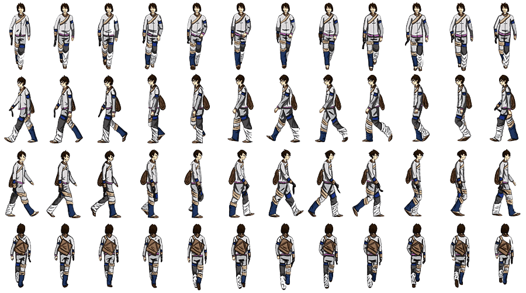

How would we use this?

```
let spritesheet;
let sprites = [];
let direction = 1; // 0 up
let step = 0;
let x;
let y;
let speed = 3;

function preload() {
  spritesheet = loadImage("walking.png");
}

function setup() {
  // fullscreen(true);
  createCanvas(500, 450);

  // 12 images across, 4 down, in the spritesheet

  let w = int(spritesheet.width / 12);
  let h = int(spritesheet.height / 4);

  for (let y = 0; y < 4; y++) {
    sprites[y] = [];
    for (let x = 0; x < 12; x++) {
      sprites[y][x] =
        spritesheet.get(x * w, y * h, w, h);
    } // iterate over rows
  } // iterate over columns

  x = width / 2;
  y = height / 2;

  imageMode(CENTER);

	// Display first sprite
  image(sprites[direction][step], x, y);
}

// nothing to do here because all the action
// happens in the keyPressed() callback
function draw() {}

function keyPressed() {
  // look at sprite sheet to determine 
  // which direction is which row

  if (keyCode === DOWN_ARROW) {
    direction = 0;
    y += speed;
  }

  if (keyCode === LEFT_ARROW) {
    direction = 1;
    x -= speed;
  }

  if (keyCode === RIGHT_ARROW) {
    direction = 2;
    x += speed;
  }

  if (keyCode === UP_ARROW) {
    direction = 3;
    y -= speed;
  }

	// Every so often 
	// advance to the next sprite
  if (frameCount % speed == 0) {
    step = (step + 1) % 12;
  }

	// Finally draw paint the sprite
  background(255);
  image(sprites[direction][step], x, y);
}

```

You can probably find many sprite sheets by googling "sprite sheet" +
whatever you want.


#### Sound!

Download this to your laptop: 
https://github.com/michaelshiloh/IntroductionToInteractiveMedia/blob/master/media/doorbell.mp3

File -> Examples -> Sound

Preload Soundfile

Very basic example:

```
/*
Must upload doorbell.mp3
Must include sound library in index.html
*/

function preload() {
  song = loadSound('doorbell.mp3');
}

function setup() {
  background(234);
}

function draw() {
}

function mouseClicked() {
  song.play();
}

```

How to prevent sound clip from restarting if it's already playing


````
/*
Must upload doorbell.mp3
Must include sound library in index.html
*/

function preload() {
  song = loadSound('doorbell.mp3');
}

function setup() {
  background(234);
  song.play();
}

function draw() {
  if (song.isPlaying()) {
    print("song is playing")
  } else {
    print("song is not playing")
    noLoop
  }
}

function mouseClicked() {
  if (song.isPlaying()) {
    song.stop();
  } else {
    song.play();
  }
}
````

As always, it's useful to explore the examples and the reference page

- Sound examples
	- File -> Examples -> Sound
		- Record Save
		- Live Input

**Remember**
Sound requires a separate library which must be included
in `index.html`

##### Sound Synthesis

The other way to make sounds is to create them mathematically

- Sound examples
	- File -> Examples -> Sound
		- Oscillator Waveform
		- Filters

We can create our own complex sounds starting with basic oscillators and then
changing the envelopes. 

##### Working in groups (time permitting):
If we had multiple sound files, how would we play the
next one when we click the mouse?

#### Introduce the midterm project

### Tuesday 28 February 2023
- Discussion (30 minutes max) 
	- Computer Vision for Artists and Designers – Zunair and Hassan 
- Midterm proposals
- Midterm most frightening part
- Time permitting, look at homework

### Thursday 2 March 2023
#### Today
- Computer vision
- Midterm hints and finish proposals

#### Working with a camera: Computer Vision!

Basic sketch showing how to get input from camera:

```
let capture;

function setup() {
  createCanvas(200, 200);
  capture = createCapture(VIDEO);
  capture.hide();
}

function draw() {
  image(capture, // what image to display
        0, 0,    // where to place the image on the canvas
        width,   // width to display

        // the height is more complicated:
        // we want the capture height to be
        // the width multiplied by the aspect ratio
        width * capture.height / capture.width);
}
```

Reference page for
[createCapture](https://p5js.org/reference/#/p5/createCapture)

Frame Differencing

- [Simple frame differencing](https://editor.p5js.org/michaelshiloh/sketches/ZqXC5-6M0), similar to the method in Golan Levin's article
- A more complex
	[example](https://editor.p5js.org/aaronsherwood/sketches/uxNAkReWT) by Prof.
	Aaron that uses frame differencing to detect which vertical slice of the
	camera image has the most motion, and trigger a corresponding sound clip

Other video tricks

- Video [Mirror](https://editor.p5js.org/aaronsherwood/sketches/cK59ueQ6a) (flipping the x)

- Color tracking

##### In class exercises
- If you wanted to display white (instead of the color of the difference)
	wherever motion above a certain threshold is detected, how would you do this?
- Can you trigger sounds according to where there is
	motion? You may start with Aaron's complex example and simplify
	[here](https://editor.p5js.org/aaronsherwood/sketches/uxNAkReWT)

#### Finish midterm proposals

#### Midterm hints

- Mang added some useful game techniques [here](https://github.com/mangtronix/IntroductionToInteractiveMedia/blob/master/lectureNotes.md#game-techniques)
- In the reading [introduction to computer
	vision](http://www.yorku.ca/caitlin/futurecinemas/resources/coursepack/readings/computervision),
	the code examples use a language called *Processing* which is 
	very similar to *p5.js*. My example for frame differencing is based on this
	article.
- [P5.js version](https://editor.p5js.org/mimi/sketches/E9f0eRBgH) 
	of the color tracking example from Dan Shiffman's book 
	[Learning Processing](http://www.learningprocessing.com)

#### Work on projects

### Tuesday 7 March 2023
#### Today
- Thursday: share midterm project
- Interactivity
- Debugging


#### Sharing midterm projects
Showing your project on Thursday is part of the assignment

#### Interactivity

Great chapter on [Interactivity](https://p5js.org/learn/interactivity.html)
especially note the sections on Mouse Buttons, Keyboard Data, Coded Keys, and
Events. Especially note:

The `mousePressed()` function works differently than the `mouseIsPressed`
variable. The value of the `mouseIsPressed` variable is true **until** the
mouse button is released. It can therefore be used within `draw()` to have a
line of code run while the mouse is pressed. In contrast, the code inside the
`mousePressed()` function only runs **once** when a button is pressed. This
makes it useful when a mouse click is used to trigger an action, such as
incrementing a value


#### Debugging

##### General guidelines
- Don't just randomly change stuff! At best, you might fix the problem but you
	won't learn anything. At worst, you'll make the problem much worse
- Bugs are opportunities to learn! Remember what I did with the array removal
	bug
- Beginners often forget the most useful, built-in debugging aid: `print()`!
- Think carefully about what *is* happening, what *should be* happening, and
	what information you can print to help you understand *why* that is
	happening. 

##### Before you ask for help:
	- Use the steps above to try to narrow down the bug as much as possible.
		Show that you have tried to solve the problem yourself and are not
		just being lazy.
	- Create a small test program which reproduces your bug in the least
		amount of code. In my experience I usually find the bug during this step.
	- Explain clearly what you think should be happening, and what you observe
		happening instead

##### Some debugging resources:
- [p5js Field Guide to Debugging](https://p5js.org/learn/debugging.html)
- [p5js Debugging (Happy
	Coding)](https://happycoding.io/tutorials/p5js/debugging)
- [A Brief Introduction to Debugging](https://vimeo.com/channels/debugging)


### Thursday 2023
#### Today
- Introduction to breadboard
- Introduction to electricity
- Introduction to Arduino
- `digitalWrite()`
- `analogWrite()`
- `analogRead()`

##### Introduction to Arduino

- IDE
- `blink`
- What role does Arduino play?
- Switches and other sensors
- LEDs and other actuators
- Inputs and outputs
- Electricity
- Circuits
- Schematics
- Series and Parallel

#### Electricity 

**Simple circuit using Arduino, LED, and Resistor**

The most confusing part of this lecture will be the solderless breadboard:
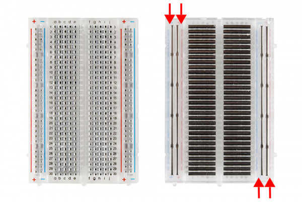
Image courtesy of
[SparkFun](https://learn.sparkfun.com/tutorials/how-to-use-a-breadboard/all)

Here is how to build the circuit

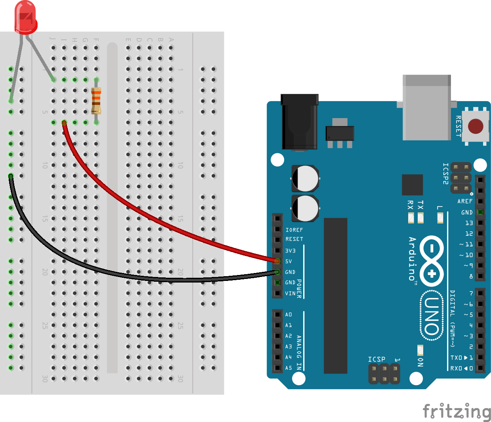


**Theory**

Electricity is mysterious

- We can predict what it will do quite accurately, but don't really understand
	it what is it
- Flow of electrons
- Electrons want to move from place of higher potential energy to place of lower potential energy
	- Like a rock or water falling from a height
	- Unlike a rock or water, electricity can only travel in a conductor
- AC vs. DC - very briefly, will discuss more as it comes up

What makes a circuit?

- Something to provide that difference in potential 
that will cause the electrons to want to move. 
	- Typically a battery, charger, or USB port
	- The technical term is "power supply"
	- In our case your laptop via the Arduino
		- What is the Arduino doing in this case?
- Conductors to allow the electronics to move
- Components or other things that usually convert this electrical energy 
to some other form of energy (e.g. light, sound, heat, movement)
- Optionally, switches or other sensors to control the flow of energy
	- In our circuit the resistor is controlling the brightness of the LED so that it doesn't burn out

#### Schematics

Here is the schematic of what you've built

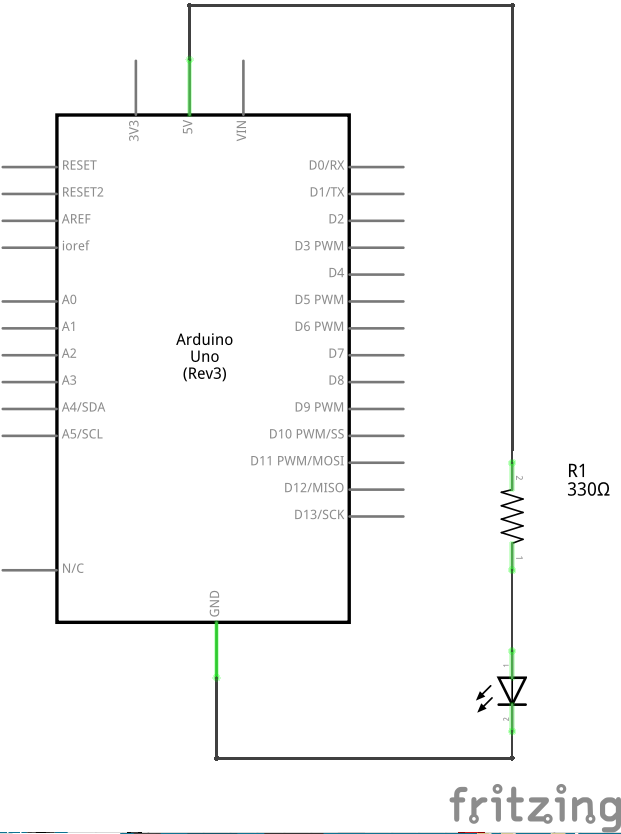

- Important part of something, 
	without getting distracted by details (e.g. subway maps)
- What's important in an electrical schematic?
	- Where is the power coming from?
	- What other components are there in the circuit?
	- How are they connected?

**Schematics are an important way to show a circuit. You will be required to
understand and use them**

#### Switches

- What if we want to turn it the LED on and off?
 	- Pull out a wire
 	- That's a switch, but a pretty inconvenient one
	- Schematic symbol of switch
	- How does it work?
		- Breaks the flow of electrons by breaking the continuous path
		- Doesn't electricity (the electrons) just flow out the end of the wire?
	- The switch can go on either side. How is this possible?

Let's use a real switch

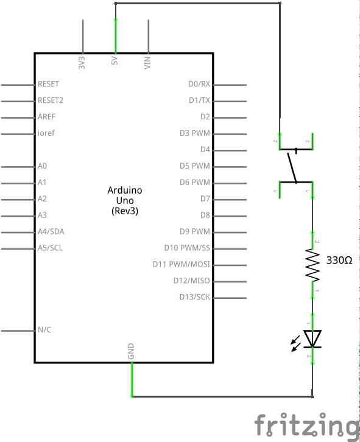
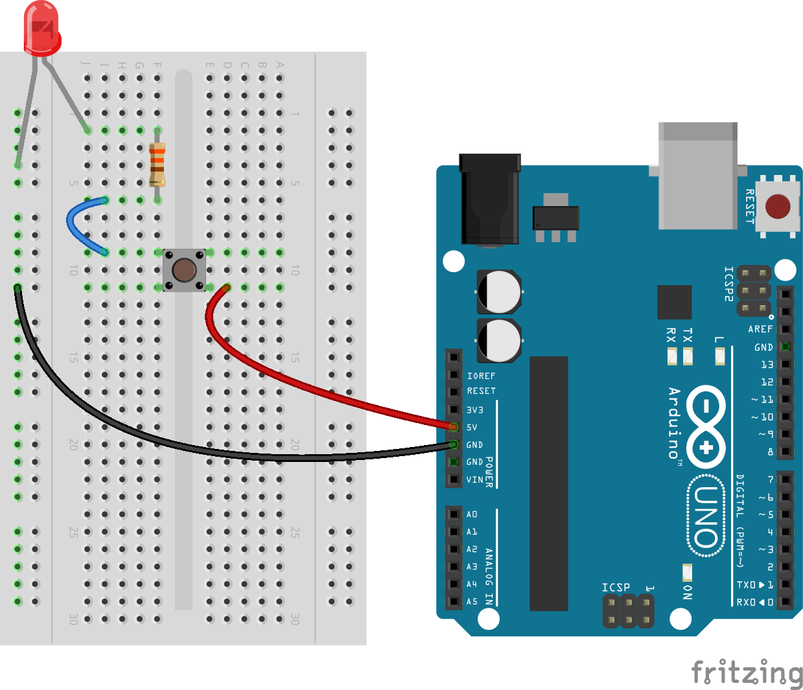

- How is this switch different from the earlier switch?
	- Schematic symbol of momentary switch
	- What was the previous "switch"?
	- Schematic symbol of toggle switch

#### Arduino finally!

Make sure everything is working

- Upload the Blink example
- Change the parameter in delay()
- Upload again and verify that the LED blinks at the new rate

#### Basic Arduino and Digital Output

Upload File -> Examples -> Basic -> Blink example

Let's extend this circuit to the breadboard:

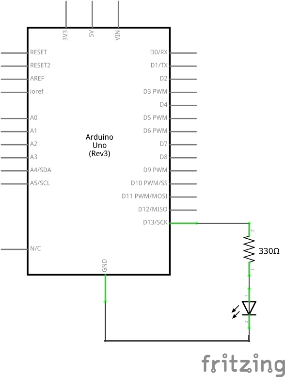


Review

- Code
- Circuit
- Input and Output (I/O) pins
	- 20 IO pins
	- All 20 pins can do digital input and digital output
	- Many of the pins have additional special functionality
- Built-in LED
	- On the Arduino Uno this LED is on pin 13
	- On the Arduino Uno LED_BUILTIN = 13 

#### Analogue Input

Build this circuit. Try to follow the schematic and not the breadboard view:

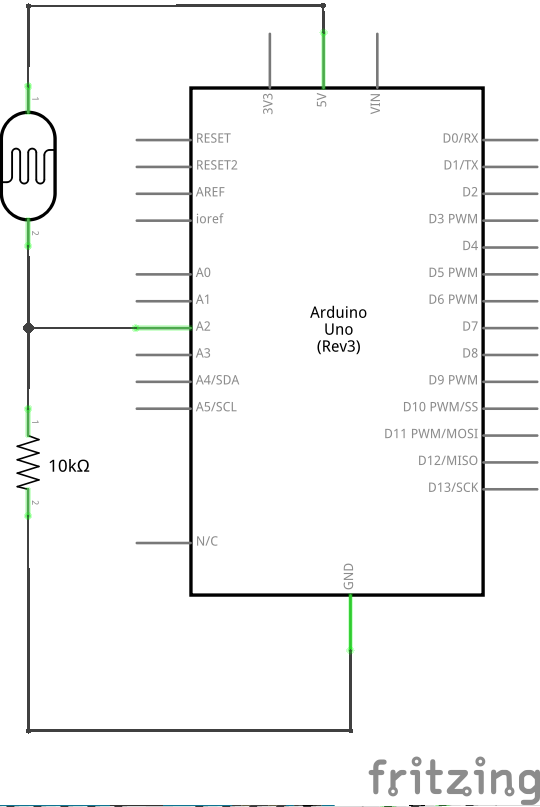
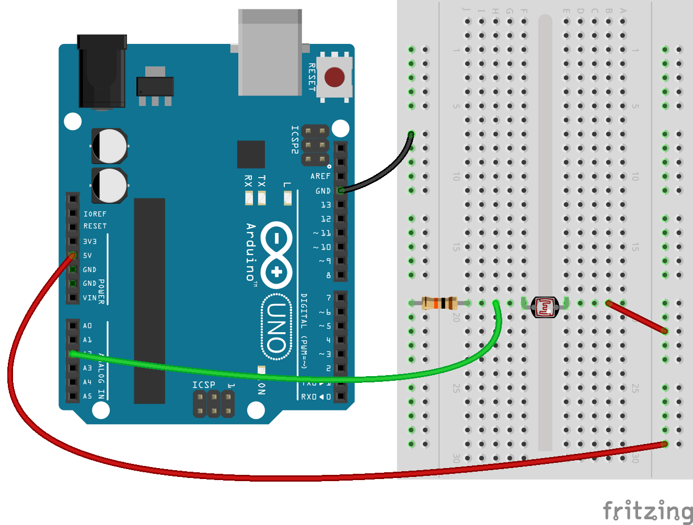

- Analogue Inputs, `analogRead()`, and (some) sensors go together
	- This only works on the six analog input pins (A0-A5)
	- Digital sensors, like a switch, have only one of two values 
	and so are more suited to a digital input
- Remember that the so-called analog input pins can do digital input and
	output as well
- Since you have so few analog input pins, when you decide which pins to use
	for which device, reserve the analog input pins for analog input devices
	as much as possible

#### Analogue Output

- Analogue Outputs, `analogWrite()`, PWM and (some) actuators go together
	- `analogWrite()` only works on the six PWM pins (3, 5, 6, 9, 10, and 11).
	- LEDs, motors, and some other actuators respond properly to PWM
	- Other actuators, like a solenoid, do not respond well to PWM and really
		should be considered digital actuators
	- Since you have so few analog outputs, when you decide which pins to use
		for which device, reserve the analog output pins for analog output devices
		as much as possible

- Not true analog voltage. PWM = Pulse Width Modulation
- Works for LEDs and motors

#### Functions that you know from p5.js which are useful here:
- `map()`
- `constrain()`
- `if()`

Remember how we used `print()` in p5.js to help us find problems in our 
program? You can do that in Arduino to but the function has a slightly
different name: `Serial.println()`
- Must be initialized `Serial.begin()`
- Can not concatenate strings with the `+` function
	- Instead, you need multiple calls to `Serial.print()` e.g.:

````
Serial.print("First value = ");
Serial.print(firstValue);
Serial.print(" Second value = ");
Serial.print(secondValue);
Serial.println();
````

Example using an analog input to control the brightness of an LED

````
const int LED_PIN = 3;           // the PWM pin the LED is attached to
const int POT_PIN = A2;
int brightness = 0;    // how bright the LED is

// the setup routine runs once when you press reset:
void setup() {
  // declare pin 9 to be an output:
  pinMode(LED_PIN, OUTPUT);
  Serial.begin(9600);
}

// the loop routine runs over and over again forever:
void loop() {
  int pot_value = analogRead(POT_PIN); // 0-1023
  brightness = map(pot_value, 0, 1023, 255, 0);
  Serial.println(brightness);
  analogWrite(LED_PIN, brightness); // 0-255
}
````

### Tuesday 28 March 2023
#### Today
- Discussion: Majid and Aibar 
	- Norman,“Emotion & Design: Attractive things work better”
	- Her Code Got Humans on the Moon
- Time permitting, some homework feedback

##### Homework and Midterm Feedback
- [How to add syntax highlighting for code](https://intro.nyuadim.com/2022/01/06/how-to-embed-a-p5js-sketch-in-your-blog-post/) in your blog posts
- Make links active
- Better discussion of failures. Include code, explain how you figured it out
	or worked around it
- Never never never use screenshots of code (or of any text)!
	- Unless there is a really good reason to do so, in which case you should
		explain it
- If a function's return value is used, the function should always return
	something
- Comments
	[e.g.](https://github.com/aylasacic/Intro-to-IM/blob/main/Midterm%20Project/sketch.js)
- Explain all variables, functions, classes, and objects unless their names
	make it perfectly clear what they are for
- Describe user testing feedback and what you did with that feedback
- Block at beginning with name, date, description
- Better descriptions in your blog posts
	([e.g.](https://intro.nyuadim.com/author/at4888/))
- Break up large chunks of code into functions
- Complex state machine with multiple variables and states

### Thursday 30 March 2023
#### Today
- More electronics
- Digital Input
- Analog Input 
- Analog Output
- More sensors

#### More electronics

#### Ohm's law
- I=V/R
- The math only works for linear components 
	- But the principle is the same for non-linear components 
	- **is a very important concept**:
		- For a given resistance, 
			the higher the pressure (voltage), 
				the higher the current
		- For a given voltage, the higher the "resistance", 
			the lower the current

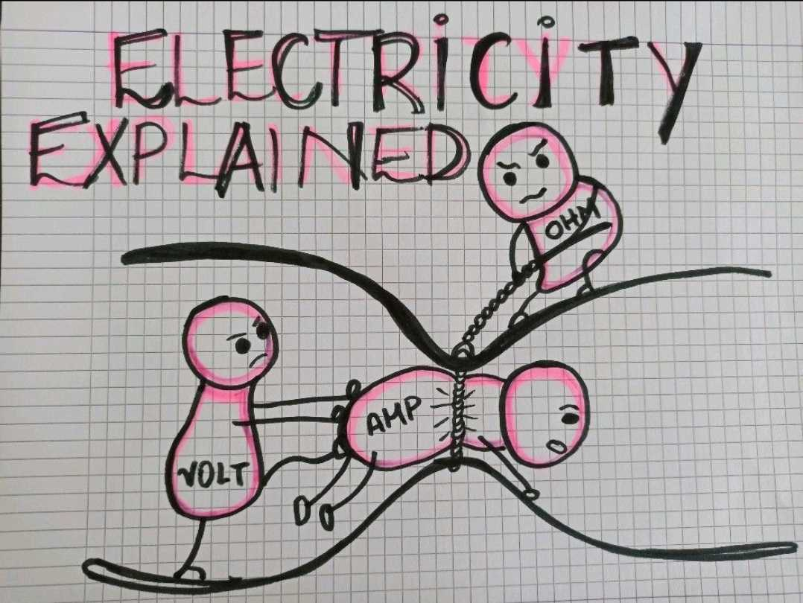

#### Digital Input

Adding a switch

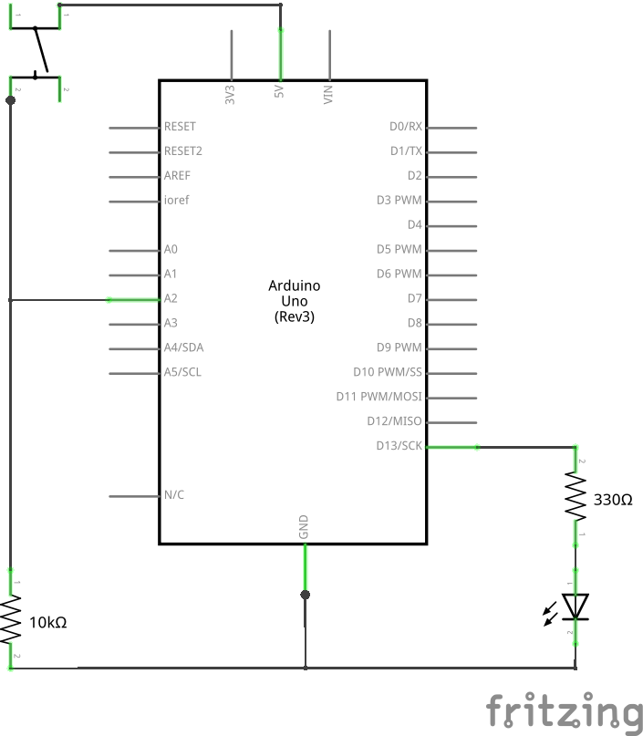
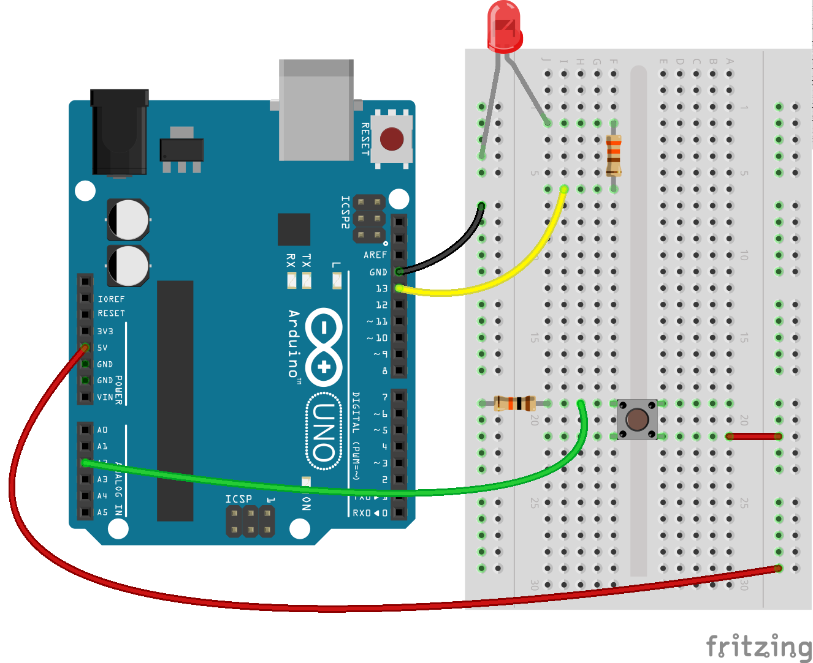

````
void setup() {
  pinMode(8, OUTPUT);
  pinMode(13, OUTPUT);
  pinMode(A2, INPUT);
}

void loop() {

  int switchPosition = digitalRead(A2);

  if (switchPosition == HIGH) {
    digitalWrite(8, HIGH);   // turn the LED on (HIGH is the voltage level)
    digitalWrite(13, LOW);
  } else  {
    digitalWrite(8, LOW);    // turn the LED off by making the voltage LOW
    digitalWrite(13, HIGH);
  }
}
````

An example:

````

const int pushButton = A2;
const int redLEDPin = A0;
const int greenLEDPin = 8;

void setup() {
  pinMode(redLEDPin, OUTPUT);
  pinMode(greenLEDPin, OUTPUT);
}

void loop() {

  int buttonState = digitalRead(pushButton);

  if (buttonState == HIGH) {
    digitalWrite(redLEDPin, HIGH);
    digitalWrite(greenLEDPin, HIGH);
    delay(500);
    digitalWrite(greenLEDPin, LOW);
    delay(300);
    digitalWrite(redLEDPin, LOW);
    digitalWrite(greenLEDPin, HIGH);
    delay(700);
  }
  allOff();
  delay(1000);
}

void allOff() {
  digitalWrite(redLEDPin, LOW);
  digitalWrite(greenLEDPin, LOW);
}
````

Other things you can do:

Add another LED on a different pin

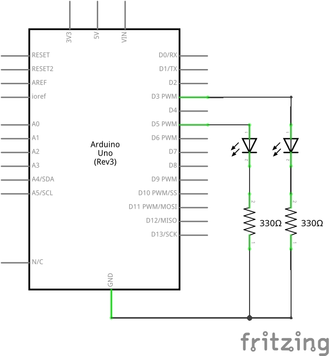
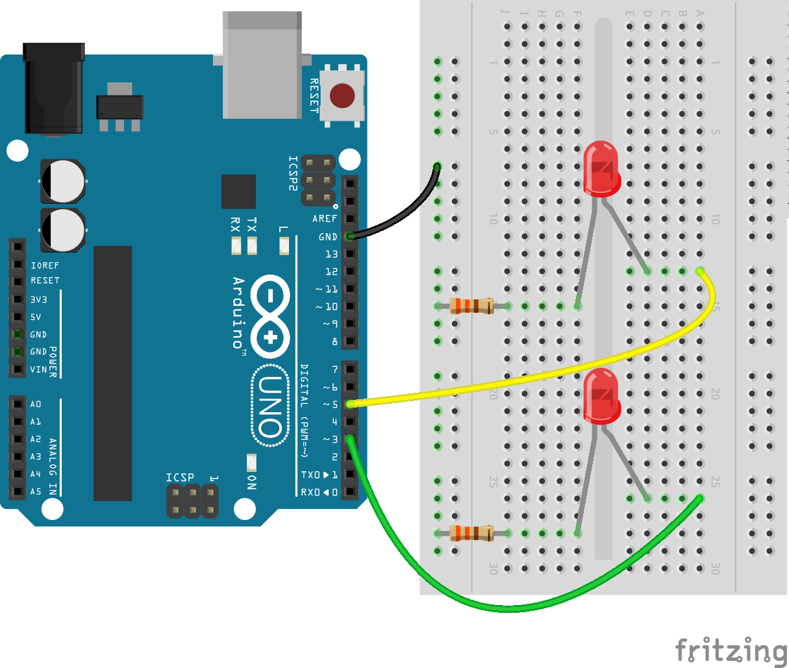

Add another switch on a different pin

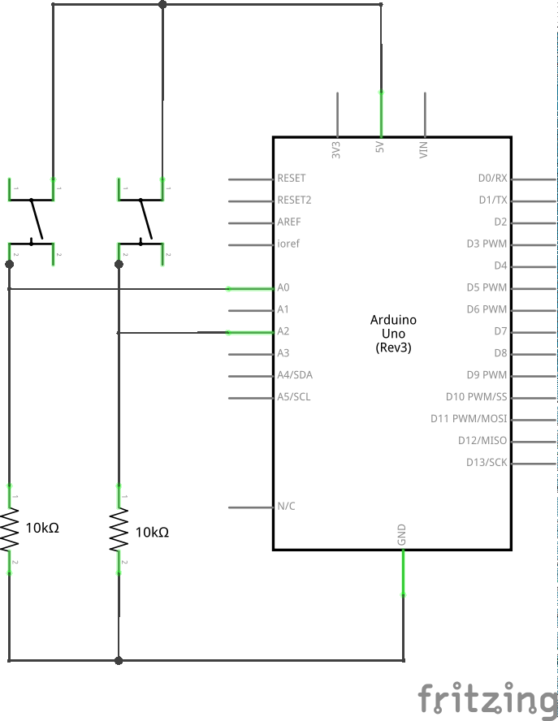
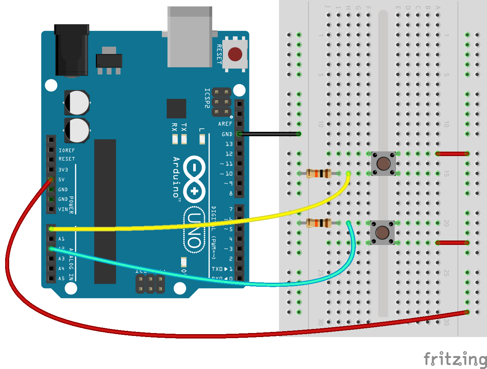

#### In-class exercise

Now write a program that will blink different patterns depending on which
switch is pressed. 
Using two switches you can select between four patterns.
How is that possible?

Do you see a similarity between this circuit and 
something we learned earlier?

Some analogue sensors are resistive, some are not. 
Resistive sensors all use the same
pattern: a voltage divider.
Note the similarity to the circuit we used for a switch.
The switch circuit is also effectively a voltage divider, one that has only
two values instead of an infinite range of values

What other sensors do we have in the kit?

Which ones are resistive?

#### Potentiometer

[Here](https://learn.sparkfun.com/tutorials/sparkfun-inventors-kit-experiment-guide---v41/circuit-1b-potentiometer)

#### Misc
- Hand drawn schematics in your homework are fine!
Here is an example:

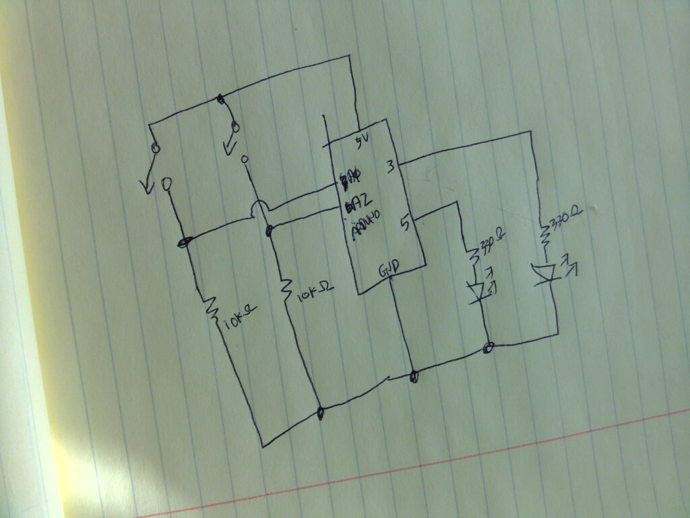

- Hand drawn switches can use the simple symbol
- Resources are available to help you with homework (me, Jack), but only
	if you start your homework early enough. If you wait until the last minute
	and then don't have time to get help, that is unexcusable.
- Use constants for pin numbers

#### In-class exercise

1. Use one of the analogue sensors to select which of two LEDs lights up
1. Use one of the analogue sensor to control how fast two LEDs alternate
1. Use a momentary switch (often called a *pushbutton* or a *button* in the
	 Arduino literature) to select a different range for mapping an analog
	 sensor to an analog output device
1. Use a potentiometer to select from 4 different behaviors of a circuit
1. Use a momentary switch to enter a mode where the minimum and maximum values
	from the LDR are stored. When the switch is released, use those values to
	map the range of values from the LDR to the full range of the LED brightness

### Tuesday 4 April 2023
#### Today
- Akhat and Ishmal
	- Physical Computing’s Greatest hits and misses
	- Making Interactive Art: Set the Stage, Then Shut Up and Listen
- Look at homework


### Thursday 6 April 2023
#### Administration
- Attendance

#### Today
- Sound
- Servo motor

#### Sound

**`tone()`**

- [Schematic](https://www.arduino.cc/en/Tutorial/ToneMelody)
- Before you try that code, just try 
`tone(spkrPin, 440);`
and
`tone(spkrPin, 440, 1000);`
- [Reference
page](https://www.arduino.cc/reference/en/language/functions/advanced-io/tone/)

**Notes**
- "Use of the `tone()` function will interfere with PWM output on pins 3 and 11"
	- The word "intefere" is rather vague. 
	I think they mean that it 
	prevents `analogWrite()` from working on pins 3 and 11
- The `tone()` function is *non-blocking*
- Arduino supports tabs 
- Arduino has arrays 
- What is resistor for? 
	- LED needs a resistor to limit current so it doesn't burn out
	- LDR needs a resistor to form a voltage divider
	- Piezo buzzer neither burns out nor needs a voltage divider
	- So why a resistor?

#### Servo motor

- [Schematic](https://www.arduino.cc/en/Tutorial/Knob)
- [Reference
page](https://www.arduino.cc/en/Reference/Servo)


**Notes**
- Use of the servo library disables `analogWrite()` (PWM) on pins 9 and 10
- The `Servo.write()` function is *non-blocking*

#### More about PWM
- How do you suppose `analogWrite()` makes an LED dimmer?
- [PWM](https://www.ekwb.com/blog/what-is-pwm-and-how-does-it-work/)
- What do `analogWrite()`, `tone()` and `Servo` have in common?
- What is sound?
- How does a servo motor
	[work](https://lastminuteengineers.com/servo-motor-arduino-tutorial/)?

**Notes**
1. You may have noticed that the built-in LED blinks 3 times when you turn on
	 your Arduino. In fact it does this every time it resets, which also happens
	 when you upload a new program. Since this LED is connected directly to pin
	 13, it means that whatever you have attached to pin 13 will be activated 3
	 times briefly whenver the Arduino resets. So, if you make a big robot, 
	 you probably should not use pin 13 for the motor
1. Pins 0 and 1 are used for communication with your laptop, and this has two
	 effects:
	1. Connecting anything to pins 0 or 1 might interfere with laptop
		 communication (which includes uploading!)
	2. Anything connected to pins 0 or 1 might be activated during
		 communication!
1. For these reasons it is best to avoid pins 0, 1, and 13. If you run out of
	 pins and need to use them there are ways around this.

#### Data Types

Unlike in p5.js, you must declare what type of data you want to store in a
variable:

- `int` - whole numbers only
- `float` - a number with a fractional part ('floating point number')
- `char` - a character
- `boolean` - only either `true` or `false`

#### Conventions: Schematics and Wire Colours

- When drawing schematics

	- All **sensors** on the **left**
	- All **inputs** on the **left** side of the Arduino 
	- All **actuators** on the **right**
	- All **outputs** on the **right** side of the Arduino 
	- There are exceptions e.g.
		- If using CAD you can't control where the pins are on Arduino
		- Some devices (e.g. the ultrasonic distance measuring sensor) that have
			both inputs and outputs

- When wiring your circuits

	- All **5V** connections should use **red** wire, 
	and don't use red for anything else
	- All **GND** connections should use **black** wire,
	and don't use black for anything else
		- If you run out of black you may either
			- Color some white cables black with a Sharpie
			- Dedicate green as an additional black, and then
			don't use green for anything else either
	- All other connections can use any other colors
	- If you use the buses on the sides of the breadboard
		- Red bus for 5V only
		- Black or Blue bus for GND only

#### Getting rid of delay
- Blink without `delay()`(Files -> Examples -> Digital -> BlinkWithoutDelay
- Excellent [tutorial](https://learn.adafruit.com/multi-tasking-the-arduino-part-1?view=all) 
showing classes for blinking an LED and sweeping a servo motor without using
	`delay()`
- [Example](https://github.com/michaelshiloh/resourcesForClasses/blob/master/src/arduinoSketches/noDelay/toneMelodyWithoutDelayClass/toneMelodyWithoutDelayClass.ino)  using a class to play a melody 
without using `delay()`
- An [improved
	class](https://github.com/michaelshiloh/resourcesForClasses/blob/master/src/arduinoSketches/noDelay/toneMelodyWithoutDelayClassMultipleMelodies/toneMelodyWithoutDelayClassMultipleMelodies.ino) which lets you play different melodies, also 
without using `delay()`
- [Playing a melody and blinking an LED without using
	`delay()`](https://github.com/michaelshiloh/resourcesForClasses/blob/master/src/arduinoSketches/noDelay/toneMelodyAndBlinkWithoutDelay/toneMelodyAndBlinkWithoutDelay.ino), not using a
	class


#### In-class exercises


1. Build a circuit with a switch (pushbutton) and a servo motor, and when you
	 press the switch go to one position, when you don't press the switch go to
	 another

2. Add a piezo buzzer so that when the switch is pressed it plays a tone for
	 half a second, then a tone for another half a second as long as the switch
	 is pressed

3. Modify the code so that it plays the two tones only once when the switch is
	 pressed

4. Add an LED and make the LED change brightness according to which tone is
	 playing

5. Add a potentiometer which controls how fast the servo motor moves from one
	 position to the next

#### Examples

Some examples using the piezo speaker, servo motor, and a potentiometer:

````
// Moving the servo motor first to one position and then to another,
// and then stopping:

const int servoPin = 7;

#include <Servo.h>
Servo myservo;

void setup() {
	myservo.attach(servoPin);
	myservo.write(10);
	delay(1000);
	myservo.write(130);
}

void loop() { 
}
````

````
// Moving the servo motor first to one position and then to another,
// continuously:

const int servoPin = 7;

#include <Servo.h>
Servo myservo;

void setup() {
	myservo.attach(servoPin);
}

void loop() {
	myservo.write(10);
	delay(1000);
	myservo.write(130);
	delay(1000);
}
````

````
// Minimal example of the tone() function
// Make a tone, never stop

const int spkrPin = 7;

void setup() {
	tone(spkrPin, 440); // starts a tone on pin 7 at frequency 440
}

void loop() {
 // Arduino always needs a loop, even if it's empty
}
````

Is the `tone()` function blocking? 

````
// If tone() is a blocking function, the LED will be off while the tone sounds
// If the LED comes on as soon as the tone starts, tone() is non-blocking
const int spkrPin = 7;

void setup() {
	pinMode(LED_BUILTIN, OUTPUT);

	digitalWrite(LED_BUILTIN, LOW);
	tone(spkrPin, 440, 1500); // starts a tone and then automatically stops it after 1500 milliseconds
	digitalWrite(LED_BUILTIN, HIGH);
}

void loop() {
}
````

````
// Using a potentiometer to control the position of a servo motor

#include <Servo.h>

Servo myservo;  // create servo object to control a servo

int potpin = A0;  // analog pin used to connect the potentiometer

void setup() {
	myservo.attach(9);  // attaches the servo on pin 9 to the servo object
}

void loop() {
	int val = analogRead(potpin); // reads the value of the potentiometer (value between 0 and 1023)
	val = map(val, 0, 1023, 0, 180); // scale it for use with the servo (value between 0 and 180)
	myservo.write(val);   // sets the servo position according to the scaled value
	delay(15);            // waits for the servo to get there
}
````

````
	// Use a potentiometer to control the position of a servo motor
	// and the pitch of a tone

	#include <Servo.h>
	Servo myservo;

	void setup() {
		// initialize serial communication at 9600 bits per second:
		Serial.begin(9600);
		myservo.attach(7);
	}

	void loop() {
		// read the input on analog pin 0:
		int sensorValue = analogRead(A2);
		// print out the value you read:
		Serial.println(sensorValue);

		// servo motor stuff
		int servoPosition = map(sensorValue, 0, 1023, 0, 180);
		myservo.write(servoPosition);

		// piezo buzzer stuff
  int pitch = map(sensorValue, 0, 1023, 200, 4000);
  tone(8, pitch);

  delay(1);        // delay in between reads for stability
}
````

### Tuesday 11 April 2023
#### Today
- Discussion
	- Ajla and Adina: A Brief Rant, follow-up
	- I will set alarm for 20 minutes. Do you want earlier warning?
- Musical Instruments

### Thursday 13 April 2023
#### Administration
- Attendance
#### Today
- Serial Communication

#### Arduino-p5.js communication
- Build [this](https://github.com/mangtronix/IntroductionToInteractiveMedia/blob/master/code/Week_11_Serial_schematic.png) circuit
- Download [this](https://github.com/mangtronix/IntroductionToInteractiveMedia/blob/master/code/Week11Serial.ino) sketch to your Arduino
- Run [this](https://editor.p5js.org/mangtronix/sketches/s67XC0zT4) p5 code on your laptop

What's going on here?

- Arduino waits for a message from p5.
- Arduino expects two values separated by a comma. It uses these two values to
	control two LEDs.
- Arduino then reads two sensors and sends the values back to p5, separated by
	a comma.
- p5 reads these two values from Arduino. One value controls the text color,
	the other controls the text transparency
- p5 sends two values back to Arduino indicating if the mouse was clicked, and
	if so, which half of the screen it was in.
- Meanwhile, Arduino is waiting for a message from p5
- Repeat

Things to notice
- Each side only sends a message when it receives a message from the other.
	This way, neither side is flooded by too many messages
- The amount of information in each message is arbitrary. You can reduce it or
	extend it by changing the code appropriately on both ends. However you
	always need to send something.
- Another way of saying this is that the number of sensors on Arduino is
	arbitrary. You can have more or less (as long as you change the code on p5
	to agree). Likewise you can change what you are detecing in p5 and sending
	to Arduino (keypresses, canvas coordinates, colors, whatever)
- What the information conveys is also arbitrary. Arduino sends messages to
	p5, it has no idea what p5 does with this information. Similarly p5 sends
	information to Arduino and has no understanding of what happens with it.
	Either side can be arbitrarily complex, or can in fact ignore the
	information after reading it.

Make it your own
- Duplicate Mang's project so that you get the other files as well
- Modify the data that is exchanged. You may need a digital sensor on the
	Arduino instead of an analog sensor. Similarly, on the p5 side, you may need
	something different from a mouse click or changing the text color and
	transparency.
- Once you are reliable sending information back and forth you can start
	adding the rest of your program

**Caution**
There are many different ways to communicate between Arduino and p5, such as
using different synchronization methods or different libraries. Unless you
thoroughly understand how they work, they are best avoided, and certainly
don't mix code based on one library with code using another library.

In-class exercise (break class into groups of 2-3 students)
- Make something that uses only one sensor on arduino and makes the ellipse in
	p5 move on the horizontal axis, in the middle of the screen, and nothing on
	arduino is controlled by p5
- Make something that controls the LED brightness from p5
- Use p5 to control a servo motor and make a sound using `tone()` on Arduino
- Use one or more sensors on Arduino to control some aspect of your midterm
	project on p5
- Take the [gravity wind
	example](https://editor.p5js.org/aaronsherwood/sketches/I7iQrNCul) and make
	it so every time the ball bounces one led lights up and then turns off, and
	you can control the wind from one analog sensor

### Tuesday 18 April 2023
#### Today
- Discussion
- Midterm project ideas

### Tuesday 25 April 2023
##### todays-lecture
#### Today
- Midterm project status
- Motors and H-bridge

#### Motors

An LED can make light, what makes motion?

	=> **Electromagnetism**

Electrical devices that rely on the principle of electromagnetism:

- Electromagnets
- Loudspeakers and headphones
- Solenoid
- Relays
- All kind of motors
	- AC motors
	- DC motors
	- Brushless DC motors
	- Stepper motors
	- Servo motors (which actually consist of a DC motor + servo circuitry)

##### In-class exercise

- Take the DC motor and connect it directly to 5V and GND
- Now reverse the wires

Can we connect the motor to an Arduino output just like we did with the piezo
buzzer?
- Arduino current limitations

##### Arduino current limitations

- What is current? It is the rate of flow of electrons through a conductor.
	- You don't get to control the current. 
	- The voltage depends on the current and the resistance (Ohm's law: I=V/R)
	- You can provide a voltage (with Arduino, the voltage is always 5V)
	- Each device has it's own "resistance"

LEDs have relatively <strong>high</strong> "resistance", 
and so consume <strong>low</strong> current.
Motors have relatively <strong>low</strong> "resistance", 
and so consume <strong>high</strong> current

- Current flowing through any resistance causes heat (P = I^2/R)
- Everything has resistance

**Therefore, where electricity is flowing there will be heat**

**Heat causes damage**

(We've not had to worry about that up to now because everything we've done
uses very little current)

Arduino can not protect itself from damaged caused by overheating. 
It does not <strong>limit</strong> current, 
it is <strong>damaged</strong> by too much current

The amount of heat a component can withstand before it is damaged 
is governed, to a large extent, by its size

The transistors that make up Arduino are tiny 


(Image courtesy of SparkFun)

The reason for using the separate Motor Driver is simple:

**It has much bigger transistors**

(It also makes it easier to control both direction and speed, 
but you could do that with the Arduino alone, 
it  would just be more complicated)

In addition to the bigger transistors, the Motor Driver
includes an H-bridge which allows us to control rotation direction

Circuit Schematic

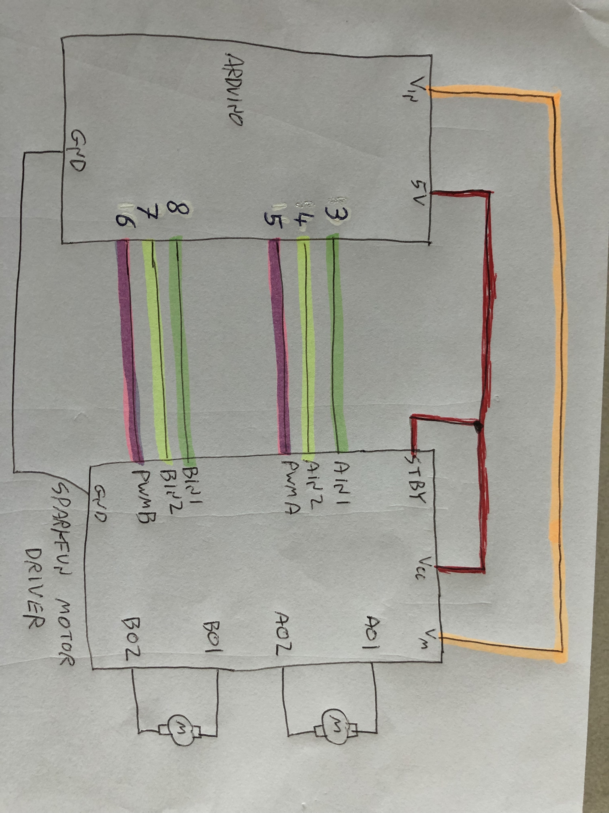

How did I choose which pins to use?
- Never use pins 0 and 1 (dedicated for USB communication)
- Avoid pin 13 if possible (it flashes 3 times on reset)
- Directional control pins (ain1, ain2, bin1, bin2) only require
	digital signals so avoid pins with extra functionality 
	(analog input, SPI, PWM)
- Inclusion of the servo library 
	disables `analogWrite()` on pins 9 and 10
	(I'm not using the servo library now but perhaps I'll add it later)
- Use of the `tone()` function 
	disables `analogWrite()` on pins 3 and 11
	(I'm not using the `tone()` function now but perhaps I'll add it later)
- This leaves PWM pins 5 and 6 for the speed controls (pwma and pwmb)
- Might as well choose nearby digital pins

Code

````

const int ain1Pin = 3;
const int ain2Pin = 4;
const int pwmAPin = 5;

const int bin1Pin = 8;
const int bin2Pin = 7;
const int pwmBPin = 6;


void setup() {
  pinMode(ain1Pin, OUTPUT);
  pinMode(ain2Pin, OUTPUT);
  pinMode(pwmAPin, OUTPUT); // not needed really
}

void loop() {
  // turn in one direction, full speed
  Serial.println("full speed");
  analogWrite(pwmAPin, 255);
  digitalWrite(ain1Pin, HIGH);
  digitalWrite(ain2Pin, LOW);
  // stay here for a second
  delay(1000);

  // slow down
  Serial.println("slowing down");
  int speed = 255;
  while (speed--) {
    analogWrite(pwmAPin, speed);
    delay(20);
  }
}

````

Control the motor speed and direction using a potentiometer:

````
const int ain1Pin = 3;
const int ain2Pin = 4;
const int pwmAPin = 5;

const int bin1Pin = 8;
const int bin2Pin = 7;
const int pwmBPin = 6;

const int potPin = A5;


void setup() {
  pinMode(ain1Pin, OUTPUT);
  pinMode(ain2Pin, OUTPUT);
  pinMode(pwmAPin, OUTPUT); // not needed really
}

void loop() {
  int potVal = analogRead(potPin);
  delay(20);
  if (potVal > 1023 / 2) { //counterclockwise
    digitalWrite(ain1Pin, HIGH);
    digitalWrite(ain2Pin, LOW);
    analogWrite(pwmAPin, potVal / 4);
  } else { //clockwise
    digitalWrite(ain1Pin, LOW);
    digitalWrite(ain2Pin, HIGH);
    analogWrite(pwmAPin, 255 - potVal / 4);
  }
}
````

##### Debugging

If you want my help solving a problem in your assignment, do the following:
1. Figure out the simplest circuit and program that demonstrates your problem
1. Upload your schematic, code, and 
the best picture you can take of your breadboard circuit to Github 
1. Write a message on Discord, describing carefully
	1. What you think should happen
	1. What you observe happens

What techniques have you learned to help you find problems?

#### Fabrication and Construction Techniques

- Panel mount vs. PCB mount
- Stranded vs. solid core wire
- Strain relief

#### Soldering

### Thursday November 24, 2022

#### Reading discussion (A Brief Rant on the Future of Interaction Design; A Follow-up Article: Zhaniya and Aisha)

#### How to use a Digital Multimeter (DMM) 

- The three most useful measurements
	- Continuity
		- Checking connections
		- Checking switches
	- Voltage
		- Checking sensor circuits
		- Checking Arduino digital outputs
	- Resistance
		- Checking resistive sensors
		- Checking motorso
- How to connect to Arduino pins or the solderless breadboard
